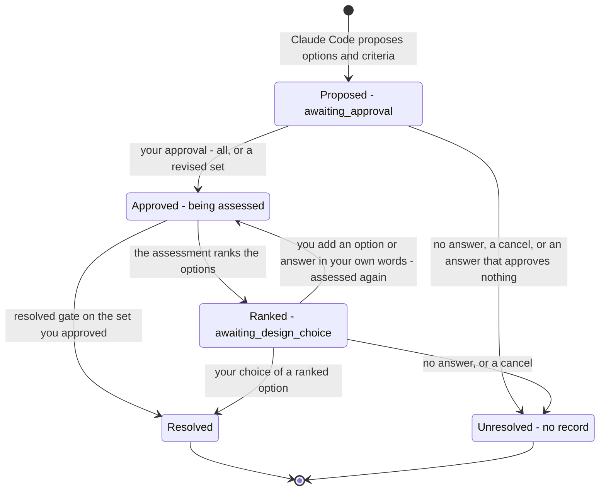

# Decision States — From Proposed to Resolved, with the Re-rank Loop and the No-Answer Exit

This page follows one decision formed from your question through the points where it waits for
you (DK-600b-1 to DK-600b-3). The forming round that leads to each state is in
[Decision forming round](c3-024-decision-kernel-flows-forming-round.md).

**Status: built on main.** Each state matches the decision continuation's `phase` field in
`kernel/capabilities/decision/state.py`. Your answer is applied according to that phase
(`apply_human_answer` in `kernel/capabilities/decision/approvals.py`). The words-answer re-rank
is proven by DK-600b-2-ii's tests, which pass on main:
`tests/kernel/capabilities/test_design_ending.py::TestHumanChoiceResolves::test_a_words_answer_at_the_ranked_question_is_reassessed_and_ranked_again`
and `::test_a_words_answer_never_resolves_the_decision`.

Parent: [Decision Kernel and Colony Memory — Design Map](c2-007-decision-kernel-flows-overview.md)

See also: [Decision forming round](c3-024-decision-kernel-flows-forming-round.md) and
[Record staging](c3-026-decision-kernel-flows-record-staging.md) (what a resolved decision leaves
behind).

## The states

| State | Continuation `phase` | What holds |
|---|---|---|
| Proposed | `awaiting_approval` | Options and criteria from `host.generate_options` are `proposed`. Nothing is researched or assessed until you approve them (`validate_basis` asks for approval first) |
| Approved | the phases of the research, synthesis and options rounds | Only what you approved, edited or added is used. The kernel researches, synthesizes and assesses ([c3-024](c3-024-decision-kernel-flows-forming-round.md)) |
| Ranked | `awaiting_design_choice` | You see the options ranked by Jev's scores, why research stopped, and each option's evidence. The ranking is evidence, not a decision |
| Resolved | decision status `resolved` | The decision is completed with you as approver (`approved_by`, `approved_at`). Its record is staged ([c3-026](c3-026-decision-kernel-flows-record-staging.md)) |
| Unresolved | none: the run is cancelled, still `waiting_human`, or `partial` | The decision never resolves. No record is staged and nothing reaches the decision store |

## The transitions

| Transition | What causes it | Where |
|---|---|---|
| Proposed → Approved | `choice_id: approve` approves every pending proposal. A structured answer approves a revised set: `approved_option_ids` and `approved_criterion_ids` pick a subset (unlisted proposals are declined). `edited_criteria` replaces the whole proposed set, and `approved_criterion_ids` is then ignored. `added_options` adds options you approve | `_apply_approval`, `_apply_structured` |
| Proposed → Unresolved | You never answer (the run waits until someone cancels it, and no answer is inferred from silence), you cancel the run, or your answer approves nothing. Free text alone, or an unknown choice, leaves the proposals unapproved, and the decision ends `partial` | `_apply_approval`; `emit_followup` |
| Approved → Ranked | `combine` ranks the options and asks you, instead of researching on, because a required criterion is a design judgement, two assessments show no progress, the research-round cap is reached, no research target is left, or the Jev budget reserve is reached | `combine`, `_hand_to_human`, `budget_gate.handover` |
| Approved → Resolved | The resolved gate in `combine`: exactly one option passes every required criterion on enough evidence, with no tie, conflict or open preference. No ranked choice is asked. Your approval of the options and criteria is the decision's approval (`approval_status: approved`, `approved_by` you). Covered by `tests/kernel/capabilities/test_decision_criteria_proposals.py::test_jev_decides_against_approved_criteria_only` | `combine` (`_select`), `emit.resolved_result` |
| Ranked → Approved | You add an option (`added_options`), or answer in your own words (`free_text` without a choice). The options are assessed and ranked again before you are asked once more. Your words are kept as a human input and never resolve the decision alone | `_apply_design_choice` |
| Ranked → Resolved | `choice_id` names a ranked option. The decision resolves in `load` with no further Jev call, and any free text with the choice is kept word for word as a condition. A choice that is not a usable option is refused and keeps nothing | `_load`, `design_resolved_result` |
| Ranked → Unresolved | You never answer, or you cancel the run | `kernel/service_cancel.py` |

**Every way into Resolved needs your answer.** You either choose a ranked option, or the resolved
gate settles the decision on the options and criteria you approved. A decision formed by ranking
never resolves without your choice (DK-600b-3). The kernel never answers for you: a human answer
can come only from a `human` actor (see the actor check in
[Request Flow 2](c3-014-decision-kernel-flows-request-handoff.md)).

**Not drawn here.** Three other questions also resolve a decision only on your answer:
- the reuse question for a strong precedent, phase `awaiting_precedent`
  ([c3-029](c3-029-decision-kernel-flows-precedent-reuse.md));
- a direct ruling on a tie, a preference, a conflict or an unsettled uncertainty, phase `awaiting_human`;
- approval of the final recommendation when a `decision_request.v1` sets `approval_required`,
  phase `awaiting_decision_approval`.

A `decision_request.v1` whose caller supplied the options and criteria never passes through
Proposed. The resolved gate can settle it with `approval_status: not_required`, and then no
record is staged.

## Legend

| Element | Meaning |
|---|---|
| Rounded box | A state of the decision. The text after the dash is its continuation `phase` |
| Arrow with a label | A transition, labelled with the action that causes it |
| `[*]` at the start | The decision gets its first proposals |
| `[*]` at the end | The decision stops changing: it resolved, or it never will |

## Cross-Links

- Parent: [Decision Kernel and Colony Memory — Design Map](c2-007-decision-kernel-flows-overview.md)
- Containers: [Decision Kernel — Container Overview](../components/decision-kernel.md)
- Siblings: [Decision forming round](c3-024-decision-kernel-flows-forming-round.md),
  [Record staging](c3-026-decision-kernel-flows-record-staging.md),
  [Precedent and reuse](c3-029-decision-kernel-flows-precedent-reuse.md)
- The generic step and outcome view: [Capability lifecycle](c3-015-decision-kernel-flows-capability-lifecycle.md)
- Product truth: [decision-forming flow](../../product-truth/flows/leafcutter/decision-forming.flow.json)
- Running it: [How to run the decision kernel](../../how-to/run-the-decision-kernel.md)

<!--
====================================================================
DECISION HISTORY
====================================================================
- 2026-10-10 [architecture-diagram-author, TICKET-20261010-DecisionLifecycleDocs]:
  Initial creation (DK-600b-5). Scaffold-free pass authorised by the user in
  decision dec-b10271ebb40b9eaa (approved 2026-10-10, the standing pass for
  every blocked diagram until a scaffold exists). The scaffold
  scripts/scaffold/new_arch_doc.py that write-c4-diagram step 4 requires is
  missing from this repository, so the frontmatter and the Legend were
  authored by hand under that authorisation. The frontmatter takes the shape
  of the sibling L3 state diagram c3-015. The Legend has one entry per
  notation element used here. No skill text was edited. The words-answer
  re-rank is drawn as built: DK-600b-2-ii is done and its two tests passed
  in this worktree on 2026-10-10. The Approved -> Resolved resolved-gate
  transition is drawn because it is built and covered by
  test_jev_decides_against_approved_criteria_only (DK-600b-1).
====================================================================
-->
