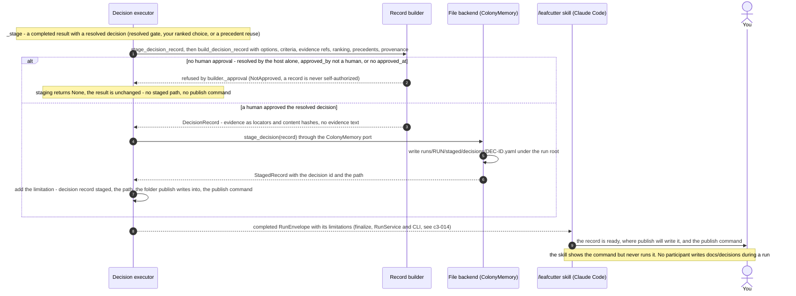

# Decision Record Staging — From the Decision Executor to the Staged Record and the Publish Notice

When a decision resolves, the kernel files what you approved as a record, but only inside the
run's own folder. This page shows that hand-off (DK-600c-1 to DK-600c-4). Publishing the record
into `docs/decisions/` is a separate command that a person runs
([Record publishing](c3-027-decision-kernel-flows-record-publishing.md)).

**Status: built on main.** [Request Flow 2](c3-014-decision-kernel-flows-request-handoff.md)
shows the run around this hand-off: finalize, the envelope and the skill. The
[learning loop](c3-020-decision-kernel-flows-learning-loop.md) shows where the record goes next.
This page draws only the staging messages.

Parent: [Decision Kernel and Colony Memory — Design Map](c2-007-decision-kernel-flows-overview.md)

See also: [Record publishing](c3-027-decision-kernel-flows-record-publishing.md) (the next step)
and [Record lifecycle](c3-028-decision-kernel-flows-record-lifecycle.md) (the record's states).

## Notes per step

Step numbers are the diagram's message numbers.

| Step | What the code does | Where |
|---|---|---|
| Note, 1 | `_stage` runs for every completed decision result. A resolved decision reaches it from the resolved gate (`_combine`), from your ranked choice (`_load`) or from a precedent reuse (`_reuse_precedent`) | `kernel/capabilities/decision/executor.py` |
| 2 | `_approval` refuses unless the decision is `resolved` with a selected option, `approval_status` is `approved`, `approved_by` is a human (`human` or `human:<id>`), and `approved_at` is set. An actor id naming a host, Jev, a service or a model is never treated as a human (`human_actor`). The refusal is logged at info level and never fails the decision | `kernel/memory/builder.py`, `kernel/memory/staging.py` |
| 3 | The record holds evidence as references (`evidence_ref`): id, locator, category, content hash, verification and source version. No evidence text is copied | `kernel/memory/builder.py` |
| 4–6 | `FileColonyMemory.stage_decision` writes under the run root, never under the repository. A write failure returns None and the decision still completes. With `memory.backend: null`, `NullColonyMemory` stages nothing | `kernel/memory/file_store.py`, `kernel/memory/port.py` |
| 7 | The limitation reads `decision record staged: <path>; publish writes it into <folder> (the kernel checkout); publish it for review with: <command>`. The command names the interpreter the kernel runs under and `scripts/run_kernel.py`, so it runs as printed from any shell | `kernel/capabilities/decision/publish_command.py` |
| 8–9 | The skill reports the completed run. When a limitation names a staged record, it tells you the record is ready and shows the command. It must not run it: `decisions publish` is yours to run | `kernel/adapters/claude_code/SKILL.md` |

The staged file sits at `<run_root>/runs/<run_id>/staged/decisions/<dec-id>.yaml`. The run root
defaults to `.leafcutter/kernel/`. Later runs look up precedent only through the published index
in `docs/decisions/`, so a record that stays staged is never found as precedent
([Record lifecycle](c3-028-decision-kernel-flows-record-lifecycle.md)).

## Legend

| Element | Meaning |
|---|---|
| `participant` | A part of the kernel or the client that takes part in staging |
| `actor` | You, the person who reads the notice |
| Solid arrow | A call or a message |
| Dashed arrow | A returned result |
| Self-arrow | Work done inside one participant |
| `alt` block | The two exclusive outcomes: refused, or staged |
| `autonumber` | The message numbers used in "Notes per step" |
| `Note` | What a participant decides, or a rule that holds on every path |

## Cross-Links

- Parent: [Decision Kernel and Colony Memory — Design Map](c2-007-decision-kernel-flows-overview.md)
- Containers: [Decision Kernel — Container Overview](../components/decision-kernel.md),
  [Colony Memory — Container Overview](../components/colony-memory.md)
- The run around it: [Request Flow 2](c3-014-decision-kernel-flows-request-handoff.md)
- Siblings: [Decision states](c3-025-decision-kernel-flows-decision-states.md),
  [Record publishing](c3-027-decision-kernel-flows-record-publishing.md),
  [Record lifecycle](c3-028-decision-kernel-flows-record-lifecycle.md)
- Decision: [ADR-060](../adrs/ADR-060-source-of-truth-and-approval-authority.md) (only a human
  approval creates a record; the kernel never writes the repository during a run)
- Product truth: [decision-staging flow](../../product-truth/flows/leafcutter/decision-staging.flow.json)
- Doing it: [How to file and reuse decisions with the kernel](../../how-to/file-and-reuse-decisions-with-the-kernel.md)

<!--
====================================================================
DECISION HISTORY
====================================================================
- 2026-10-10 [architecture-diagram-author, TICKET-20261010-DecisionLifecycleDocs]:
  Initial creation (DK-600c-5-ii). Scaffold-free pass authorised by the user
  in decision dec-b10271ebb40b9eaa (approved 2026-10-10, the standing pass
  for every blocked diagram until a scaffold exists). The scaffold
  scripts/scaffold/new_arch_doc.py that write-c4-diagram step 4 requires is
  missing from this repository, so the frontmatter and the Legend were
  authored by hand under that authorisation. The frontmatter takes the shape
  of the sibling L3 sequence diagram c3-014. The Legend has one entry per
  notation element used here. No skill text was edited.
====================================================================
-->
