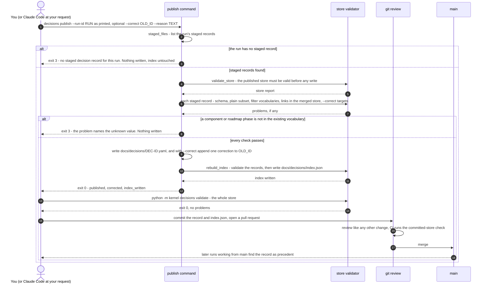

# Decision Record Publishing — From Your Publish Request Through Review to Merge

A staged record reaches the repository only when a person publishes it. This page shows that
path, from the publish command through git review to the merge (DK-600d-1 to DK-600d-4). The
record was staged as shown in [Record staging](c3-026-decision-kernel-flows-record-staging.md).

**Status: built on main.** The publish, validate and index commands are in
`kernel/memory/cli.py`. The [learning loop](c3-020-decision-kernel-flows-learning-loop.md) shows
publishing as one step. This page opens it up.

`publish` checks first and writes second (`kernel/memory/publish.py`). It refuses before writing
anything if the existing store is broken or any staged record fails a check. Exit code 3 means
"refused, with the problems listed" (`CLI_EXIT_CODES` in `kernel/service_errors.py`).

Parent: [Decision Kernel and Colony Memory — Design Map](c2-007-decision-kernel-flows-overview.md)

See also: [Record lifecycle](c3-028-decision-kernel-flows-record-lifecycle.md) (the record's
states, including a correction) and
[Precedent and reuse](c3-029-decision-kernel-flows-precedent-reuse.md) (how a merged record is
found again).

## Notes per step

Step numbers are the diagram's message numbers.

| Step | What the code does | Where |
|---|---|---|
| 1 | The staging notice prints the command, and it runs as printed from any shell. Claude Code runs it only when you ask: the `/leafcutter` skill shows it but never runs it on its own. The printed form calls `scripts/run_kernel.py` with the kernel's interpreter. `python -m kernel decisions publish` is the same command. `--run-id` is required. `--correct` can be repeated. `--reason` defaults to the note the new record keeps about the older one, or else a generated sentence | `kernel/memory/cli.py` (`add_parser`) |
| 2–3 | Problem text: `no staged decision record for this run`, reported against the run id. A run id that is not a plain identifier is refused the same way | `kernel/memory/publish.py` (`publish`) |
| 4–5 | Every problem in the existing store is reported as `store: ...`. Any such problem blocks the publication | `kernel/memory/validate.py` (`validate_store`) |
| 6–8 | Checked for each staged record: the JSON Schema `config/decision_record.schema.json`, the plain YAML subset, the filter values against the existing vocabularies (`components` from `docs/components.json`, `roadmap_phase` from `docs/roadmap.json`, `change_target` and `risk_surface` from `config/ac_store_schema.json`, rule-file globs), the links the record would have in the merged store, and each `--correct` target (it must be in the store, and a staged record must supersede it). An unknown value reads `<field> value '<value>' is not in the existing vocabulary`. Other refusals in this branch: a different record with the same id is already published, or a schema, link or correction problem | `kernel/memory/vocab.py` (`unknown`), `kernel/memory/publish.py` (`_load_staged`, `_correction_problems`) |
| 9 | Files are written atomically. A correction appends one entry to the older record's `corrections` and extends its `superseded_by`. Nothing else in it changes ([Record lifecycle](c3-028-decision-kernel-flows-record-lifecycle.md)) | `kernel/memory/publish.py` (`_write_all`, `apply_correction`) |
| 10–11 | The index is regenerated from the records and never hand-edited | `kernel/memory/publish.py` (`rebuild_index`) |
| 13–14 | `decisions validate` checks every record and that the index is up to date | `kernel/memory/cli.py` (`run_decisions`) |
| 15–17 | Git is the canonical store, so a record counts once it is merged. The test suite in CI runs the same validation over the committed `docs/decisions/` | `tests/kernel/memory/test_committed_store.py` |
| 18 | Precedent lookup reads `docs/decisions/index.json` of the checkout a run works in | `kernel/memory/file_store.py` (`find_decisions`) |

## Legend

| Element | Meaning |
|---|---|
| `actor` | You, or Claude Code when you ask it to publish |
| `participant` | A command or a system that takes part in publishing |
| Solid arrow | A command, a call or a hand-off |
| Dashed arrow | A returned result or exit code |
| Self-arrow | Work done inside one participant |
| `alt` block | Mutually exclusive outcomes. The two exit-3 stops end before any write |
| `autonumber` | The message numbers used in "Notes per step" |

## Cross-Links

- Parent: [Decision Kernel and Colony Memory — Design Map](c2-007-decision-kernel-flows-overview.md)
- Containers: [Decision Kernel — Container Overview](../components/decision-kernel.md),
  [Colony Memory — Container Overview](../components/colony-memory.md)
- The whole loop: [Learning loop](c3-020-decision-kernel-flows-learning-loop.md)
- Siblings: [Record staging](c3-026-decision-kernel-flows-record-staging.md),
  [Record lifecycle](c3-028-decision-kernel-flows-record-lifecycle.md)
- Decisions: [ADR-059](../adrs/ADR-059-decision-store-reviewable-yaml-records-now-graph-later.md),
  [ADR-060](../adrs/ADR-060-source-of-truth-and-approval-authority.md)
- CLI exit codes: [design part 5](../../analysis/2026-09-30-decision-kernel-design-5-client-observability.md)
- Product truth: [decision-publishing flow](../../product-truth/flows/leafcutter/decision-publishing.flow.json)
- Doing it: [How to file and reuse decisions with the kernel](../../how-to/file-and-reuse-decisions-with-the-kernel.md)

<!--
====================================================================
DECISION HISTORY
====================================================================
- 2026-10-10 [architecture-diagram-author, TICKET-20261010-DecisionLifecycleDocs]:
  Initial creation (DK-600d-5-ii). Scaffold-free pass authorised by the user
  in decision dec-b10271ebb40b9eaa (approved 2026-10-10, the standing pass
  for every blocked diagram until a scaffold exists). The scaffold
  scripts/scaffold/new_arch_doc.py that write-c4-diagram step 4 requires is
  missing from this repository, so the frontmatter and the Legend were
  authored by hand under that authorisation. The frontmatter takes the shape
  of the sibling L3 sequence diagram c3-014. The Legend has one entry per
  notation element used here. No skill text was edited.
====================================================================
-->
