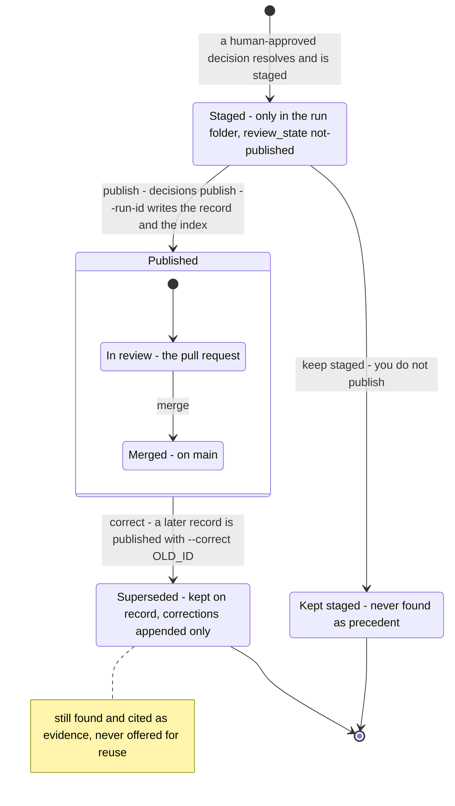

# Decision Record Lifecycle — Staged, Published, Kept Staged or Superseded

This page follows one decision record from the moment a run stages it (DK-600d-1, DK-600d-3,
DK-600d-4). [Record staging](c3-026-decision-kernel-flows-record-staging.md) and
[Record publishing](c3-027-decision-kernel-flows-record-publishing.md) show the messages behind
each transition.

**Status: built on main.** The states are the `lifecycle_stage` (`staged`, `published`,
`superseded`) and `review_state` (`not-published`, `in-review`, `merged`) values of the decision
dataset in `docs/product-truth/mock-data/leafcutter/decisions.mock.json`.

Parent: [Decision Kernel and Colony Memory — Design Map](c2-007-decision-kernel-flows-overview.md)

See also: [Record publishing](c3-027-decision-kernel-flows-record-publishing.md) and
[Precedent and reuse](c3-029-decision-kernel-flows-precedent-reuse.md) (how a published record is
found again).

## The states

| State | Where the record is | Found by a later run's precedent lookup? |
|---|---|---|
| Staged | `<run_root>/runs/<run_id>/staged/decisions/<dec-id>.yaml` only | No. The lookup reads only `docs/decisions/index.json` (`FileColonyMemory.find_decisions`) |
| Kept staged | The same file, because you chose not to publish | Never. Neither `docs/decisions/` nor its index holds the record (DK-600d-1-i) |
| Published: in review | `docs/decisions/<dec-id>.yaml` and `index.json` in the checkout where publish ran, then on the pull request branch | By runs on a checkout whose index holds it |
| Published: merged | The same files on main | By every later run working from main |
| Superseded | The same published file, with a `corrections` entry appended and its `superseded_by` extended | Yes. It is judged and can be cited as `prior_decisions` evidence, labelled superseded. It is never offered for reuse (DK-600e-3-iii) |

## The transitions

| Transition | What causes it | Where |
|---|---|---|
| → Staged | A resolved decision with a human approver and an approval time. Nothing else is staged ([c3-026](c3-026-decision-kernel-flows-record-staging.md)) | `kernel/memory/staging.py`, `kernel/memory/builder.py` |
| Staged → Kept staged | You do not run publish. Nothing records that choice: the file just stays in the run folder. Running publish for that run later still takes the publish transition | none (no command) |
| Staged → Published | `decisions publish --run-id RUN` validates, then writes the record and regenerates the index ([c3-027](c3-027-decision-kernel-flows-record-publishing.md)) | `kernel/memory/publish.py` (`publish`) |
| In review → Merged | Your pull request with the record and the index merges to main | git |
| Published → Superseded | A later decision that decided anew and chose a different option lists this record under `supersedes`. It is published with `--correct OLD_ID` (and a `--reason`). `apply_correction` appends one entry to `corrections`: the reason, `corrected_at`, `corrected_by`, `superseded_by`, the new selected option, and the preserved original choice, evidence ids and assumptions. It also extends `superseded_by`. No other field changes, and no earlier correction changes | `kernel/memory/publish.py` (`apply_correction`) |

**Superseded has no way out.** No command removes a correction or a `superseded_by` entry, and
`validate` checks that the links in both records agree. The record stays on file as history.

**What the index does without `--correct`.** The index derives each record's `superseded_by`
from its own list plus every other record's `supersedes` (`kernel/memory/index.py`). So once a
record that supersedes an older one is published, the lookup already treats the older one as
superseded, even without `--correct`. `--correct` is what writes the correction into the older
file itself. The run that decided anew does not yet print `--correct` in its publish command:
DK-600e-3-i is not built, so you add `--correct OLD_ID` yourself.

## Legend

| Element | Meaning |
|---|---|
| Rounded box | A state of the record, with where it is or how it is labelled |
| Box holding other boxes | The composite state Published, with its review states inside |
| Arrow with a label | A transition, labelled with the action that causes it |
| `[*]` at the start | The record comes into being, or the record enters Published |
| `[*]` at the end | An end state: nothing moves the record on from here |
| Note | A fact about a state that its label cannot hold |

## Cross-Links

- Parent: [Decision Kernel and Colony Memory — Design Map](c2-007-decision-kernel-flows-overview.md)
- Containers: [Decision Kernel — Container Overview](../components/decision-kernel.md),
  [Colony Memory — Container Overview](../components/colony-memory.md)
- Siblings: [Record staging](c3-026-decision-kernel-flows-record-staging.md),
  [Record publishing](c3-027-decision-kernel-flows-record-publishing.md),
  [Precedent and reuse](c3-029-decision-kernel-flows-precedent-reuse.md)
- The whole loop: [Learning loop](c3-020-decision-kernel-flows-learning-loop.md)
- Decision: [ADR-060](../adrs/ADR-060-source-of-truth-and-approval-authority.md) (append-only corrections)
- Product truth: [decision-publishing flow](../../product-truth/flows/leafcutter/decision-publishing.flow.json),
  [decision dataset](../../product-truth/mock-data/leafcutter/decisions.mock.json)
- Doing it: [How to file and reuse decisions with the kernel](../../how-to/file-and-reuse-decisions-with-the-kernel.md)

<!--
====================================================================
DECISION HISTORY
====================================================================
- 2026-10-10 [architecture-diagram-author, TICKET-20261010-DecisionLifecycleDocs]:
  Initial creation (DK-600d-5-iii). Scaffold-free pass authorised by the user
  in decision dec-b10271ebb40b9eaa (approved 2026-10-10, the standing pass
  for every blocked diagram until a scaffold exists). The scaffold
  scripts/scaffold/new_arch_doc.py that write-c4-diagram step 4 requires is
  missing from this repository, so the frontmatter and the Legend were
  authored by hand under that authorisation. The frontmatter takes the shape
  of the sibling L3 state diagram c3-015. The Legend has one entry per
  notation element used here. No skill text was edited. Superseded is drawn
  as found and cited as evidence, never offered for reuse (DK-600e-3-iii),
  as the AC requires. DK-600e-3-i (the run's publish command carrying
  --correct) is stated as not built: its branch had no commits beyond main on
  2026-10-10.
====================================================================
-->
