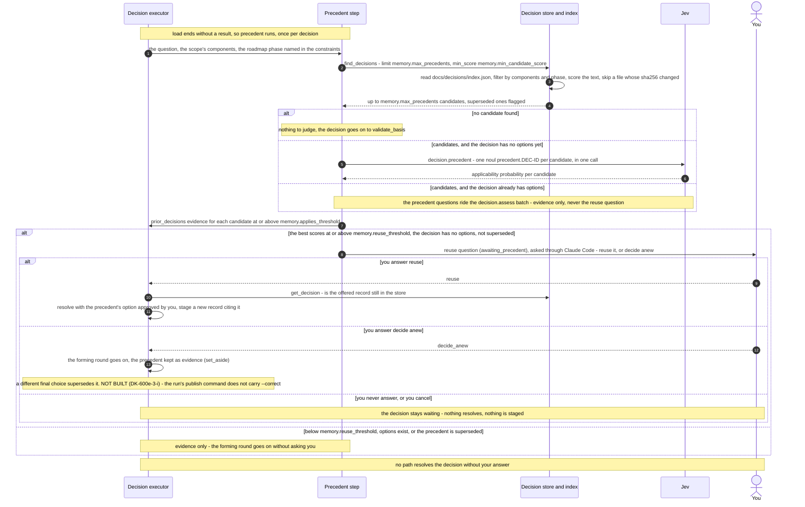

# Decision Precedent and Reuse — From the Lookup to Your Reuse Answer

Every decision first checks whether an earlier published decision already answers it. This page
shows that precedent step, from the lookup to your answer when the kernel offers to reuse an
earlier choice (DK-600e-1 to DK-600e-4).

**Status: built on main**, except for one part of deciding anew, marked "not built" below
(DK-600e-3-i). [Request Flow 1](c3-013-decision-kernel-flows-request-native.md) shows where the
step sits in a run. The [learning loop](c3-020-decision-kernel-flows-learning-loop.md) shows how
records reach the store. This page draws the step itself.

The thresholds are configuration keys under `memory` in `config/kernel_config.default.json`,
validated by `kernel/config_memory.py`. `memory.reuse_threshold` may not be below
`memory.applies_threshold`. This page names them by key; the shipped values are in that file.

Parent: [Decision Kernel and Colony Memory — Design Map](c2-007-decision-kernel-flows-overview.md)

See also: [Decision forming round](c3-024-decision-kernel-flows-forming-round.md) (where deciding
anew continues), [Record staging](c3-026-decision-kernel-flows-record-staging.md) (the new record
a reuse stages) and [Record lifecycle](c3-028-decision-kernel-flows-record-lifecycle.md) (what
superseded means).

## Notes per step

Step numbers are the diagram's message numbers.

| Step | What the code does | Where |
|---|---|---|
| 1 | The query holds the decision question, the scope's component ids and any roadmap phase named in a `[severity] roadmap_phase: <id>` constraint. The step runs once (`precedent_checked`). With `memory.max_precedents` below 1, or `memory.backend: null`, no candidate is ever found | `kernel/memory/precedent.py` (`precedent_query`, `find_precedents`) |
| 2–4 | The file backend reads only the published index. A staged record is never in it. Candidates must pass the filters and reach `memory.min_candidate_score` on content-word overlap. A file whose sha256 no longer matches the index is skipped with a warning. A record counts as superseded when its own `superseded_by` or any other record's `supersedes` names a later record | `kernel/memory/file_store.py` (`find_decisions`), `kernel/memory/index.py` |
| 5–6 | One `noul` question per candidate. Jev sees a short summary of the earlier record, never its evidence text. If the Jev budget is already exhausted, the precedent is skipped with the limitation "precedent was not judged: the Jev call budget is exhausted" | `kernel/memory/precedent.py` (`precedent_questions`, `summary`), `kernel/capabilities/decision/executor.py` (`_precedent`) |
| 7 | `judge` keeps each candidate at or above `memory.applies_threshold` as `prior_decisions` evidence, with source `memory.decisions`, the record path as locator, and the approver and date in the title. A candidate below it is noted `not_applicable` and left out. The event `decision.precedent` records ids and scores, never text | `kernel/memory/precedent.py` (`judge`, `precedent_evidence`); `_apply_precedents` |
| 8 | Only the highest-scoring candidate is offered. The question reads "Decision <id> (approved by <approver> on <date>) chose <title> for a matching question. Reuse it, or decide anew?" | `kernel/memory/precedent.py` (`confirm_text`, `confirm_choices`) |
| 9–11 | Reusing is an approval by you, so your answer stamps `approved_by` and `approved_at`. If the offered record has left the store, the decision decides anew with a limitation instead. The new record has assessment basis `precedent_reuse` and notes the precedent as `reused` | `kernel/capabilities/decision/approvals.py` (`_apply_precedent_choice`), `kernel/capabilities/decision/executor.py` (`_reuse_precedent`) |
| 12–13 | Deciding anew continues the forming round from grounding ([c3-024](c3-024-decision-kernel-flows-forming-round.md)). If your final choice is a different option (compared by title), the staged record lists the precedent under `supersedes`. The run never edits the older record. To append the correction to it, you publish with `--correct <old id>` yourself ([c3-028](c3-028-decision-kernel-flows-record-lifecycle.md)) | `kernel/memory/precedent.py` (`final_links`) |

Precedent is evidence, never authority. It never changes routing scores or thresholds (ADR-060
§4, ADR-059 §5). A reuse resolves only on your answer, and a decision that decides anew resolves
only on your answer to the ranked question
([Decision states](c3-025-decision-kernel-flows-decision-states.md)).

## Legend

| Element | Meaning |
|---|---|
| `participant` | A part of the kernel that takes part in the precedent step |
| `actor` | You, the person who answers the reuse question |
| Solid arrow | A call, a question or a hand-over of evidence |
| Dashed arrow | A returned result or your answer |
| Self-arrow | Work done inside one participant |
| `alt` block | Mutually exclusive branches. Nested blocks are the outcomes inside one branch |
| `Note` | What a participant decides, a part marked NOT BUILT, or a rule that holds on every path |
| `autonumber` | The message numbers used in "Notes per step" |

## Cross-Links

- Parent: [Decision Kernel and Colony Memory — Design Map](c2-007-decision-kernel-flows-overview.md)
- Containers: [Decision Kernel — Container Overview](../components/decision-kernel.md),
  [Colony Memory — Container Overview](../components/colony-memory.md)
- Where it sits in a run: [Request Flow 1](c3-013-decision-kernel-flows-request-native.md)
- The whole loop: [Learning loop](c3-020-decision-kernel-flows-learning-loop.md)
- Siblings: [Decision forming round](c3-024-decision-kernel-flows-forming-round.md),
  [Decision states](c3-025-decision-kernel-flows-decision-states.md),
  [Record staging](c3-026-decision-kernel-flows-record-staging.md),
  [Record lifecycle](c3-028-decision-kernel-flows-record-lifecycle.md)
- Decisions: [ADR-059](../adrs/ADR-059-decision-store-reviewable-yaml-records-now-graph-later.md),
  [ADR-060](../adrs/ADR-060-source-of-truth-and-approval-authority.md)
- Product truth: [decision-retrieval flow](../../product-truth/flows/leafcutter/decision-retrieval.flow.json)
- Doing it: [How to file and reuse decisions with the kernel](../../how-to/file-and-reuse-decisions-with-the-kernel.md)

<!--
====================================================================
DECISION HISTORY
====================================================================
- 2026-10-10 [architecture-diagram-author, TICKET-20261010-DecisionLifecycleDocs]:
  Initial creation (DK-600e-5). Scaffold-free pass authorised by the user in
  decision dec-b10271ebb40b9eaa (approved 2026-10-10, the standing pass for
  every blocked diagram until a scaffold exists). The scaffold
  scripts/scaffold/new_arch_doc.py that write-c4-diagram step 4 requires is
  missing from this repository, so the frontmatter and the Legend were
  authored by hand under that authorisation. The frontmatter takes the shape
  of the sibling L3 sequence diagram c3-014. The Legend has one entry per
  notation element used here. No skill text was edited. Thresholds are named
  by configuration key, not by number. DK-600e-3-i (the run's publish
  command carrying --correct) is drawn as not built: its branch had no
  commits beyond main on 2026-10-10.
====================================================================
-->
