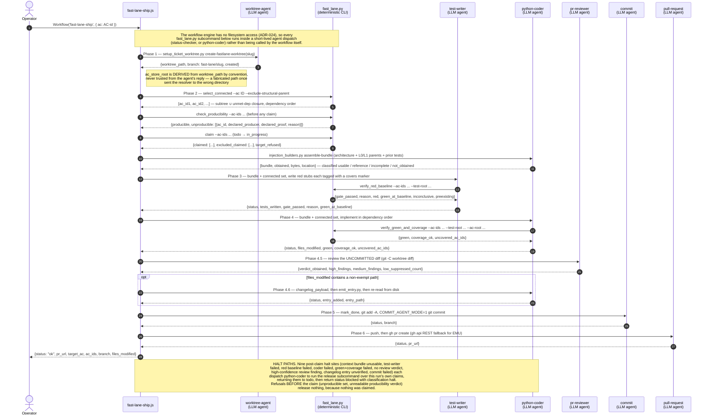

# Fast-Lane Build Loop — Sequence Diagram

This diagram documents the ordered message flow of the fast lane as implemented in
`templates/workflows-js/fast-lane-ship.js` and its deterministic Python gate
functions in `scripts/build_orchestration/fast_lane.py`. One AC id goes in; an open
pull request comes out.

> **The two-agent loop is the *inner* loop, not the lane.** `test-writer` and
> `python-coder` each receive the whole connected build set in a single flat
> dispatch, and that inner loop is invariant in the size of the set. But the lane
> around it contains **20 `agent()` call sites** — 11 on the happy path (worktree,
> resolve, producibility, claim, context bundle, test-writer, coder, review,
> changelog, commit, pull-request) and 9 `release`-on-failure dispatches. Reading
> "two dispatches" as a description of the whole lane is the single most common way
> to misread this file.
>
> What the lane genuinely does **not** have is a supervisor chain or an LLM planner
> — the phase order is fixed and code-defined (BO-2400a-5). What it **does** have,
> contrary to earlier revisions of this document, is per-run worktree isolation
> (BO-2400f-3) and an LLM code review before commit (BO-2400f-11).

---

Parent: [Build Orchestration — Epic & Ticket Dispatch Sequencing](../components/build-orchestration.md)

See also: [Interactive Pause/Resume — Pause, Ask, Answer, Resume Sequence](c3-002-interactive-pause-resume-sequence.md) — the companion sequence diagram for the pause/resume substrate in the same build orchestration component.

---

## Gate Summary

| Gate | Runs | Pass Condition | Halt Condition |
|------|------|----------------|----------------|
| `select_connected` | After the worktree exists, before anything is claimed | Returns the connected build set — `subtree(ac_id) ∪ transitive unmet depends_on closure` — in dependency order, readiness-agnostic. An **empty** list is a clean no-op (`nothing_to_build: true`), not a failure | An empty list accompanied by a diagnostic (`not found`, `no such`, `traceback`, …) is treated as a **resolution failure**, not an empty set — a stale worktree returning the wrong AC store path once made every id "not found" and was silently reported as nothing to build |
| `check_producibility` | On every non-empty set, before any claim or build dispatch | `producible: true` | Any member declares a deliverable or proof no phase in this roster produces → `status: "refused"`. Fail-closed: a missing or non-boolean `producible` key also refuses. Nothing is released, because nothing was claimed yet |
| `claim` | Immediately after the producibility guard | Returns the ids this run flipped `todo → in_progress` | `target_refused: true` → a concurrent fast-lane run owns the set; this run halts and touches no claims |
| `verify_red_baseline` | After test-writer, before coder | At least one **newly-added** covering test is red — `FAILED` or `XFAIL` (`gate_passed == True`). Newly-added tests that are green are reported as `green_at_baseline` (non-fatal); pre-existing tests are reported but never affect the verdict | No newly-added covering test is red — coder is NOT dispatched. The halt carries exactly one named `reason`: `no_new_covering_tests`, `all_new_tests_green_at_baseline`, `no_red_outcome_among_new_tests`, or `baseline_partition_unavailable` (fail-closed when the git partition is unresolvable) |
| `verify_green_and_coverage` | After coder, before review and commit | All tagged tests PASS **and** every AC id has ≥1 covering test | Either condition fails — nothing is committed and no PR is opened |
| `pr-reviewer` (LLM, not a script) | Phase 4.5 — after the green gate, **before** commit | `verdict_obtained: true` with an empty `high_findings` list | Any high-confidence finding halts the run. Fail-closed: `verdict_obtained` is the only positive signal, so a missing key, a null, or an unparseable reply halts too — an unread review is never a clean pass. A generic `passed: true` is deliberately **not** accepted |
| `changelog` (conditional) | Phase 4.6 — only when `files_modified` contains a path outside `changelogs/`, `tickets/`, `docs/acceptance-criteria/`, `docs/known-issues/` | `status: "ok"` **and** `entry_added: true`, where `entry_added` comes from an independent re-read of the working tree rather than the emitter's own report | `changelog_emit_failed` (the emit errored) or `changelog_entry_absent_from_change` (reported ok, but no entry on disk). Either halts before the PR — a PR without an entry cannot pass the required "Changelog entry present" CI check |
| `mark_done` | Phase 5, first step of the commit agent | `all_done: true` | A stale id aborts the commit; the run then releases every claim, including ACs `mark_done` had already flipped to done |

## Actors

| Actor | Type | Description |
|-------|------|-------------|
| Operator | Human / orchestrator | Invokes the workflow with a **single AC id** — `Workflow("fast-lane-ship", { ac: "<AC-id>" })`. No other input; `/fast-lane-build` is a thin command shim over this workflow |
| `fast-lane-ship.js` | Workflow (E2 top-level body) | Orchestrates the full arc; holds no LLM state between phases. The inner build loop is inlined rather than a nested workflow, because E2 is leaf-invariant — a workflow cannot call `workflow()` |
| `worktree-agent` | LLM agent — Phase 1 | Runs `create-fastlane-worktree` to cut a fresh, bootstrapped worktree on `fast-lane/<slug>` off the latest `origin/main` |
| `fast_lane.py` | Deterministic CLI | One script behind every mechanical gate in the lane: `select_connected`, `check_producibility`, `claim`, `release`, `verify_red_baseline`, `verify_green_and_coverage`, `changelog_payload`, `mark_done`. Invoked as single Bash calls whose JSON the workflow branches on. `select_batch` is also still present in this script, but **no lane invokes it** — its only caller was the orphaned runner deleted under BO-2400c-1-v |
| `test-writer` | LLM agent | Writes failing test stubs for the whole connected set in one flat dispatch, then runs the red-baseline gate and reports its real output |
| `verify_red_baseline` | Python gate (BO-2400a-3) | Deterministic: partitions covering tests into newly-added vs pre-existing via git, then confirms at least one newly-added test is red before coder is dispatched. Requiring *every* covering test to be red made partially-implemented ACs unbuildable, so the rule was amended to one-red-is-enough (BO-2400a-3-v) |
| `python-coder` | LLM agent — four distinct roles | The single busiest agent type in the lane. It assembles the context bundle, implements production code for the whole set in one flat dispatch, emits the changelog entry, and executes all nine `release` rollbacks. It is reused for `release` because that dispatch must run a shell command, and `status-checker`'s registry entry declares `permits_shell: false` |
| `verify_green_and_coverage` | Python gate (BO-2400a-4) | Deterministic: confirms all scoped tests pass and every AC id has ≥1 covering test |
| `pr-reviewer` | LLM agent — Phase 4.5 | Reviews the run's own uncommitted `git diff`. Runs before commit so a finding is a correction to the change about to be delivered, not a follow-up stacked on a defect already in the delivered history |
| `commit` | LLM agent — Phase 5 | Marks the built ACs done, stages, and commits on the worktree branch. Pre-authorized — it does not ask for a second confirmation, because pointing at the AC was the authorization |
| `pull-request` | LLM agent — Phase 6 | Pushes the branch and opens the PR against `main`, with a `gh api` REST fallback when the GraphQL path is EMU-blocked |

## Key Property

The **mechanical gates cannot be persuaded**. `verify_red_baseline` and
`verify_green_and_coverage` are deterministic Python invoked via Bash; the workflow
branches on their real JSON output, and every one of those branches is written to
fail closed, so a missing key or an unparseable reply halts exactly like an explicit
failure. The same fail-closed discipline is applied to the two LLM judgments the lane
does make — the producibility verdict and the review verdict — precisely because they
are LLM judgments.

What distinguishes the fast lane from the standard build path (`build-feature.js`) is
therefore **not** the absence of LLM review. It is the absence of the supervisor chain
and the planner: the phase order is fixed in code, the whole connected set moves
through one flat test-writer/coder pair rather than a per-ticket supervisor each, and
the AC lifecycle (`claim` → build → `mark_done`, or `release` on any halt) is managed
by the lane itself.

## Cross-References

- [Build Orchestration — Epic & Ticket Dispatch Sequencing](../components/build-orchestration.md) — the component that owns `fast-lane-ship.js` and `scripts/build_orchestration/fast_lane.py`.
- [Interactive Pause/Resume — Pause, Ask, Answer, Resume Sequence](c3-002-interactive-pause-resume-sequence.md) — companion sequence diagram for the pause/resume substrate in the same component.
- [Interactive Pause/Resume — Run Lifecycle State Diagram](c3-001-interactive-pause-resume-run-lifecycle.md) — run lifecycle states for the pause/resume mechanism.

<!--
====================================================================
DECISION HISTORY
====================================================================
- 2026-09-01 [architecture-diagram-author]: Re-pointed from the orphaned second
  fast-lane runner (deleted under AC BO-2400c-1-v) to
  `templates/workflows-js/fast-lane-ship.js`.
  The divergence was far larger than the filename: the orphaned runner had 2 agent()
  dispatches and terminated at commit staging, while the live lane has 20 call sites
  and terminates at an open PR. Participants added: worktree-agent, pr-reviewer,
  commit, pull-request. `select_batch` replaced by `select_connected`. The three
  separate gate participants were collapsed into a single `fast_lane.py` participant,
  which is what they actually are — one script with eight subcommands — to keep the
  diagram legible after the phase count roughly tripled. The "exactly 2 LLM dispatches"
  claim was scoped down to the inner build loop, where it is still true, rather than
  deleted outright.
====================================================================
-->
