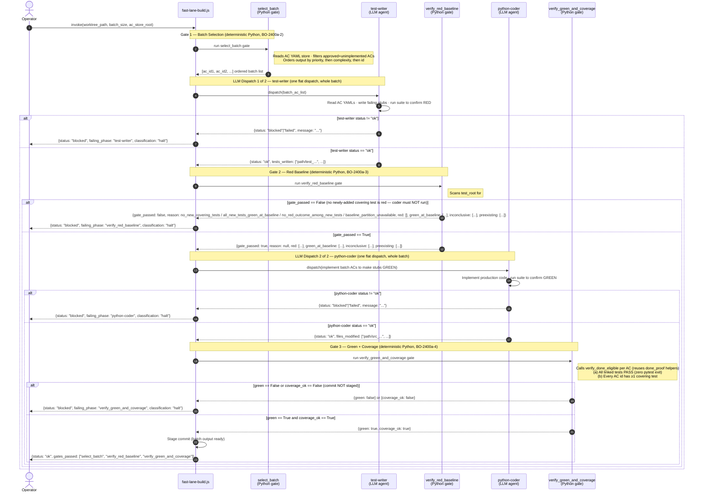

# Fast-Lane Build Loop — Sequence Diagram

This diagram documents the ordered message flow of the fast-lane build loop as
implemented in `templates/workflows-js/fast-lane-build.js` and its deterministic
Python gate functions in `scripts/build_orchestration/fast_lane.py`. The loop
dispatches exactly two LLM agents — one `test-writer` and one `python-coder` —
regardless of the batch size `N`, with three deterministic Python gates enforcing
correctness at each transition (BO-2400a-2, BO-2400a-3, BO-2400a-4).

> **Exactly 2 LLM dispatches.** The `test-writer` and `python-coder` each receive
> the full AC batch in a single flat dispatch — the invocation count is fixed at 2,
> independent of `N` (BO-2400a-1). No supervisor chain, no LLM planner, no per-ticket
> worktrees (BO-2400a-5). The gates are deterministic Python scripts, not LLM judgments.

---

Parent: [Build Orchestration — Epic & Ticket Dispatch Sequencing](../components/build-orchestration.md)

See also: [Interactive Pause/Resume — Pause, Ask, Answer, Resume Sequence](c3-002-interactive-pause-resume-sequence.md) — the companion sequence diagram for the pause/resume substrate in the same build orchestration component.

---

## Gate Summary

| Gate | Runs | Pass Condition | Halt Condition |
|------|------|----------------|----------------|
| `select_batch` | Before test-writer | Returns a non-empty ordered AC id list | Argument validation fails (`worktree_path` absent) |
| `verify_red_baseline` | After test-writer, before coder | At least one **newly-added** covering test is red — `FAILED` or `XFAIL` (`gate_passed == True`). Newly-added tests that are green are reported as `green_at_baseline` (non-fatal); pre-existing tests are reported but never affect the verdict | No newly-added covering test is red — coder is NOT dispatched. The halt carries exactly one named `reason`: `no_new_covering_tests`, `all_new_tests_green_at_baseline`, `no_red_outcome_among_new_tests`, or `baseline_partition_unavailable` (fail-closed when the git partition is unresolvable) |
| `verify_green_and_coverage` | After coder, before commit staging | All tagged tests PASS **and** every AC id has ≥1 covering test | Either condition fails — commit is NOT staged |

## Actors

| Actor | Type | Description |
|-------|------|-------------|
| Operator | Human / orchestrator | Invokes the workflow with `worktree_path`, `batch_size`, and `ac_store_root` |
| `fast-lane-build.js` | Workflow (E2 top-level body) | Orchestrates the two-dispatch sequence; holds no LLM state between gates |
| `select_batch` | Python gate (BO-2400a-2) | Deterministic: reads AC YAML store, filters approved+unimplemented, orders batch — no LLM |
| `test-writer` | LLM agent — dispatch 1 of 2 | Writes failing test stubs for the whole batch in one flat dispatch |
| `verify_red_baseline` | Python gate (BO-2400a-3) | Deterministic: partitions covering tests into newly-added vs pre-existing via git, then confirms at least one newly-added test is red before coder is dispatched. Requiring *every* covering test to be red made partially-implemented ACs unbuildable, so the rule was amended to one-red-is-enough (BO-2400a-3-v) |
| `python-coder` | LLM agent — dispatch 2 of 2 | Implements production code for the whole batch in one flat dispatch |
| `verify_green_and_coverage` | Python gate (BO-2400a-4) | Deterministic: confirms all batch tests pass and every AC id has ≥1 covering test |

## Key Property

The fast lane uses **exactly 2 LLM dispatches** regardless of batch size `N`. The
three gates (`select_batch`, `verify_red_baseline`, `verify_green_and_coverage`) are
deterministic Python scripts invoked via Bash — they do not consume LLM tokens and
cannot be "persuaded". This is the defining constraint of the fast lane over the
standard build path (`build-feature.js`), which dispatches one supervisor and one coder
per ticket.

## Cross-References

- [Build Orchestration — Epic & Ticket Dispatch Sequencing](../components/build-orchestration.md) — the component that owns `fast-lane-build.js` and `scripts/build_orchestration/fast_lane.py`.
- [Interactive Pause/Resume — Pause, Ask, Answer, Resume Sequence](c3-002-interactive-pause-resume-sequence.md) — companion sequence diagram for the pause/resume substrate in the same component.
- [Interactive Pause/Resume — Run Lifecycle State Diagram](c3-001-interactive-pause-resume-run-lifecycle.md) — run lifecycle states for the pause/resume mechanism.
