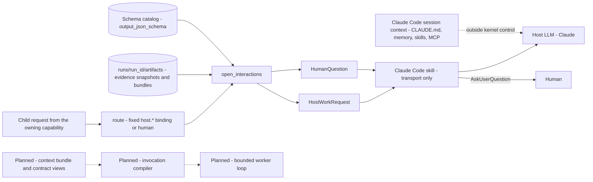

# Decision Kernel Context — Invocation Compiler and Host LLM, Bounded Worker Loop, Human

These three consumers sit outside the kernel process. In V0 they receive a persisted packet
through the `RunEnvelope`: a `HostWorkRequest` for the host LLM, a `HumanQuestion` for the human.
The bounded worker loop and the invocation compiler are planned. This page lists what each
packet holds and where each field comes from.

Parent: [Decision Kernel and Colony Memory — Design Map](decision-kernel-flows-overview.md)

See also: [Request Flow 2 — Handoff, Resume and Finalize](decision-kernel-flows-request-handoff.md).

## Host LLM and the invocation compiler

| Context piece | Exact source | Assembled by | Available from |
|---|---|---|---|
| Operation and goal | The child request a capability proposed: `options_request.v1`, `synthesis_request.v1`, `retrieval_request.v1` (for `host.research`) or `human_question_request.v1` (for `host.formulate_question`) | `open_interactions` (P4 basic, P6); host descriptors (P8) | V0 |
| Input artifacts | `input_artifact_refs`: absolute paths inside `runs/<run_id>/artifacts/` (evidence snapshots, bundles) | `open_interactions`, which also writes the packet to `runs/<run_id>/interactions/<id>.json` | V0 |
| Input evidence | `input_evidence_ids` | `open_interactions` | V0 |
| Allowed operations | Per host capability: `generate_options` → read_supplied_artifacts, propose_options; `synthesize_evidence` → read_supplied_artifacts, synthesize; `bounded_research` → read_supplied_artifacts, read_repo_paths, web_fetch; `formulate_question` → read_supplied_artifacts | Host descriptors (design part 4) | V0 |
| Forbidden operations | For every host operation: `edit_repository`, `approve_policy`, `change_permissions`, `choose_next_step`, `run_other_leafcutter_commands` | Host descriptors | V0 |
| Output contract | `output_schema_id` and the inline `output_json_schema` from the schema catalog. Registered ids only; free-form schemas from models are not accepted (design part 1, deviation 5) | `open_interactions` | V0 |
| Context limit | `host.max_input_chars` 60000 → `context_limits` | `open_interactions` | V0 |
| Repair feedback | `rejections`, `attempt`, and `error.details` of a rejected submission | Resume path | V0 |
| Transport instructions | The skill body: perform only the operation, read only listed artifacts, never choose the next step, edit files, approve or answer for the user (design part 5) | `kernel/adapters/claude_code/SKILL.md`, installed by the user | V0, phase P7 (not built yet) |
| Ambient session context | `CLAUDE.md`, auto-memory, loaded skills, MCP prompts, the conversation: the legacy knowledge plane | The Claude Code harness, not the kernel | V0, uncontrolled (spec §2.3, §11.5). A clean per-task context comes with Stage 5 executors (spec §20). OP-12 |
| Compiled model instructions | Capability definition, component policies, the original task and clarified requirements, retrieved evidence, approved decisions, output contract (ADR-052 §3) | Invocation compiler: deterministic code, never an LLM | Planned; where it lives is open (OP-08) |
| Version record per invocation | Policy, evidence and template versions (ADR-052 §9) | Tracer | Partly V0: Jev template ids, versions and input fingerprints are traced. Policy, template and model version fields next to `CorrelationIds` are an ADR-056 §9 recommendation to the V0 build |

Host output is host-reported. Kernel validation checks its structure and references, not its
truth (spec §7.11, §11.5).

## Bounded worker loop (for example coding) — planned

V0 builds no worker loop: automatic application-code modification is excluded from the MVP
(spec §4.3), and every host operation forbids `edit_repository`.

| Context piece | Exact source | Assembled by | Available from |
|---|---|---|---|
| Operation, task, approved decisions, relevant evidence, constraints, expected output (for example "a patch proposal and any unresolved implementation questions") | ADR-052 §3 | Invocation compiler | Planned |
| `ContextBundle`: task intent, glossary and component references, selected evidence, ACs and decisions, constraints, contradictions, likely read and write locations, related tests and interfaces, explicit omissions | Spec §17.5 | Context compiler | Stage 2 |
| Coding view: intended behaviour, decisions, architecture constraints, relevant code, permitted change scope | Shared implementation contract (spec §18.3) | Contract compilation | Stage 3 |
| Testing view: AC-to-test mapping, invariants, negative cases, concurrency and failure scenarios, affected interfaces | Spec §18.3 | Contract compilation | Stage 3 |
| Component policies: context rules before planning, verification rules after; recompiled against the actually changed files | Spec §18.4–§18.5 | Policy compilation | Stage 3 |
| Readiness gate: mandatory decisions resolved, approvals recorded, evidence current, no blocking contradiction, valid contract | Spec §18.2 | Readiness gate | Stage 3 |
| Executor: a coding agent with tools, a workspace, permissions and execution control | Spec §20 | Direct executor | Stage 5 (OP-10) |

The loop itself (ADR-052 §7): inspect the supplied code, propose a patch, run permitted tests,
inspect failures, revise. It runs inside a bounded contract. A missing requirement comes back as
a request, never as a silent contract change. ADR-052 §5 sketches post-checks for it
(ILLUSTRATIVE): `changes_within_authorized_scope` (deterministic), `required_tests_pass`
(test_runner), `documentation_impact` (jev).

## Human interactions

| Context piece | Exact source | Assembled by | Available from |
|---|---|---|---|
| Why a question exists | Decision `needs_human` (preference, tie, approval); approval of LLM-proposed criteria; clarification after routing returned `insufficient_context` (`routing.on_insufficient_context` "human") | Capability proposal, or `route` | V0 |
| Question wording | Template wording, or `host.formulate_question` output when `host.formulate_questions` is true (default false) | `open_interactions` | V0 |
| Choices with consequences, `free_text_allowed`, `why_research_cannot_settle`, `decision_id` | `human_question_request.v1` payload | `HumanQuestion` | V0 |
| Relevant evidence | `relevant_evidence_ids` from the decision | `HumanQuestion` | V0 |
| Proposed criteria to approve or edit | `proposed_criteria` from `host.generate_options` | `validate_basis` | V0 (edit handling: OP-04) |
| Presentation | The skill asks through AskUserQuestion with question, choices and consequences; free text only if allowed | Skill (P7) | V0 |
| Actor rule | `required_actor_kind="human"`; the submission needs `actor.kind="human"` and records `relayed_by="claude_code"` | Resume validation | V0 |
| After the answer | `Evidence` with category `task_context`, semantic type `human_input`, actor provenance | `await_interaction` | V0 |

The human also appears in the learning layer, all later: setting backlog priority from
capability-gap statistics, where Jev may only propose a ranking (ADR-056 §6); reviewing every
learned change before activation (ADR-056 §3 rule 5); and human-review scores in Langfuse
(ADR-058 §3, decided but not scheduled).

Open points for this page: OP-04, OP-08, OP-10, OP-12 in [open points](decision-kernel-flows-open-points.md).

## Legend

| Element | Meaning |
|---|---|
| Solid arrow | A V0 path |
| Dotted arrow, "outside kernel control" | Context that reaches the host LLM in V0 but that the kernel neither sets nor records |
| Other dotted arrows | Planned paths |
| Cylinder | Run artifacts or the schema catalog |

## Cross-Links

- Parent: [Design Map](decision-kernel-flows-overview.md)
- Sibling pages: [Context map](decision-kernel-context-map.md), [Request Flow 2](decision-kernel-flows-request-handoff.md)
- Host operations: [design part 4](../../analysis/2026-09-30-decision-kernel-design-4-jev-and-capabilities.md)
- Skill and envelope: [design part 5](../../analysis/2026-09-30-decision-kernel-design-5-client-observability.md)
- Later-stage contracts: [spec §17–§20](../../analysis/2026-09-30-leafcutter-kernel-spec-rev3-7-later-stages.md)
