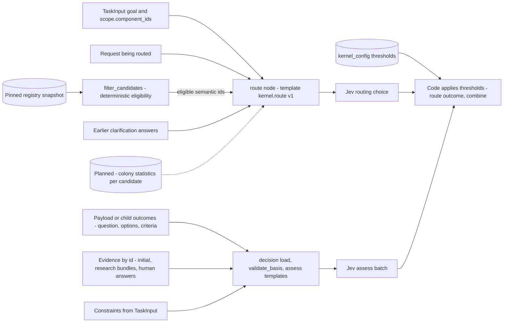

# Decision Kernel Context — The Routing and Decision Jev Calls

Jev answers typed questions about a supplied state. It never invents options, criteria or
questions (ADR-053 §2). So everything Jev knows in a call is exactly what kernel code puts into
the state and the question templates. This page lists that content for the two Jev consumers in
the request flow. The research capability's Jev calls are on the
[research page](decision-kernel-context-research.md).

Parent: [Decision Kernel and Colony Memory — Design Map](decision-kernel-flows-overview.md)

See also: [Context map](decision-kernel-context-map.md).

## Routing Jev call

**When Jev is called at all.** Only for items that need semantic routing: a request of kind
`capability` (the root goal and free-form requests) or a request with more than one eligible
candidate. All other items bind deterministically. As built, a `research_request.v1` child binds
to `research`, and retrieval children bind by `operation` (design parts 2 and 3). One batched
call covers all such items in a superstep.

| Context piece | Exact source | Assembled by | Available from |
|---|---|---|---|
| Task goal | `TaskInput.goal`. The skill writes the user's words verbatim; `Task.original_goal` is never rewritten | `intake`, then the routing template | V0 |
| Component ids | `TaskInput.scope.component_ids`, validated against `docs/components.json` | `intake`, routing template | V0 |
| The request being routed | The root `Request` (`goal_request.v1`, or the caller's `input_payload`) or a child request a capability proposed. Design: `kind, goal, question, payload_summary`. P4 code: `kind, goal, question, payload_schema, payload_keys`, batched under `requests.<work_item_id>` (OP-01) | Routing template | V0 |
| Choices | The `description` of each eligible descriptor with `routing: semantic` in `config/capability_registry.json`, taken from the snapshot pinned at intake. The description is "the trusted Jev routing criterion text" (at most 400 characters). V0 semantic entries: `decision`, `research` | `filter_candidates`, then the routing template | V0 |
| Sentinel choices | `__NONE__` (becomes `no_match`) and `__NEEDS_CONTEXT__` (becomes `insufficient_context`) | Routing template `kernel.route`, version 1 | V0 |
| Clarifications | Human answers (`free_text` or `choice_id`) to an earlier `insufficient_context` clarification | `route` node, P4 code in `nodes_route.py`; not in the design text (OP-02) | V0 (code) |
| Colony statistics per candidate. ILLUSTRATIVE: success for similar requests, average cost, average latency | Colony memory store through the `ColonyMemory` port (`capability_stats`, `path_stats`), scoped by capability, task_type, component, repository and policy_version | Not designed. The kernel reads compact statistics only (ADR-057 §5) | Later: ADR-057 INFLUENCE ROUTING, only after calibration and held-out evaluation (ADR-056 §9 "4 or later"). OP-03 |

**Kept away from Jev.**

| Input | Source | Used by | Available from |
|---|---|---|---|
| Eligibility: 10 ordered exclusion checks with reason codes (disabled, unavailable, binding missing, kind, payload schema, output schema, scope, permission, side effect, budget) | Registry snapshot, `BindingTable`, run permissions, budgets, configuration | `filter_candidates` (`kernel/registry/eligibility.py`) | V0 |
| Thresholds: `min_selected_probability` 0.8, `min_confidence` 0.5, `on_insufficient_context` "human" | `config/kernel_config.default.json` → `routing` | `route` | V0 |
| Secret masking of the state | `kernel/observability/redaction.py` | Before sending | V0 |

Never offered: `fixed` descriptors, legacy registry entries (ADR-055) and raw Langfuse data
(ADR-056 §8). Colony statistics MUST NOT override the eligibility exclusions (ADR-057 §5).

## Decision Jev calls (`assess`)

`validate_basis` runs first and is deterministic. `assess` sends one Jev batch only when options
exist and every criterion is approved (design part 4).

| Context piece | Exact source | Assembled by | Available from |
|---|---|---|---|
| Question | `decision_request.v1.question` in the caller's `input_payload`, or the root goal | Decision `load` | V0 |
| Options | The caller's payload, or `options.v1` from `host.generate_options` (every option `proposal_status=proposed`) | `load`, from the payload or from child outcomes | V0 |
| Criteria | The caller's payload, or criteria an LLM proposed and a human approved or edited (`approval_status=approved`, `approved_by` set). Unapproved proposals never reach `assess` | `load`, `validate_basis` | V0 (edit handling: OP-04) |
| Evidence excerpts | Resolved by id through `ctx.evidence(ids)` from the run's evidence: `TaskInput.initial_evidence` (`task_context`), research bundles (repository excerpts; `host.research` evidence is `host_reported`), human answers (`task_context`, `human_input`) | `load` via `ExecutionContext`; as built, a snapshot of `state["evidence"]` | V0 |
| Constraints | `TaskInput.constraints`, each with origin (caller, policy, human, host) and severity (must, should, may) | `load` | V0 |
| Approval requirement | `decision_request.v1.approval_required` | `load`, then `combine` | V0 |
| Questions | `sufficient.<crit>`, `satisfies.<crit>.<opt>`, `missing` (the missing-knowledge list plus `none`), `preference`, `conflict`. Each template has an id and a version | `assess` | V0 |
| Thresholds (kept away from Jev) | `decision.*`: sufficiency 0.8, satisfies 0.8, preference 0.7, conflict 0.7, missing 0.4 | `combine` (pure code) | V0 |
| Prior decisions and ADRs | V0: evidence category `prior_decisions` from `docs/architecture/adrs` and the knowledge-map `adrs` surface. Later: research reused as approved decision knowledge | Research and retrieval | V0 as evidence; reuse as knowledge in Stage 4 (spec §19.1) |
| Component policies (decision rules) | A policy catalog whose storage is undecided (ADR-054 open question 2) | Not designed | Stage 3 (spec §18.4). OP-07 |
| Glossary terms and component descriptors | `docs/glossary.md`, component directory | Context compiler | Stage 2 (spec §17.1). OP-05 |
| Calibration per decision type | `decision_outcomes` in the colony memory store. The sources say calibration is read against the decision basis and thresholds; they do not say it enters Jev's state | Learning evaluator | ADR-057 ANALYZE (Stage 4). Automatic threshold changes: ADR-056 open question 6 |

A low-calibration decision type is first read as a weak decision basis, meaning the policy or ADR
behind it, not as a Jev fault (ADR-056 §4).

Open points for this page: OP-01, OP-02, OP-03, OP-04, OP-05, OP-07 in [open points](decision-kernel-flows-open-points.md).

## Legend

| Element | Meaning |
|---|---|
| Solid arrow | A V0 context path |
| Dotted arrow | A planned context path |
| Cylinder | Stored data |
| "Kept away from Jev" | Inputs code uses to decide whether Jev is asked, or what its answer means |

## Cross-Links

- Parent: [Design Map](decision-kernel-flows-overview.md)
- Sibling pages: [Context map](decision-kernel-context-map.md), [Research](decision-kernel-context-research.md)
- Templates and thresholds: [design part 4](../../analysis/2026-09-30-decision-kernel-design-4-jev-and-capabilities.md),
  [design part 2](../../analysis/2026-09-30-decision-kernel-design-2-contracts-registry-config.md)
- Statistics for routing: [ADR-057](../adrs/ADR-057-colony-memory-store-optional-postgres.md),
  [Colony Memory](../components/colony-memory.md)
