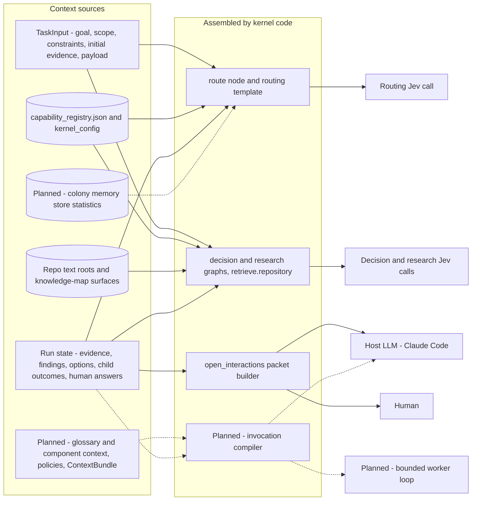

# Decision Kernel Context Map — Who Gets Which Context

In the kernel no consumer receives "the context". Each call gets a small, typed input that
kernel code assembles from named sources. This page shows the whole picture. Three detail pages
list every context piece with its exact source, its assembler and the stage it arrives in.

A capability receives only its validated request, the relevant evidence references or excerpts,
its constraints and its execution context. It does not receive the whole repository or the whole
run history by default (spec §5).

Parent: [Decision Kernel and Colony Memory — Design Map](decision-kernel-flows-overview.md)

## Consumers

| Consumer | Receives, in short | Assembled by | Available from | Detail |
|---|---|---|---|---|
| Routing Jev call | Task goal and component ids, the request, the descriptions of eligible `semantic` capabilities, the `__NONE__` and `__NEEDS_CONTEXT__` choices, earlier clarification answers | `route` node with the routing template (`kernel/scheduler/routing.py`) | V0. Colony statistics: ADR-057 INFLUENCE ROUTING (Stage 4 or later) | [Jev calls](decision-kernel-context-jev.md) |
| Decision Jev calls (`assess`: sufficiency, satisfaction, missing knowledge, preference, conflict) | Question, options, approved criteria, evidence excerpts, constraints | Decision graph `load`, templates in `assess` | V0. Policies: Stage 3. Glossary and component context: Stage 2 | [Jev calls](decision-kernel-context-jev.md) |
| Research capability and its retrieval | Research question, evidence needs, category descriptions, source catalog, search candidates | Research graph, `retrieve.repository` | V0. Context compiler: Stage 2 | [Research](decision-kernel-context-research.md) |
| Host LLM (Claude Code) | A `HostWorkRequest`: operation, goal, input artifacts, evidence ids, allowed and forbidden operations, output schema. Also its own session context | `open_interactions`. The invocation compiler is planned | V0 | [Host, worker, human](decision-kernel-context-host-worker-human.md) |
| Bounded worker loop (for example coding) | A compiled view of the implementation contract: operation, task, approved decisions, evidence, constraints, expected output | Invocation compiler and context compiler, both planned | Later: inputs in Stages 2–3, executor in Stage 5 | [Host, worker, human](decision-kernel-context-host-worker-human.md) |
| Human | A `HumanQuestion`: question, choices with consequences, free-text rule, why research cannot settle it | `open_interactions`, with template wording or `host.formulate_question` | V0 | [Host, worker, human](decision-kernel-context-host-worker-human.md) |

## Rules that hold for every kernel consumer

- **Kernel code assembles, models do not.** The kernel, never a model, assigns IDs, root
  identity and execution permissions (spec §7.2). Model instructions are to be compiled
  deterministically, never improvised by an LLM (ADR-052 §3).
- **Evidence is not instruction.** Retrieved text is quoted into Jev state as values only, never
  interpolated into a template (design part 4, spec §13.3).
- **Every piece is traceable.** Evidence carries a locator, a source version (commit and dirty
  flag), a content hash and provenance. Every Jev call records its template id and version and an
  input fingerprint (spec §7.3, design part 4).
- **Secrets are masked before sending.** The redactor masks Jev state and host packets. Retrieval
  skips `.env*`, keys and `.git` (design parts 2 and 5).
- **The runtime never reads Langfuse.** Learned context reaches routing only as compact
  statistics from the colony memory store (ADR-056 §8, ADR-057 §5).
- **Legacy registries are never candidates.** Only `config/capability_registry.json` supplies
  routing choices (ADR-055).

## Contrast: how legacy agents get their context

Legacy agents are Claude Code sub-agents. The harness assembles their context at spawn from the
[11-channel knowledge plane](../agent_knowledge_plane.md).

| Aspect | Legacy agent | Kernel consumer |
|---|---|---|
| What receives context | An agent: a persona prompt that carries the process inside it (ADR-052, Context) | One step: a Jev question, a host operation or a human question |
| Who assembles it | The Claude Code harness at spawn. `build.py` compiles registry tables into agent templates (`scripts/injection_builders.py`). The fast lane builds a layered bundle (`assemble_context_bundle`: architecture and high-level ACs, then prior tests, prior outputs and the working diff) | Deterministic kernel code for each call: the `route` node, the capability graphs, the retrieval adapter, the packet builder |
| What goes in | Whole channels: `CLAUDE.md`, auto-memory, MCP prompts, the glossary through `CLAUDE.md`, auto-loaded skills, agent frontmatter, harness config, the ticket via `ticket_path`, folder `README.md`, `PROJECT_CONTEXT.md`, on-demand skills | Only what the step needs: the request, evidence by id or as capped excerpts, criteria, constraints |
| How relevance is decided | The agent reads more on its own (Read, Grep, on-demand skills) | Jev selects evidence needs and reranks candidates. Code searches, filters and caps. Jev decides only against supplied criteria |
| Where the process lives | In the agent prompt and its skills | In graphs, configuration and checks. Prompts are compiled outputs (ADR-052) |
| Precedence | "Specificity wins": ticket, then agent frontmatter, on-demand skills, auto-loaded skills and `PROJECT_CONTEXT.md`, folder `README.md`, then `CLAUDE.md`, memory and glossary | No source-authority order is written down yet (OP-06). Conflicts are kept as contradictions and never averaged (spec §10.5) |
| Traceability | Which channels were active at spawn | Locator, source version and hash per evidence item. Template id, version and input fingerprint per Jev call. One Langfuse trace per run |
| Learning | `route-learning` and `capture-learning` write to `PROJECT_CONTEXT.md`, memory files, docs and ADRs, and later agents receive them through the same channels | Outcomes go to Langfuse. A planned learning evaluator distils them into the colony memory store, and routing reads compact statistics. Process changes only through reviewed promotion |

**Where the two meet in V0.** The kernel's host LLM is a Claude Code session. The legacy
channels (`CLAUDE.md`, auto-memory, skills, MCP) therefore still reach it during host work, next
to the kernel's packet. The kernel neither controls nor records them. The spec calls Claude Code
hosting "a bootstrap compromise, not a sandbox or a guaranteed clean model context" (spec §2.3,
§11.5). A clean per-task context comes with direct executors in Stage 5 (spec §20). See OP-12.

Open points for this page: OP-06, OP-11, OP-12, OP-13 in [open points](decision-kernel-flows-open-points.md).

## Legend

| Element | Meaning |
|---|---|
| Solid arrow | A context path that is in V0 |
| Dotted arrow | A planned context path |
| Cylinder | Stored data: registry, configuration, repository files, database |
| Box inside "Assembled by kernel code" | Deterministic code that selects and shapes context |

## Cross-Links

- Parent: [Design Map](decision-kernel-flows-overview.md)
- Detail pages: [Jev calls](decision-kernel-context-jev.md), [Research](decision-kernel-context-research.md),
  [Host, worker, human](decision-kernel-context-host-worker-human.md)
- Legacy: [Agent Knowledge Plane](../agent_knowledge_plane.md),
  [Agent Knowledge System](../agent_knowledge_system.md),
  [Injection Builder](../components/injection-builder.md)
- Later-stage context: [spec §17](../../analysis/2026-09-30-leafcutter-kernel-spec-rev3-7-later-stages.md)
