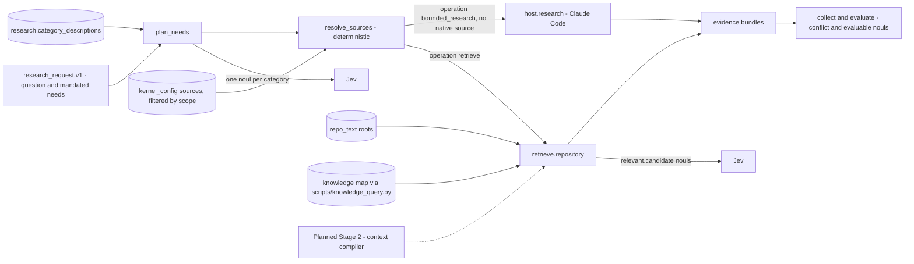

# Decision Kernel Context — The Research Capability and Repository Retrieval

The research graph is domain-agnostic. Evidence categories are stable, and source bindings carry
the specifics (spec §10.2). Task names such as "LangGraph" live in request data and source
metadata, never in the graph. This page shows which repository files and knowledge surfaces feed
each category in V0, and what Stage 2 adds.

Parent: [Decision Kernel and Colony Memory — Design Map](decision-kernel-flows-overview.md)

See also: [Context map](decision-kernel-context-map.md) and
[Request Flow 1](decision-kernel-flows-request-native.md).

## Research graph inputs

| Context piece | Exact source | Assembled by | Available from |
|---|---|---|---|
| Question and mandated needs | `research_request.v1`, usually from the decision capability's `emit`, which pre-fills needs from the missing-knowledge answer (for example `missing_decision_basis` → `prior_decisions`) | `plan_needs` | V0 |
| Category descriptions for the need questions | `research.category_descriptions` (6 entries, no vendor names) | `plan_needs` | V0 |
| Need thresholds (code) | `research.need_required_threshold` 0.8, `need_supporting_threshold` 0.5 | `plan_needs` | V0 |
| Source catalog | `config/kernel_config.default.json` → `sources`, filtered by `scope.source_ids`, `read_roots`, `technologies` and availability | `resolve_sources` | V0 |
| Merged bundle for the `conflict` question | The child evidence bundles | `collect` | V0 |
| `evaluable` question and threshold 0.7; `allow_synthesis` true | `research.*` | `evaluate`; below the threshold it asks the host for synthesis once | V0 |

## Sources per evidence category (V0 defaults)

| Category | Source id and kind | Exact roots or surfaces |
|---|---|---|
| `internal_principles` | `repo.principles`, repo_text | `CLAUDE.md`, `docs/conventions`, `docs/vision.md` |
| `prior_decisions` | `repo.decisions`, repo_text | `docs/architecture/adrs` |
| `prior_decisions` | `knowledge.decisions`, knowledge_map | Surface `adrs` (`docs/architecture/adrs/`) |
| `existing_patterns` | `repo.patterns`, repo_text | `kernel`, `scripts`, `docs/architecture` |
| `existing_patterns`, `task_context` | `knowledge.components`, knowledge_map | Surfaces `components` (`docs/architecture/components/`), `skills` (`config/skill_registry.json`), `agents` (`config/agent_registry.json`). Reading these legacy registries as evidence conflicts with the wording of ADR-055 §2 (OP-11) |
| `authoritative_guidance`, `external_practices` | `host.research`, host_research | No native source. Claude Code works under `read_supplied_artifacts`, `read_repo_paths` and `web_fetch`; its evidence is `host_reported` |
| — | Not a V0 source | `docs/glossary.md` is a knowledge-map surface (`glossary` in `config/paths.json`), but no default source includes it (OP-05) |

`task_context` also arrives without retrieval: `TaskInput.initial_evidence` and human answers
enter the run as `task_context` evidence (design parts 3 and 4).

## How `retrieve.repository` builds evidence

| Step | Exact source or rule | Code | Available from |
|---|---|---|---|
| Query terms | Deterministic: lowercase tokens of 3 or more characters from the need's question and `scope.technologies`, minus stopwords | `terms.py` | V0 |
| File walk | Allowlisted roots under `scope.repository_root`; skips `retrieval.deny_globs` (`.env*`, keys, `.git`) and files above `max_file_bytes` | `repository.py`, `access.py` | V0 |
| Knowledge-map nodes | `build_knowledge_map` over the `config/paths.json` surfaces, loaded by path and cached per process and surface. A load failure makes the source unavailable, never "no results" | `knowledge_map.py` | V0 |
| Rerank | One Jev batch of `relevant.<candidate>` questions over at most 20 candidates; keeps p ≥ 0.5 and the top 6 | `rerank.py` | V0 |
| Excerpt | ±12 lines around hits, at most 2000 characters, with a `truncated` flag | `repository.py`, `evidence_build.py` | V0 |
| Source version | `git rev-parse HEAD` and `git status --porcelain`, cached per run | `versioning.py` | V0 |
| Provenance | Strategy, terms, rank, relevance; `content_hash = sha256(excerpt)` | `evidence_build.py` | V0 |

Excerpt text is evidence, not instructions. It enters Jev state only as quoted values
(design part 4). An unavailable source stays visible in `unavailable_sources`, and conflicts stay
as recorded contradictions (spec §10.3, §10.5).

## What Stage 2 adds (planned, spec §17, roadmap `phase_kernel_2_knowledge`)

| Addition | Source |
|---|---|
| Glossary terms as canonical terminology and compact component descriptors, selected before deeper retrieval | §17.1 |
| Progressive disclosure over a knowledge graph: overview, modules, signatures, docstrings, callers and tests, then source excerpts. Jev judges when the resolution is enough; code controls retrieval and budgets | §17.2 |
| Hybrid search behind one information-need interface: exact lookup, grep, structural, graph, BM25, embeddings, Jev reranking | §17.3 |
| Read location versus write location | §17.4 |
| An immutable, versioned `ContextBundle` with role-specific views, and reusable search memory revalidated against versions | §17.5 |

Stage 2's exit condition: the kernel supplies a compact evidence package before a reasoning or
coding model is called. ADR-056 §9 notes that reusable retrieval plans are the closest colony
mechanism in Stage 2 and that its source is otherwise silent on Stage 2.

Open points for this page: OP-05, OP-06, OP-11 in [open points](decision-kernel-flows-open-points.md).

## Legend

| Element | Meaning |
|---|---|
| Solid arrow | A V0 path |
| Dotted arrow | A planned path |
| Cylinder | Configuration or repository data read by the adapter |

## Cross-Links

- Parent: [Design Map](decision-kernel-flows-overview.md)
- Sibling pages: [Context map](decision-kernel-context-map.md), [Jev calls](decision-kernel-context-jev.md)
- The knowledge map it reads: [Knowledge System](../components/knowledge-system.md)
- Adapter design: [design part 4](../../analysis/2026-09-30-decision-kernel-design-4-jev-and-capabilities.md)
