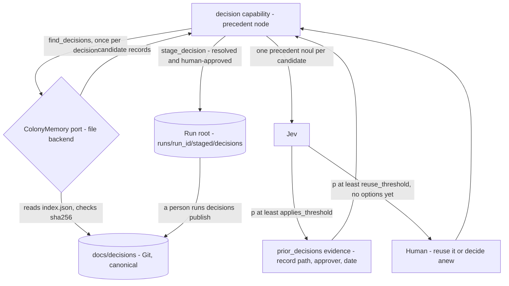
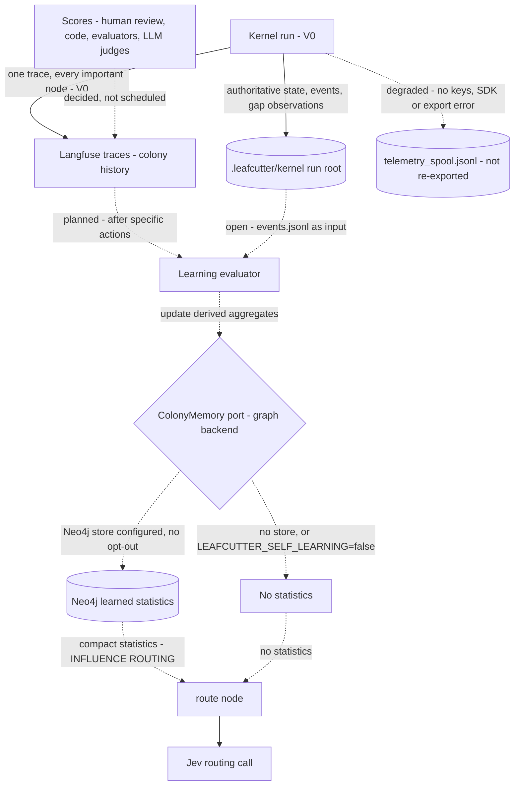

# Decision Kernel Learning Loop — From a Run to Precedent and Routing Context

> "Langfuse remembers what happened. The colony memory store remembers what Leafcutter learned."
> ([ADR-057](../adrs/ADR-057-colony-memory-store-optional-postgres.md) §1)

A run can shape a later run in two ways, and they have different status and authority:

1. **Decision records (live on main).** A decision a human approved is staged, published by a
   person into Git, and offered to later decisions as precedent
   ([ADR-059](../adrs/ADR-059-decision-store-reviewable-yaml-records-now-graph-later.md),
   [ADR-060](../adrs/ADR-060-source-of-truth-and-approval-authority.md)).
2. **Learned statistics (planned).** Outcomes recorded in Langfuse are distilled into derived
   aggregates in Neo4j that later reach the routing call
   ([ADR-065](../adrs/ADR-065-colony-learned-statistics-neo4j-aggregates.md)).

Both go through the one `ColonyMemory` port. Its backends, settings and statistic kinds are in
[Colony Memory — Container Overview](../components/colony-memory.md).

**Loop 1: decision records (live).**

Parent: [Decision Kernel and Colony Memory — Design Map](decision-kernel-flows-overview.md)

See also: [Regression memory](decision-kernel-flows-regression-memory.md) (the offline branch)
and [Context: Jev calls](decision-kernel-context-jev.md) (what each Jev call receives).

| Step | What happens | Status | Source |
|---|---|---|---|
| Lookup | The `precedent` node runs after `load`. Query: the question, the scope's component ids, any roadmap phase named in the constraints. The file backend filters `index.json`, scores the text by content-word overlap (at least `memory.min_candidate_score` 0.3), keeps at most `max_precedents` (3) and skips a file whose sha256 no longer matches | Live | ADR-059 §2–§3; design part 4, As built (decision store) |
| Judge | One `precedent.<dec-id>` noul per candidate. With options it rides the `assess` batch; with none yet it is one `decision.precedent` call. An exhausted Jev budget skips the precedent with a limitation | Live | design part 4 |
| Evidence | At `applies_threshold` (0.5): `prior_decisions` evidence, source `memory.decisions`, locator = record path, a title naming approver and date, no `provenance.actor`. Trace event `decision.precedent` holds ids and scores, never text | Live | ADR-059 §5, ADR-060 §4 |
| Reuse | At `reuse_threshold` (0.8), with no options of its own and not superseded: the confirm question. `reuse` resolves with the precedent's option, approved by the current human, in a new record that cites it; `decide_anew` continues and a different final choice `supersedes` it | Live | ADR-060 §4–§5 |
| Stage | Only a resolved decision with an `approved` status, a human approver and an approval time; `kernel/memory/builder.py` refuses the rest. The run's limitations name the file and the publish command | Live | ADR-060 §2–§3 |
| Publish | A person runs `python -m kernel decisions publish --run-id R`; `validate` and `index` keep the store consistent and CI runs `validate`. A correction is `--correct OLD_ID`, append-only | Live | ADR-059 §3–§4, ADR-060 §5 |

Precedent never changes routing scores or thresholds; the calibration gate of ADR-056 §9 stands
(ADR-059 §5).

**Loop 2: learned statistics (planned).**

| Step | What happens | Status | Source |
|---|---|---|---|
| Run → run root | Checkpoints, `run.json`, `events.jsonl`, artifacts, interaction ledger, gap observations and drafts, staged records | V0 | Design part 3 |
| Run → Langfuse | One trace per run, `trace_id` from `run_id`; observations for nodes, capabilities, retrieval and Jev calls; events such as `intent.assessed`, `routing.assessed`, `decision.status`, `decision.precedent`, `run.finalized` | V0 | Design part 5; ADR-058 §2 |
| Degraded mode | Missing keys, failed auth, an SDK error or a failed export: observations go to the spool and the envelope reports `observability: degraded`; the run is unaffected. V0 does not re-export the spool | V0 | Design part 5 |
| Scores | Outcomes attach to the decision or routing observation, for example `decision_correct`, `routing_success`, `human_override` (ILLUSTRATIVE). The `Tracer` protocol has no score operation | Decided; the roadmap lists it under `phase_colony_2_analyze` | ADR-058 §3 |
| Learning evaluator | Updates derived aggregates after specific actions, never in the routing hot path; aggregates stay rebuildable from Langfuse and run records. Which actions, and incremental update versus rebuild, are ADR-065 open questions 1 and 3 | Decided; not built | ADR-057 §5, ADR-065 §2 |
| Graph backend | Attaches to ADR-059's port; no second port. The statistics methods and the composition with the file backend are left to the build (OP-27, OP-28) | Decided; not built | ADR-065 §3 |
| Store → routing | Compact statistics per candidate, scoped by capability, task_type, component, repository and policy_version | INFLUENCE ROUTING only, after calibration and held-out evaluation | ADR-057 §7, §10; ADR-056 §9 |

**V0's part is recording.** ADR-056 §9 recommends three prerequisites: version fields next to
`CorrelationIds`, an outcome event keyed to `decision_id`, and countable gap records. On main only
the gap records exist as recommended; see OP-26 for what exists instead.

## Adoption stages (ADR-057 §10, carried over by ADR-065)

| Stage | What it does | Kernel stage | Roadmap phase |
|---|---|---|---|
| COLLECT | Optional Neo4j store, write-only: graph usage, decisions, outcomes, capability gaps, fallback usage. No influence on behaviour | Not in V0: statistics start only with COLLECT (ADR-065 §6) | `phase_colony_1_collect` |
| ANALYZE | Learning evaluator; statistics, common paths, wrong decisions, calibration. The roadmap also lists Langfuse scores and dataset cases here | Stage 4 | `phase_colony_2_analyze` |
| SUGGEST | For example "historically this path performs better"; routing unchanged | Stage 4 | `phase_colony_3_suggest` |
| INFLUENCE ROUTING | Historical evidence in Jev routing, with exploration | Stage 4 or later, after calibration and spec §19.4 evaluation | `phase_colony_4_influence` |
| EVOLVE | Recurring gaps, weak policies, candidate workflows, repeated LLM reasoning; proposals only | Stage 4 proposals (ADR-056 §5–§7) | `phase_colony_5_evolve` |

The ladder governs learned statistics only. Precedent from decision records is evidence from day
one (ADR-059 §5). `phase_kernel_4_trails` still describes the store as a "performance store"
(OP-18).

## When memory is off

- **Decision records off.** `memory.backend: null` selects `NullColonyMemory`: no precedent,
  nothing staged. A decision runs exactly as it did before the store existed (ADR-059 §2).
- **Statistics off.** With no Neo4j store configured, or with `LEAFCUTTER_SELF_LEARNING=false`,
  there are no learned statistics. The routing call routes on semantic fit alone, as it does today.
  Langfuse is not behind either switch: every run is still traced (ADR-058 §1).
- ADR-065 §4 selects `NullColonyMemory` without a Neo4j store; read literally, that would also
  switch off precedent, which `memory.backend: file` keeps on. ADR-065 §3 leaves the composition
  to the build (OP-28). The run root still records gaps, and `python -m kernel gaps --json`
  aggregates them.

## Where each record fits

| Record | Holds | Authority | Read at runtime by |
|---|---|---|---|
| Run root `.leafcutter/kernel/` | Workflow state of runs on this checkout; local gap observations; staged records until published | Authoritative for workflow state (spec §12.2); not canonical for decisions (ADR-060 §1) | The kernel: resume, status, cancel, gaps |
| `docs/decisions/` | Published, human-approved decision records and `index.json` | Canonical in Git (ADR-060 §1); only `decisions publish` writes it | The decision capability through the port, as precedent |
| Langfuse traces and scores | What happened, including outcomes and corrections | Observability, never workflow state or canonical | Nobody on the hot path; humans and the learning evaluator |
| Learned statistics (Neo4j, planned) | Derived aggregates | Derived and optional; rebuildable (ADR-065); later shareable (ADR-057 §8) | The kernel through the port, from INFLUENCE ROUTING |
| Langfuse datasets | Confirmed wrong decisions | Regression memory | Offline only, before a change deploys |

The gap observations in the run root are the first countable colony input (ADR-056,
Operational). In the main checkout `.leafcutter/` may be a symlink into the shared install tree,
so run data can be shared across checkouts (design part 6, risk 12).

## Safeguards on these paths

- Only a human approval creates a record, and the kernel never writes the repository during a run
  (ADR-060 §2–§3). Nothing in a record grants a permission.
- Precedent is evidence. It never resolves a decision without the current human and never changes
  routing scores or thresholds (ADR-060 §4).
- Usage alone never counts as evidence of correctness. Reinforce on verified outcomes (ADR-056 §2–§3).
- Trails rank and propose; they never legislate (ADR-056 §3 rule 5).
- Statistics never override the deterministic eligibility exclusions (ADR-056 §8, ADR-057 §5).
- The hot path never queries Langfuse: not traces, scores or datasets (ADR-058 §6).
- Every statistic carries its context dimensions; no global success rates (ADR-057 §7).

Open points for this page: OP-18 to OP-22, OP-25 to OP-28 and OP-31 in
[open points](decision-kernel-flows-open-points.md).

## Legend

| Element | Meaning |
|---|---|
| Solid arrow | A path live on main |
| Dotted arrow | Decided or planned, not built |
| Diamond | The `ColonyMemory` port, which selects its backend at startup |
| Cylinder | Stored data |

## Cross-Links

- Parent: [Design Map](decision-kernel-flows-overview.md)
- Port, backends and settings: [Colony Memory — Container Overview](../components/colony-memory.md)
- Decisions: [ADR-056](../adrs/ADR-056-colony-memory-evidence-reinforcement.md),
  [ADR-057](../adrs/ADR-057-colony-memory-store-optional-postgres.md),
  [ADR-058](../adrs/ADR-058-langfuse-colony-history-scores-datasets.md),
  [ADR-059](../adrs/ADR-059-decision-store-reviewable-yaml-records-now-graph-later.md),
  [ADR-060](../adrs/ADR-060-source-of-truth-and-approval-authority.md),
  [ADR-061](../adrs/ADR-061-identity-of-declared-and-learned-records.md),
  [ADR-065](../adrs/ADR-065-colony-learned-statistics-neo4j-aggregates.md)
- Sibling: [Regression memory](decision-kernel-flows-regression-memory.md)
