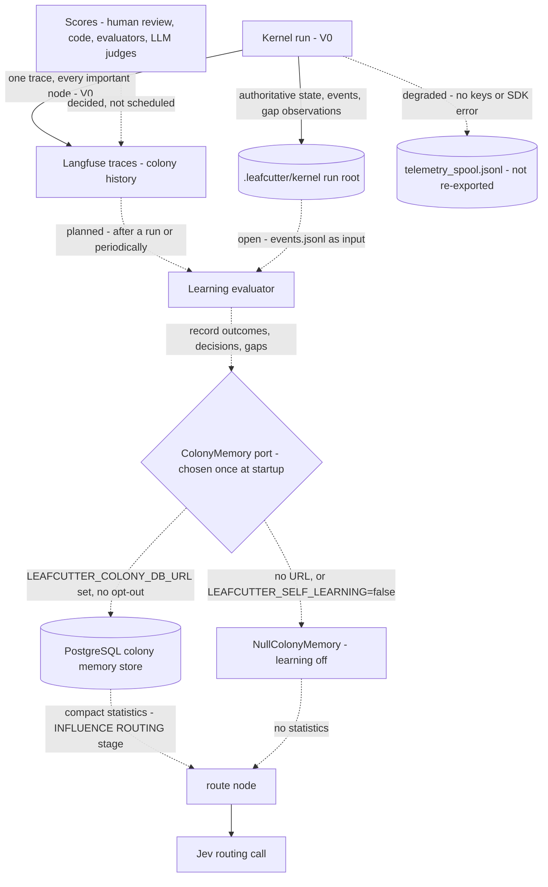

# Decision Kernel Learning Loop — From a Run to Routing Context

> "Langfuse remembers what happened. The colony memory store remembers what Leafcutter learned."
> ([ADR-057](../adrs/ADR-057-colony-memory-store-optional-postgres.md) §1)

This page follows one run's data from execution to the point where it can shape a later routing
decision. In V0 only the run root, the Langfuse trace, the degraded spool and the routing call
exist. Every dotted arrow is decided or planned, not built. The store's
tables, port and enablement are described in
[Colony Memory — Container Overview](../components/colony-memory.md). This page covers the data
path and its link to the kernel's context.

Parent: [Decision Kernel and Colony Memory — Design Map](decision-kernel-flows-overview.md)

See also: [Regression memory](decision-kernel-flows-regression-memory.md) (the offline branch)
and [Context: Jev calls](decision-kernel-context-jev.md) (what the routing call receives).

## Each step and its status

| Step | What happens | Status | Source |
|---|---|---|---|
| Run → run root | Checkpoints, `run.json`, `events.jsonl`, artifacts, interaction ledger, `gaps/observations.jsonl` and drafts | V0 | Design part 3 |
| Run → Langfuse | One trace per run, `trace_id` from `run_id`; observations for scheduler nodes, capabilities, retrieval, Jev calls; events `routing.assessed`, `decision.status`, `gap.recorded`, `run.finalized` | V0 | Design part 5; ADR-058 §2 |
| Degraded mode | Missing keys, failed auth or an SDK error: observations go to the spool, `observability="degraded"`; the run is unaffected. V0 does not re-export the spool | V0 | Design part 5 |
| Scores | Outcomes attach to the decision or routing observation, for example `decision_correct`, `routing_success`, `human_override` (ILLUSTRATIVE). The `Tracer` protocol has no score operation yet | Decided; ADR-058 does not schedule it, the roadmap lists it under `phase_colony_2_analyze` | ADR-058 §3 |
| Learning evaluator | Distils completed-run outcomes into the store, from Langfuse traces and scores or directly at run end. Aggregation never runs in the routing hot path | Decided; cadence and placement open | ADR-057 §5, ADR-058 §3 |
| `ColonyMemory` port | One port, Postgres or Null, chosen once at startup. No `if settings.<db_url>:` branches elsewhere | Decided; COLLECT starts right after V0 at the earliest | ADR-057 §3, §10 |
| Store → routing | Compact statistics per candidate, scoped by capability, task_type, component, repository and policy_version | INFLUENCE ROUTING: only after calibration and held-out evaluation | ADR-057 §7, §10; ADR-056 §9 |

**V0's part is recording, not learning.** ADR-056 §9 recommends three prerequisites to the V0
build: policy, template and model version fields next to `CorrelationIds`; an outcome event that
references an earlier `decision_id`, across runs if needed; and countable gap records. Traces
recorded without them can never be counted later. The roadmap's founding exit criteria require
each prerequisite to be implemented or explicitly deferred by a recorded decision, and a
colony-health baseline from the first real runs.

## Adoption stages (ADR-057 §10)

| Stage | What it does | Kernel stage | Roadmap phase |
|---|---|---|---|
| COLLECT | Store optional; record graph usage, decisions, outcomes, capability gaps, fallback usage. No influence on behaviour | Right after V0 at the earliest; starting inside V0 is a V0 build decision (OP-17) | `phase_colony_1_collect` |
| ANALYZE | Learning evaluator; derive and show statistics: success rates, common paths, wrong decisions, calibration. The roadmap also lists Langfuse scores and dataset cases here | Stage 4 | `phase_colony_2_analyze` |
| SUGGEST | Suggest, for example "historically this path performs better"; routing unchanged | Stage 4 | `phase_colony_3_suggest` |
| INFLUENCE ROUTING | Feed historical evidence into Jev routing, with exploration | Stage 4 or later, after calibration and spec §19.4 evaluation | `phase_colony_4_influence` |
| EVOLVE | Detect recurring gaps, weak policies, candidate workflows, repeated LLM reasoning; proposals only | Stage 4 proposals (ADR-056 §5–§7) | `phase_colony_5_evolve` |

The roadmap phases are as edited on 2026-09-30. `phase_kernel_4_trails` still describes the same
store as a "performance store" (OP-18).

## When no store is configured

`NullColonyMemory` is selected at startup when `LEAFCUTTER_COLONY_DB_URL` is absent or
`LEAFCUTTER_SELF_LEARNING=false` is set. The kernel, Jev, LangGraph, the Claude Code handoff and
Langfuse tracing keep working; only cross-run learning is off (ADR-057 §3, §4). Langfuse is not
behind this switch: every run is still traced (ADR-058 §1). The routing call then gets no
statistics and routes on semantic fit alone, exactly as V0 does. The run root still records gaps locally,
and `python -m kernel gaps --json` still aggregates them (design part 5).

## Where the run root fits

| Record | Holds | Authority | Read at runtime by |
|---|---|---|---|
| Run root `.leafcutter/kernel/` | Workflow state of runs on this checkout; local gap observations | Authoritative for workflow state (spec §12.2). Never replaced by the store (ADR-057 §9) | The kernel: resume, status, cancel, gaps |
| Langfuse traces and scores | What happened, including outcomes and corrections | Observability, never the checkpointer or decision database | Nobody on the hot path; humans and the learning evaluator |
| Colony memory store | What the colony learned: compact statistics, decision outcomes | Derived and optional; later shareable by a team (ADR-057 §8) | The kernel through the port, from INFLUENCE ROUTING |
| Langfuse datasets | Confirmed wrong decisions | Regression memory | Offline only, before a change deploys |

The gap observations in the run root are the first countable colony input (ADR-056,
Operational). In the main checkout `.leafcutter/` may be a symlink into the shared install tree,
so run data can be shared across checkouts (design part 6, risk 12).

## Safeguards on this path

- Usage alone never counts as evidence of correctness. Reinforce on verified outcomes: a
  post-check passed, tests went green, a human accepted the result (ADR-056 §2–§3).
- Trails rank and propose; they never legislate. Every learned change to a policy, workflow,
  threshold or registry entry needs review, preserved versions and a rollback path (ADR-056 §3).
- Statistics never override the deterministic eligibility exclusions (ADR-056 §8, ADR-057 §5).
- The hot path never queries Langfuse: not traces, scores or datasets (ADR-058 §6).
- Every statistic carries its context dimensions; no global success rates (ADR-057 §7).

Open points for this page: OP-17 to OP-23 and OP-25 in [open points](decision-kernel-flows-open-points.md).

## Legend

| Element | Meaning |
|---|---|
| Solid arrow | A V0 data path |
| Dotted arrow | Decided or planned, not built |
| Diamond | The port that selects one implementation at startup |
| Cylinder | Stored data |

## Cross-Links

- Parent: [Design Map](decision-kernel-flows-overview.md)
- Store, port and tables: [Colony Memory — Container Overview](../components/colony-memory.md)
- Decisions: [ADR-056](../adrs/ADR-056-colony-memory-evidence-reinforcement.md),
  [ADR-057](../adrs/ADR-057-colony-memory-store-optional-postgres.md),
  [ADR-058](../adrs/ADR-058-langfuse-colony-history-scores-datasets.md)
- Sibling: [Regression memory](decision-kernel-flows-regression-memory.md)
