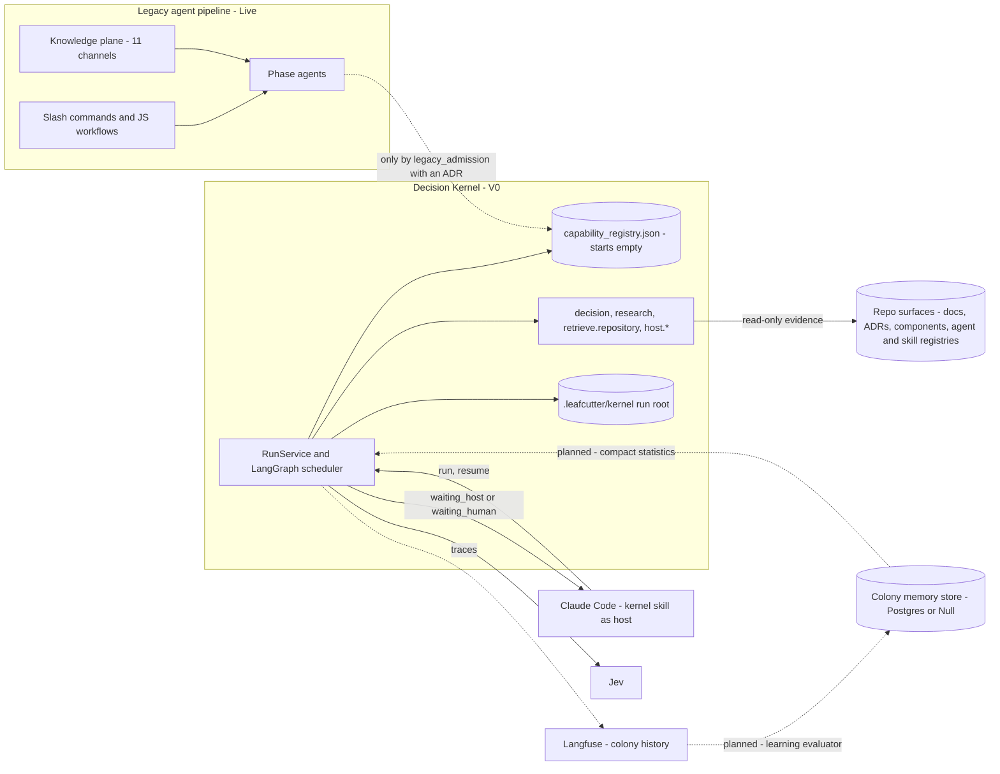

# Decision Kernel and Colony Memory — Design Map

This page is the entry point to the flow and context docs for the Decision Kernel and colony
memory. It lists every design the project has produced so far and gives each one's source and
status. It also shows how the new designs relate to the legacy agent pipeline. The child pages
show the flows, the data paths and where each consumer gets its context.

These pages map what the sources say as of 2026-09-30. They add no design of their own. Planned
elements are marked planned. Where sources are silent or disagree, the pages point to the
[open points](decision-kernel-flows-open-points.md) list instead of choosing an answer.

**Status words used on every page**

| Status | Meaning |
|---|---|
| Live | Runs today in this repository and in adopter installs |
| V0 | Kernel V0 scope, being built now (roadmap `phase_kernel_1_founding`, status active) |
| Later (Stage n) | Kernel spec §3 stage n and its roadmap phase `phase_kernel_n_*`, status planned. The colony store has its own planned track, `phase_colony_1_collect` to `phase_colony_5_evolve` |
| Decided, not scheduled | Accepted by an ADR, but no stage or phase builds it yet |

## How the designs relate

Parent: none (`root: true`). The kernel's own container view is
[Decision Kernel — Container Overview](../components/decision-kernel.md); the learning layer's is
[Colony Memory — Container Overview](../components/colony-memory.md).

**What the picture says.**

- **The legacy pipeline stays live and runs in parallel.** [ADR-052](../adrs/ADR-052-capabilities-replace-agents-prompts-are-compiled.md)
  admits no agent and "does not migrate, rewrite or retire any existing agent template". It
  expects "two representations of the process" to coexist for a while.
  [ADR-055](../adrs/ADR-055-capability-registry-starts-empty.md) says "two registry families
  coexist". The kernel lives only in leafcutter-ai and is not shipped to adopters, so adopters
  have only the legacy pipeline. No source sets a retirement plan (open point OP-16).
- **Legacy agents and skills reach the kernel only by recorded admission.** The kernel routes
  only over `config/capability_registry.json`. A legacy asset enters it as an entry with
  `admission.kind = legacy_admission`, a `legacy_source {registry, id}` and a `decision_ref`
  that names an ADR (`^ADR-\d{3}$`). There is no bulk import. So far no ADR admits any legacy asset. The seven V0
  entries (`decision`, `research`, `retrieve.repository`, four `host.*`) are all
  `native_registration`.
- **The kernel reads legacy knowledge as evidence, not as candidates.** The retrieval adapter
  reads repository files and knowledge-map surfaces (ADRs, component docs, the agent and skill
  registries) as read-only evidence. This path conflicts with the wording of ADR-055 §2
  (open point OP-11).
- **Claude Code hosts both.** It runs legacy agents, and it is the kernel's host for generative
  and human work. The kernel skill's name collides with the shipped `/leafcutter` knowledge-hub
  command (open point OP-15).
- **The learning path is planned.** V0 traces every run in Langfuse. The learning evaluator, the
  colony memory store and statistics that reach routing are later work
  ([learning loop](decision-kernel-flows-learning-loop.md)).

## Design inventory

| # | Design | What it decides | Source | Status |
|---|---|---|---|---|
| 1 | Legacy agent pipeline | Slash commands, JS workflows (`build-feature.js`, `build-ticket.js`) and phase agents dispatched at depth 1; the ticket record drives completion | [agentic-runtime-flow](../../agentic-runtime-flow.md), [agent_delivery_workflows](../agent_delivery_workflows.md), [build-orchestration](../components/build-orchestration.md) | Live |
| 2 | Legacy context and learning | 11 injection channels into an agent's context; `route-learning` / `capture-learning` persist learnings | [agent_knowledge_plane](../agent_knowledge_plane.md), [agent_knowledge_system](../agent_knowledge_system.md), [injection-builder](../components/injection-builder.md), [knowledge-system](../components/knowledge-system.md) | Live |
| 3 | Decision Kernel V0 | RunService, fixed LangGraph scheduler, Jev routing and decisions, research, read-only retrieval, host and human handoff, resume, gaps, Langfuse | [decision-kernel](../components/decision-kernel.md), [design parts 1–6](../../analysis/2026-09-30-decision-kernel-design.md), [spec Rev 3](../../analysis/2026-09-30-leafcutter-kernel-spec-rev3.md) | V0 (P0 done; per git history P1–P5 merged on `feature/kernel-bootstrap-v0`) |
| 4 | Capability lifecycle and invocation compiler | The capability replaces the agent; PREPARE to ESCALATE; prompts are compiled by deterministic code | [ADR-052](../adrs/ADR-052-capabilities-replace-agents-prompts-are-compiled.md) | Accepted. The lifecycle shape is present in the V0 graphs; the compiler is not designed yet (OP-08) |
| 5 | Intelligence selection | Deterministic, Jev, LLM or human per check; the escalation path; executor names | [ADR-053](../adrs/ADR-053-intelligence-selection-deterministic-jev-llm-human.md) | Accepted; V0's decision capability applies it |
| 6 | Process maturity and resolution order | Workflow, policy or LLM-guided; levels 0–4; resolution order workflow → policy → LLM-guided → gap | [ADR-054](../adrs/ADR-054-process-representation-and-maturity-model.md) | Accepted. V0 has level 3 (native graphs) and level 1 (`host_handoff`). Level 2 policies are Later (Stage 3) |
| 7 | Empty registry and admission | The kernel routes only over the new registry; legacy assets only via `legacy_admission` plus an ADR | [ADR-055](../adrs/ADR-055-capability-registry-starts-empty.md) | Accepted; V0 |
| 8 | Colony memory loop | Reinforce on verified outcomes; evaporation; negative evidence; exploration; trails rank and propose, never legislate | [ADR-056](../adrs/ADR-056-colony-memory-evidence-reinforcement.md) | Accepted. V0 records the prerequisites only (a recommendation). Store and statistics: Later (Stage 4). Influence on routing: Stage 4 or later |
| 9 | Optional PostgreSQL colony memory store | `ColonyMemory` port with a Postgres implementation or `NullColonyMemory`, chosen once at startup; `LEAFCUTTER_COLONY_DB_URL` | [ADR-057](../adrs/ADR-057-colony-memory-store-optional-postgres.md), [colony-memory](../components/colony-memory.md) | Accepted. COLLECT starts right after V0 at the earliest; ANALYZE and SUGGEST in Stage 4; INFLUENCE ROUTING Stage 4 or later. Roadmap: `phase_colony_1_collect` to `phase_colony_5_evolve` |
| 10 | Langfuse as colony history | Every important node traced; decisions and routing choices scored; datasets as regression memory | [ADR-058](../adrs/ADR-058-langfuse-colony-history-scores-datasets.md) | Accepted. Node tracing is V0. ADR-058 does not schedule scores, datasets or the regression gate; the roadmap lists scores and dataset cases under `phase_colony_2_analyze` (Stage 4) |
| 11 | Knowledge and context compiler | Glossary- and component-aware search, progressive disclosure, `ContextBundle`, role-specific views | spec [§17](../../analysis/2026-09-30-leafcutter-kernel-spec-rev3-7-later-stages.md); roadmap `phase_kernel_2_knowledge` | Later (Stage 2) |
| 12 | Engineering workflows and executable policies | Discovery, readiness gates, implementation contract with coding, testing and documentation views, component policies | spec §18; `phase_kernel_3_workflows` | Later (Stage 3) |
| 13 | Controlled learning | Research-to-ADR reuse, bug-to-policy proposals, evaluation before activation | spec §19; `phase_kernel_4_trails` | Later (Stage 4) |
| 14 | Independent engineering runtime | Direct model and agent executors, more clients, stronger isolation | spec §20; `phase_kernel_5_specialists` | Later (Stage 5) |

## Pages in this set

| Page | Shows |
|---|---|
| [Request flow 1: native work](decision-kernel-flows-request-native.md) | Skill → CLI → RunService → scheduler → Jev routing → decision → research → retrieval, up to the first wait |
| [Request flow 2: handoff and resume](decision-kernel-flows-request-handoff.md) | Host or human handoff, resume validation, parent continuation, finalize |
| [Capability lifecycle](decision-kernel-flows-capability-lifecycle.md) | ADR-052 lifecycle with the executor of every step (ADR-053) and the V0 mapping |
| [Context map](decision-kernel-context-map.md) | Every kernel consumer and its context sources, contrasted with the legacy knowledge plane |
| [Context: Jev calls](decision-kernel-context-jev.md) | Routing Jev call and decision Jev calls |
| [Context: research](decision-kernel-context-research.md) | Research capability and the retrieval adapter |
| [Context: host, worker, human](decision-kernel-context-host-worker-human.md) | Invocation compiler and host LLM, bounded worker loop, human interactions |
| [Learning loop](decision-kernel-flows-learning-loop.md) | Run → Langfuse → learning evaluator → colony store → routing context; `NullColonyMemory`; run root |
| [Regression memory](decision-kernel-flows-regression-memory.md) | Confirmed mistakes → Langfuse datasets → regression evaluation before a change |
| [Open points](decision-kernel-flows-open-points.md) | Where the sources are silent or disagree |

## Definitions

Terms marked (G) are defined in [the glossary](../../glossary.md). The wording here follows it.

| Term | Meaning here |
|---|---|
| Decision Kernel (G) | The resumable runtime in `kernel/` that routes a goal to a registered capability with Jev, gathers evidence, hands generative or human work out as checkpointed handoffs and ends every run in a typed terminal state |
| Capability (G) | The contract-driven unit of work that replaces the agent: input contract, policies, evidence preparation, decisions, execution strategy, verification, typed result (ADR-052) |
| Jev (G) | TypeSafe's bounded decision model, called through `langchain-typesafe`. It answers typed questions (`noul`, `choice`, `score`) about a supplied state and never invents criteria or content |
| Decision specification (G) | A small Jev instruction that evaluates only supplied criteria and has an explicit insufficient-evidence path (ADR-052 §8) |
| Invocation compiler (G) | Deterministic code that builds a model's instructions from the capability definition, policies, task, evidence, approved decisions and output contract (ADR-052 §3) |
| Process maturity level (G) | 0 Unknown, 1 LLM-guided, 2 Policy-guided, 3 Workflow-guided, 4 Deterministic (ADR-054) |
| Capability gap (G) | A record that no suitable native capability existed. Types: `unsupported`, `host_only`, `provider_failure`, `permission`, `ambiguous` |
| Colony memory (G) | Execution statistics and decision outcomes learned from verified outcomes. Usage alone is never evidence of correctness (ADR-056) |
| Colony memory store | ADR-057's name for ADR-056's "performance store" (G): optional PostgreSQL behind the `ColonyMemory` port, holding compact learned statistics |
| `NullColonyMemory` | The port implementation chosen when no store is configured or learning is opted out. Cross-run learning is off; everything else works (ADR-057) |
| Learning evaluator | The planned component that distils completed-run outcomes into the colony memory store, from Langfuse traces and scores or at run end (ADR-057 §5) |
| Colony history | Langfuse traces and scores: the complete record of what happened (ADR-058) |
| Regression memory | Langfuse datasets of confirmed wrong decisions, run before a change deploys (ADR-058 §4) |
| Pheromone trail (G) | A learned routing preference built from verified outcomes; it may rank and propose, never legislate |
| RunService | The client-independent API: `start_run`, `resume_run`, `get_run`, `cancel_run` (design part 5) |
| RunEnvelope | The JSON the CLI prints: status, output or report reference, pending interaction, limitations, gaps, trace references |
| Work item, continuation | A work item tracks one request's execution; a continuation is the owning capability's saved state for resume (spec §7.4) |
| Evidence bundle | A capability's evidence and findings with coverage per need, unavailable sources and contradictions (`evidence_bundle.v1`) |
| Host handoff | A persisted `HostWorkRequest` that Claude Code performs and returns through `resume` (spec §11.1) |
| Run root | `.leafcutter/kernel/`: checkpoints, run records, `events.jsonl`, artifacts, interaction ledger, gap observations, telemetry spool |
| Knowledge plane | The legacy set of 11 channels through which Claude Code agents receive context at spawn ([agent_knowledge_plane](../agent_knowledge_plane.md)) |
| Context bundle | Later (Stage 2): an immutable, versioned package of task intent, glossary and component references, evidence, constraints and omissions, with role-specific views (spec §17.5) |

## Legend

| Element | Meaning |
|---|---|
| Solid arrow | A path that is live or in V0 scope |
| Dotted arrow | A planned path, or one that exists only after a recorded decision |
| Cylinder | Stored data: a file, a registry, a database |
| Subgraph | One system: the legacy pipeline or the kernel |

## Cross-Links

- Child pages: listed in [Pages in this set](#pages-in-this-set).
- [Decision Kernel — Container Overview](../components/decision-kernel.md) — the kernel's containers.
- [Colony Memory — Container Overview](../components/colony-memory.md) — the learning layer's containers.
- Decisions: [ADR-052](../adrs/ADR-052-capabilities-replace-agents-prompts-are-compiled.md),
  [ADR-053](../adrs/ADR-053-intelligence-selection-deterministic-jev-llm-human.md),
  [ADR-054](../adrs/ADR-054-process-representation-and-maturity-model.md),
  [ADR-055](../adrs/ADR-055-capability-registry-starts-empty.md),
  [ADR-056](../adrs/ADR-056-colony-memory-evidence-reinforcement.md),
  [ADR-057](../adrs/ADR-057-colony-memory-store-optional-postgres.md),
  [ADR-058](../adrs/ADR-058-langfuse-colony-history-scores-datasets.md).
