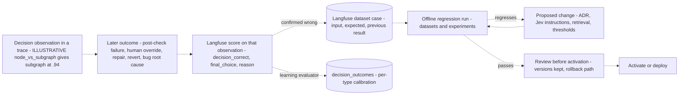

# Decision Kernel Regression Memory — Confirmed Mistakes as Langfuse Dataset Cases

Langfuse datasets are the colony's regression memory. They hold confirmed wrong decisions, so
that a later version does not relearn an old mistake
([ADR-058](../adrs/ADR-058-langfuse-colony-history-scores-datasets.md) §4). This branch runs
offline. The kernel's hot path never reads datasets (ADR-058 §6).

**Status: decided, not built.** ADR-058 says V0 scope is unchanged and that scores, datasets
and the regression gate "need new work, which this ADR does not schedule". The roadmap (as
edited on 2026-09-30) lists scores and dataset cases among the exit criteria of
`phase_colony_2_analyze`, which is kernel Stage 4. The kernel's `Tracer` protocol has no score
operation yet.

Parent: [Decision Kernel and Colony Memory — Design Map](decision-kernel-flows-overview.md)

See also: [Learning loop](decision-kernel-flows-learning-loop.md) (the runtime branch).

## From a decision to a dataset case

| Step | What the sources say | Source |
|---|---|---|
| The decision is observable | Every Jev decision and routing choice is its own observation with `CorrelationIds`. V0 emits `decision.status` and `routing.assessed` | ADR-058 §3; design part 5 |
| A later event attributes an outcome | A post-check failure, a human override at an interaction, a repair loop, a revert or a bug root-cause analysis that references the earlier `decision_id`, possibly from another run | ADR-056 §4 |
| The outcome finds its decision | The deterministic `trace_id` (from `run_id`) and the `decision_id` in the observation's metadata. V0 is recommended to add an outcome event keyed to `decision_id` | ADR-058 §3; ADR-056 §9 |
| The outcome becomes a score | ILLUSTRATIVE: `decision_correct = false`, `final_choice = node`, `reason = "No independent lifecycle"`. Scores can come from human review, application code, deterministic evaluators or LLM judges | ADR-058 §3 |
| A confirmed mistake becomes a case | ILLUSTRATIVE: dataset `node_vs_subgraph_decisions`; input = feature description plus ADR; expected = NODE; previous Jev result = SUBGRAPH | ADR-058 §4 |
| The same scores feed calibration | The learning evaluator distils them into `decision_outcomes`, the raw material for per-decision-type calibration | ADR-057 §6; ADR-056 §4 |

## The regression gate

Before a change to any of these is deployed, the decision system runs offline against the
relevant dataset cases, using Langfuse datasets and experiments (ADR-058 §4):

- an ADR or other decision basis;
- Jev instructions, meaning the decision specifications of ADR-052 §8;
- evidence retrieval;
- confidence thresholds (ADR-053).

This is the concrete form of spec §19.4, "Evaluate proposed policies, capability changes,
retrieval plans, and prompt/model versions on held-out cases". A passing run does not replace
review: activation still needs review, preserved versions and a rollback path (spec §19.2;
ADR-056 §3 rule 5). The change records its regression result together with its review
(ADR-058, Operational).

## Limits the sources name

- Many wrong decisions never produce a later event, so cases lean toward mistakes that are easy
  to detect. A missing `decision_correct = false` does not prove a decision right, and a human
  override can express a preference rather than an error (ADR-056, ADR-058 Negative).
- A case that motivated a change is not held out for that change (ADR-058 Negative; OP-24).
- Degraded-mode runs never reach Langfuse, so they cannot be scored or become cases
  (ADR-058 Negative).
- What counts as "correct" is not settled (ADR-056 open question 3; ADR-058 open question 1).

Open points for this page: OP-21, OP-24, OP-25 in [open points](decision-kernel-flows-open-points.md).

## Legend

| Element | Meaning |
|---|---|
| Dotted arrow | Every step here is decided by ADR-058 but not built yet |
| Cylinder | Stored data in Langfuse or the colony memory store |

## Cross-Links

- Parent: [Design Map](decision-kernel-flows-overview.md)
- Sibling: [Learning loop](decision-kernel-flows-learning-loop.md)
- Decisions: [ADR-056](../adrs/ADR-056-colony-memory-evidence-reinforcement.md) §3–§4,
  [ADR-058](../adrs/ADR-058-langfuse-colony-history-scores-datasets.md) §3–§4
- Evaluation before activation: [spec §19](../../analysis/2026-09-30-leafcutter-kernel-spec-rev3-7-later-stages.md)
