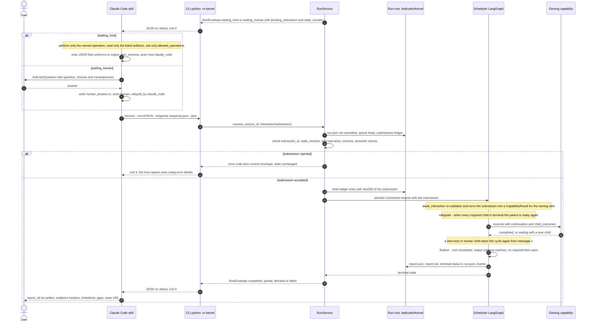

# Decision Kernel Request Flow 2 — Host or Human Handoff, Resume and Finalize

This is the second half of a kernel run. [Request Flow 1](decision-kernel-flows-request-native.md)
ended with a `waiting_host` or `waiting_human` envelope and a CLI process that exited normally.
This page shows how Claude Code serves the pending interaction, how `resume` validates the
answer before the graph moves, and how the run reaches a terminal state.

**Status: V0.** Interaction nodes and submission validation are phase P6. The RunService
implementation, CLI and skill are P7. The `host.*` operations are P8. Cancellation hardening is
P9 (design part 6).

The cycle repeats: one handoff at a time, because `max_concurrent_host` is 1 and only the queue
head is served (design part 3).

Parent: [Decision Kernel and Colony Memory — Design Map](decision-kernel-flows-overview.md)

See also: [Request Flow 1](decision-kernel-flows-request-native.md) and
[Context: host, worker, human](decision-kernel-context-host-worker-human.md).

## Resume validation, in order

`RunService.resume_run` checks the submission before it touches the graph (design part 3).

| Check | Rejection code | Effect |
|---|---|---|
| `run.json` status is `cancelled` | `run_cancelled` | Stale resumes after a cancel are refused; cancellation provenance is kept |
| No pending interaction: an identical ledger hash replays the current envelope; anything else is refused | `stale_submission` | An identical duplicate is idempotent |
| `interaction_id` is the queue head and `expected_state_revision` matches | `stale_submission` | |
| A `human` interaction accepts only `human_answer.v1` from `actor.kind="human"`; a `host_work` interaction only its `output_schema_id` from `actor.kind="host"` | `kind_mismatch` | A generative result can never answer a human question |
| Schema through the catalog, then the semantic checks: cited ids exist, the selected option was supplied, the `choice_id` was offered | `schema_invalid`, `semantic_invalid` | State unchanged; the interaction stays pending; host repairs count against `host.max_repair_attempts` (1) |

The ledger entry is written before `Command(resume=…)`. A restart finds the ledger entry and
resumes the still-pending interaction. The P6 restart tests must cover a restart just before
and just after that write (spec §13.1, design part 3).

## What a submission becomes

| Submission | Becomes | Source |
|---|---|---|
| Host output (`options.v1`, `findings.v1`, `evidence_bundle.v1`) | `CapabilityResult(completed)`; host evidence carries `verification=host_reported`; options stay `proposal_status=proposed`; usage is `unavailable` unless the host reports it | design part 4, `conversion.py` |
| Human answer (`human_answer.v1`) | `Evidence(category=task_context, semantic_type=human_input, source.kind=human)`, with the actor and `relayed_by` in provenance | design part 4 |

Every host operation also records a `host_only` gap observation. That is the scout signal the
[learning loop](decision-kernel-flows-learning-loop.md) counts later (design part 4, ADR-056 §6).

## Other ways a run ends

- **Cancel.** `python -m kernel cancel --run-id RUN --actor human:<id>` writes `cancel` and
  `status=cancelled` to `run.json` and appends `run.cancelled`. A running process sees it through
  `cancel_probe()` between supersteps (design part 3). P9 still has to verify the
  `aupdate_state(as_node="finalize")` step (design part 6, risk 5).
- **Silence.** An unanswered human question keeps the run in `waiting_human` until someone
  cancels it. No answer is inferred from silence (spec §11.6).
- **Guards.** Budget, time, no-progress and depth guards end the run as `partial` or `blocked`
  with the unresolved question (design part 3).

## Tracing across processes

Each CLI process opens a trace segment (`leafcutter.run` or `leafcutter.run.resume`) on the same
`trace_id`, which is derived from `run_id`. A resumed run therefore appends to one trace.
Handoffs appear as `interaction.opened`, `submission.accepted` and `submission.rejected` events.
The host's own work is host-reported, not traced by the kernel (design part 5; ADR-058 §2).

Open points for this flow: OP-04, OP-12, OP-15 in [open points](decision-kernel-flows-open-points.md).

## Legend

| Element | Meaning |
|---|---|
| Solid arrow | A call or message |
| Dashed arrow | A return value |
| `alt` block | Mutually exclusive branches |
| Self-arrow | Work done inside one participant |

## Cross-Links

- Parent: [Design Map](decision-kernel-flows-overview.md)
- Sibling: [Request Flow 1](decision-kernel-flows-request-native.md)
- Client, CLI exit codes and skill body: [design part 5](../../analysis/2026-09-30-decision-kernel-design-5-client-observability.md)
- Host handoff contract: [spec part 5 §11](../../analysis/2026-09-30-leafcutter-kernel-spec-rev3-5-client-observability-safeguards.md)
