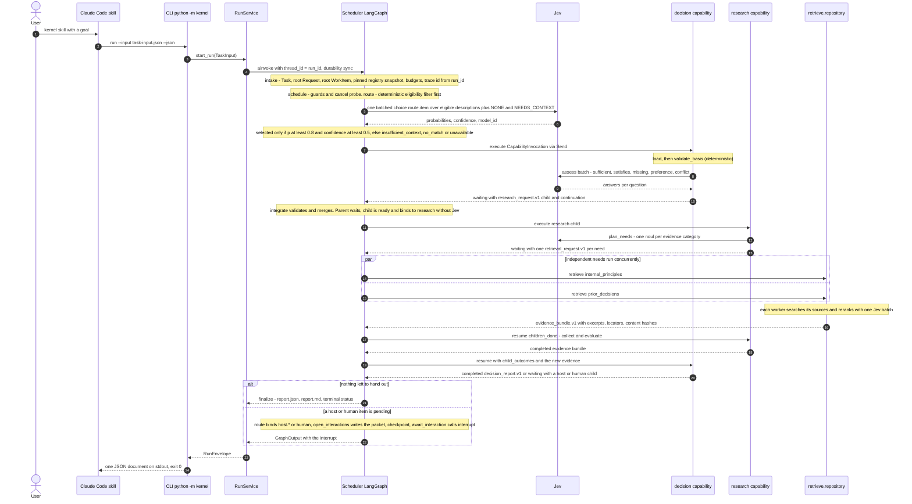

# Decision Kernel Request Flow 1 — Native Work up to the First Wait

This is the first half of one kernel run. It starts when the user calls the kernel skill in
Claude Code. It ends at one of two points: the run finalizes, or it stops and waits for host or
human work. The second half is [Request Flow 2](decision-kernel-flows-request-handoff.md).

**Status: V0.** Phases P1–P5 (contracts, persistence, Jev adapter, scheduler, native
capabilities) are merged on the kernel branch. The CLI, RunService implementation and skill are
phase P7; host operations are P8 (design part 6).

**Example path.** The caller's `TaskInput` carries a `decision_request.v1` payload with options
and approved criteria, as in the spec §4.4 demonstration ("node or subgraph?"). With a bare goal
and no options, `validate_basis` asks the host for options first. That branch is shown in
[flow 2](decision-kernel-flows-request-handoff.md).

Parent: [Decision Kernel and Colony Memory — Design Map](decision-kernel-flows-overview.md)

See also: [Request Flow 2 — Handoff, Resume and Finalize](decision-kernel-flows-request-handoff.md)
and [Context: Jev calls](decision-kernel-context-jev.md).

## Where the flow waits

| Wait point | What is persisted first | What the envelope says |
|---|---|---|
| A host item is bound (`host.generate_options`, `host.synthesize`, `host.research`, `host.formulate_question`) | `open_interactions` writes the packet to `runs/<run_id>/interactions/<id>.json`; the superstep is on disk (`durability="sync"`) before the CLI exits | `waiting_host` with the full `HostWorkRequest` |
| A human item is bound (decision `needs_human`, criteria approval, or a routing clarification) | Same, as a `HumanQuestion` | `waiting_human` |
| No interaction pending and the root is terminal or a guard trips | `finalize` writes `report.json`, `report.md` and the terminal status | `completed`, `partial`, `blocked` or `failed` |

Native work never waits inside a CLI call. Children run inside the same `ainvoke`, and the
parent resumes when every required child is terminal (spec §8.1 steps 8–9). Only host and human
work stop the process. `await_interaction` has no side effects before `interrupt()`, so it can
safely run again on resume (design part 3).

## Notes per step

Step numbers are the diagram's message numbers.

| Step | Source of truth |
|---|---|
| 2 | The goal travels as a JSON file, never interpolated into a shell command (spec §11.2) |
| 4 | `intake` is idempotent. With no `input_payload`, the root request is a `goal_request.v1`. A request of kind `capability` always needs semantic routing (design parts 2 and 3) |
| 5–6 | One Jev call covers every item that needs semantic routing. The top candidate is never selected silently (design part 4). `fixed` capabilities are never offered to Jev |
| 8–10 | `validate_basis` and `combine` are deterministic; `assess` is one Jev batch. Thresholds come from `config/kernel_config.default.json` (`decision.*`) |
| 11 | As built, a `research_request.v1` child of kind `evidence` binds to `research` without Jev (design part 3, "As built") |
| 12–13 | Each retrieval child carries `operation` (`retrieve` or `bounded_research`); a need with no native source goes to `host.research` instead (design part 2) |
| 14–16 | Workers get independent state snapshots and return results only; `integrate` merges in sorted-id order (spec §8.3) |
| 19 | The parent reads child output from the run artifact `result-<invocation_id>.json` (design part 3, "As built") |
| 21–24 | Exit code 0 for every envelope, including `waiting_*`, `blocked` and `failed` (design part 5) |

Every node, capability and Jev call becomes a Langfuse observation on one trace whose id is
derived from `run_id` (design part 5). The trace is observability only; the run root is
authoritative ([learning loop](decision-kernel-flows-learning-loop.md)).

**Later stages change the context, not this sequence.** From ADR-057's INFLUENCE ROUTING stage,
the routing call can also receive colony statistics. From Stage 2, evidence can come from the
context compiler. See [Context: Jev calls](decision-kernel-context-jev.md).

Open points for this flow: OP-01, OP-02, OP-03, OP-15 in [open points](decision-kernel-flows-open-points.md).

## Legend

| Element | Meaning |
|---|---|
| Solid arrow | A call or message |
| Dashed arrow | A return value |
| `par` block | Work items dispatched in the same superstep by separate `Send` packets |
| `alt` block | Mutually exclusive outcomes |

## Cross-Links

- Parent: [Design Map](decision-kernel-flows-overview.md)
- Sibling: [Request Flow 2](decision-kernel-flows-request-handoff.md)
- Kernel graph topology: [design part 3](../../analysis/2026-09-30-decision-kernel-design-3-kernel-scheduler.md)
- Capabilities and Jev templates: [design part 4](../../analysis/2026-09-30-decision-kernel-design-4-jev-and-capabilities.md)
