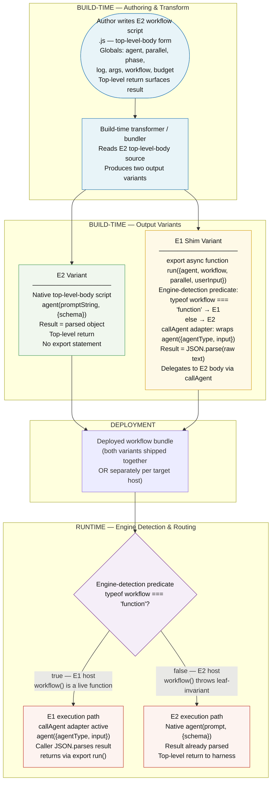

# Dual-Engine Workflow Build Transform — Data Flow

This L1 diagram shows how a workflow script authored in the E2 top-level-body
style flows through the build pipeline to produce both an E2-native variant and
an E1-compatible shim wrapper, and how the engine-detection predicate routes
execution to the correct path at runtime.

Two distinct phases are shown:

1. **Build-time transform** — a bundler/transformer reads the E2 source script
   and emits two output variants: the native E2 form (unchanged) and a shim
   wrapper that adapts the E2 script for E1-engine hosts.
2. **Runtime routing** — the engine-detection predicate inside each deployed
   shim inspects the invocation context and delegates to either the E2 execution
   path or the E1 shim execution path.

> **Key invariant:** Workflow authors write exclusively in the E2 top-level-body
> form. The E1 compatibility shim is generated mechanically at build time — no
> hand-authored E1 `export async function run(...)` variants exist.

---

---

## Stage Summary

| Stage | What happens |
|---|---|
| **Author writes E2 source** | The workflow author writes a single `.js` file using the E2 top-level-body contract: globals (`agent`, `parallel`, `phase`, `log`, `args`, `workflow`, `budget`), `agent(promptString, {schema})` calls where the result is an already-parsed object, and a top-level `return` to surface the result. |
| **Build-time transform** | A bundler/transformer reads the E2 source and emits two output variants. This step is purely mechanical — no LLM or manual authoring is involved. |
| **E2 variant** | The native E2 output is the source script in top-level-body form, unchanged or lightly wrapped. It runs directly in an E2 harness with no shim overhead. |
| **E1 shim variant** | An `export async function run({agent, workflow, parallel, userInput})` wrapper is generated. It embeds the engine-detection predicate, a `callAgent` adapter that bridges `agent({agentType, input})` (E1 API) to the E2-style `agent(prompt, {schema})` call pattern, and delegates to the E2 body logic. |
| **Engine-detection predicate** | At runtime, `typeof workflow === 'function'` distinguishes E1 from E2: in an E1 host, `workflow` is passed as a live function; in an E2 host, calling `workflow()` throws because it is a leaf-invariant guard (the script IS the workflow). |
| **Runtime routing** | Predicate `true` → E1 execution path (callAgent adapter active, result is raw text requiring `JSON.parse`). Predicate `false` → E2 execution path (native harness, result is already parsed). |

---

## Key Design Constraints

1. **Author writes only E2 form.** No author writes E1 `export run()` wrappers
   by hand. All E1 compatibility shims are generated by the build-time transformer.

2. **E1 and E2 API asymmetry is encapsulated in the shim.** The `callAgent`
   adapter in the shim handles the structural difference:
   - E2: `agent(promptString, { agentType, schema, label, phase, effort })` → returns a parsed object.
   - E1: `agent({ agentType, input })` → returns raw text; caller must `JSON.parse`.

3. **Engine-detection predicate is deterministic.** `typeof workflow === 'function'`
   is a pure, zero-side-effect check. It does not call `workflow()` (which would
   throw in E2 leaf context); it only inspects the type of the binding.

4. **No LLM fallback.** The build transform is mechanical. If the transformer
   cannot produce a valid shim, it fails fast at build time — it does not invoke
   an LLM to generate compatibility code at runtime.

5. **Non-transparent edges are not bridged by the shim.** The following
   differences remain caller-visible regardless of which path executes:
   - `Date.now()` / `Math.random()` are banned in E2 (determinism requirement).
   - `parallel()` is capped at 4096 tokens / ~16 concurrent branches in E2.
   - Schema-enforcement asymmetry: E2 enforces the `schema` parameter; E1 ignores it.
   - `prompt()`-gate vs agent-mediated gate: E2 uses `agent()`; E1 uses `prompt()`.
   - `workflow()` leaf-invariant: E2 throws if called; E1 treats it as a function call.

---

## Relationship to Adjacent Docs

| Document | What this diagram adds |
|---|---|
| [ADR-030 Dual-Engine Workflow Support](../adrs/ADR-030-dual-engine-workflow-support.md) | The ADR records the decision. This diagram shows the structural data flow the decision implies. |
| [Workflow Authoring Contract](../../reference/workflow-authoring-contract.md) | The reference doc shows the E2 canonical skeleton and shim pattern in code. This diagram shows how those artifacts relate in the build and runtime pipeline. |
| [quick-fix.js](../../../templates/workflows-js/quick-fix.js) | The working E2 reference implementation this diagram was derived from. |

---

<!--
====================================================================
DECISION HISTORY
====================================================================
- 2026-07-01 [python-coder]: Initial creation. L1 data_flow diagram showing
  the build-time E2 → E1-shim transform and the runtime engine-detection
  predicate routing. Created as part of ticket 03 of
  EPIC-DualEngineWorkflowSupport (spike: canonical E2 contract + ADR).
  Frontmatter type: data_flow (per config/diagram_types.json).
====================================================================
-->
