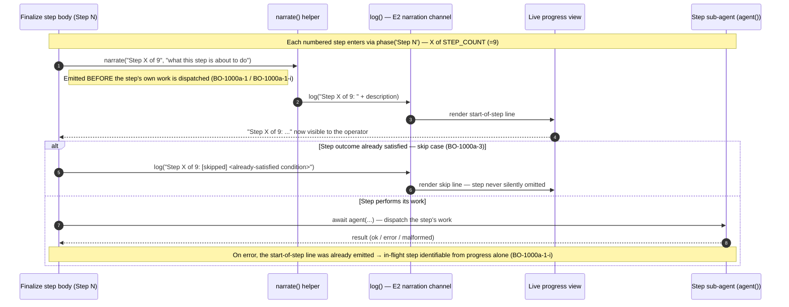

# Finalize Start-of-Step Narration — Emission Sequence

This diagram shows how a **start-of-step progress line** travels from the entry
of each numbered `finalize-feature` workflow step, through the shared narration
channel (`narrate()` → `log()`), to the live progress view — so an operator can
see which step is in flight the moment it begins.

The load-bearing property is **ordering**: the start-of-step line is emitted
*before* the step dispatches its own work (BO-1000a-1), so the in-flight step is
identifiable from the progress output alone even if that work later errors
(BO-1000a-1-i).

> **Every non-error step narrates.** A start-of-step line fires at the entry of
> all `STEP_COUNT` (= 9) numbered steps — carrying the `"Step X of 9"` position
> label (BO-1000a-2). A step whose outcome is already satisfied is **not**
> silently skipped: it still emits a start line reporting the skip and naming the
> already-satisfied condition (BO-1000a-3).

---

Parent: [Feature to Merged PR — End-to-End Sequence Diagram](c2-006-feature-to-merged-pr.md)

---

## The emission path, participant by participant

| Participant | Role in the emission path |
|---|---|
| Finalize step body (`Step N`) | The numbered step block in `finalize-feature.js`. On entry it calls `phase('Step N')` then invokes `narrate(...)` before its first `await agent(...)`. |
| `narrate()` helper | Shared start-of-step helper. Formats `progressText + ': ' + description` and forwards it to the narration channel. One helper keeps the `"Step X of N"` scheme uniform across all steps. |
| `log()` — E2 narration channel | The E2 engine global that writes onto the workflow's narration channel (the same channel used by `outcome()` and 20+ other call sites). Not a side channel. |
| Live progress view | Where the operator reads the streamed narration in real time. |
| Step sub-agent (`agent()`) | The step's actual work, dispatched *after* the start-of-step line. Shown to fix the ordering relative to the narration signal. |

## Ordering guarantees

- **Before the work (BO-1000a-1):** `narrate()` runs at the step's entry, before
  the first `await agent(...)` dispatch — never after the step returns.
- **Survives an error (BO-1000a-1-i):** because the start line is already on the
  channel, a subsequent error or malformed result cannot pre-empt it; the
  in-flight step is recoverable from the progress stream without relying on the
  error branch printing its own diagnostic line.
- **Skip still narrates (BO-1000a-3):** a step whose outcome is already satisfied
  still emits a start line reporting the skip and its cause; it is never a silent
  early return.

## Cross-References

- [Feature to Merged PR — End-to-End Sequence Diagram](c2-006-feature-to-merged-pr.md) — parent flow; finalize is its terminal (merge/close) phase.
- [Build Orchestration](../components/build-orchestration.md) — the component that owns the finalize-feature workflow surface.

<!--
====================================================================
DECISION HISTORY
====================================================================
- 2026-07-21 [architecture-diagram-author, EPIC-InFlightVisibility/06]:
  Initial creation (BO-1000a-4). Sequence of the start-of-step narration
  emission path in finalize-feature.js: step body -> narrate() -> log()
  (E2 narration channel) -> live progress view, with the start-of-step line
  emitted before the step's own agent() dispatch (BO-1000a-1 / BO-1000a-1-i),
  the "Step X of 9" framing (BO-1000a-2), and the skip-still-narrates case
  (BO-1000a-3) shown in the alt branch. Followed the established *-sequence.md
  directory convention (gates/probe/self-heal); scripts/scaffold/new_arch_doc.py
  is not deployed in this repo.
====================================================================
-->
