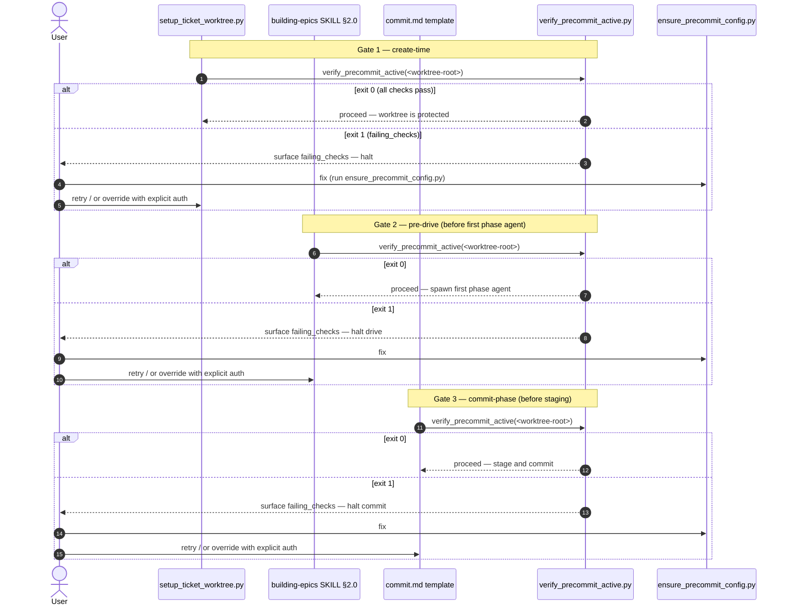

# Lifecycle Gates — Probe Invocation Sequence

This diagram shows the three points across the worktree lifecycle where a gate
invokes the probe `verify_precommit_active.py`. Each gate proceeds only when the
probe exits `0`; on a non-zero exit it surfaces the `failing_checks` to the user
and halts.

> **Same probe, three call sites.** Create-time, pre-drive, and commit-phase all
> run the identical four-check probe. A failure at any gate offers the user the
> same options: fix (run `ensure_precommit_config.py`), retry, or override with
> explicit authorisation.

---

Parent: [Worktree Quality Gate Guard — Container Overview](../components/worktree-quality-gate-guard.md)

---

## The three gates

| Gate | Call site | When it runs | On failure |
|---|---|---|---|
| Create-time | `setup_ticket_worktree.py` | Immediately after the worktree is created. | Surface `failing_checks`; user fixes, retries, or overrides. |
| Pre-drive | building-epics SKILL §2.0 | Before the first phase agent is spawned. | Halt the drive; user fixes, retries, or overrides. |
| Commit-phase | `commit.md` template | Before staging files for a commit. | Halt the commit; user fixes, retries, or overrides. |

## User options on failure

1. **Fix** — run `ensure_precommit_config.py` to re-materialise the config, then re-run the probe.
2. **Retry** — re-invoke the gate once the environment is repaired.
3. **Override** — proceed only with explicit authorisation (the fail-closed default is to halt).

## Cross-References

- [Worktree Quality Gate Guard — Container Overview](../components/worktree-quality-gate-guard.md) — parent container.
- [Probe Sequence](probe-sequence.md) — the four-check probe each gate invokes.
- [Self-Heal Sequence](self-heal-sequence.md) — the remedy the "fix" option triggers.
- [ADR-031 — Worktree Quality Gate Guard](../adrs/ADR-031-worktree-quality-gate-guard.md).

<!--
====================================================================
DECISION HISTORY
====================================================================
- 2026-07-06 [architecture-diagram-author, EPIC-WorktreeQualityGateGuard/08]:
  Initial creation (BO-1700d-4). Sequence of the three lifecycle gates
  (create-time, pre-drive, commit-phase) invoking verify_precommit_active.py,
  with the fix/retry/override options on a fail-closed halt.
====================================================================
-->
