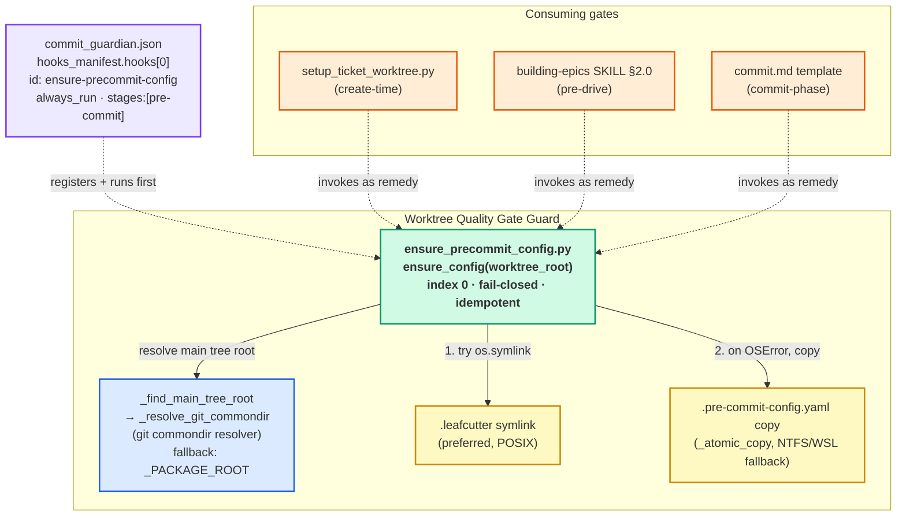

# Self-Healing Config Hook — Component Diagram

This diagram shows `ensure_precommit_config.py` as a component: its resolver
dependency, the two re-materialisation outputs it can produce, its index-0
registration in the manifest, and the gates that consume it.

---

Parent: [Worktree Quality Gate Guard — Container Overview](../components/worktree-quality-gate-guard.md)

---

## Elements

| Element | Role |
|---|---|
| `ensure_config(worktree_root)` | Core entry point. Idempotent no-op when config already resolves; otherwise re-materialises it; fail-closed (returns `False`, never raises). |
| `_resolve_git_commondir` (via `_find_main_tree_root`) | Resolves the shared `.git` commondir to locate the main tree's `.leafcutter`. Falls back to `_PACKAGE_ROOT` when git resolution is unavailable. |
| `.leafcutter` symlink | Preferred output — a symlink to the main tree's `.leafcutter` directory, preserving all hook configs. |
| `.pre-commit-config.yaml` copy | Fallback output — an atomic write-temp-then-rename copy used when symlink creation raises `OSError` (e.g. NTFS/WSL). |
| `commit_guardian.json` `hooks[0]` | Registers the hook at index 0 (`always_run`, `stages: [pre-commit]`) so it runs before every other hook. |
| Consuming gates | `setup_ticket_worktree.py`, building-epics SKILL §2.0, and `commit.md` invoke this hook as the remedy when the probe fails. |

## Cross-References

- [Worktree Quality Gate Guard — Container Overview](../components/worktree-quality-gate-guard.md) — parent container.
- [Self-Heal Sequence](self-heal-sequence.md) — the runtime flow of this component on every commit.
- [ADR-031 — Worktree Quality Gate Guard](../adrs/ADR-031-worktree-quality-gate-guard.md).

<!--
====================================================================
DECISION HISTORY
====================================================================
- 2026-07-06 [architecture-diagram-author, EPIC-WorktreeQualityGateGuard/08]:
  Initial creation (BO-1700c-2). Component view of ensure_precommit_config.py
  rendered as a flowchart (diagram_type: component): resolver dependency,
  symlink/copy outputs, index-0 registration, and the three consuming gates.
====================================================================
-->
