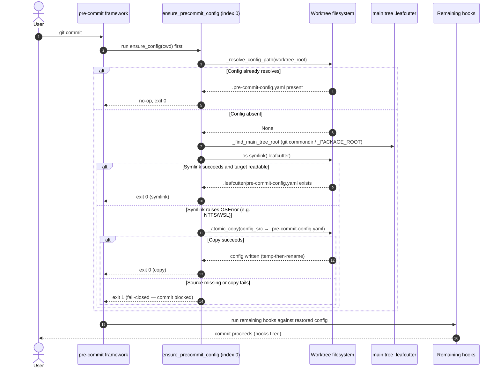

# Self-Healing Config Hook — Commit-Time Sequence

This diagram shows what happens on every `git commit` inside a worktree:
`ensure_precommit_config.py` runs first (manifest index 0), re-materialises the
`.pre-commit-config.yaml` if it is absent, and only then do the remaining hooks
run against the restored config.

> **Idempotent + fail-closed.** When the config already resolves, the hook is a
> no-op and exits `0`. When it must re-materialise and both strategies fail, it
> exits `1` — blocking the commit rather than letting it proceed unchecked.

---

Parent: [Worktree Quality Gate Guard — Container Overview](../components/worktree-quality-gate-guard.md)

---

## Step summary

| Phase | What happens |
|---|---|
| Dispatch | `pre-commit` invokes `ensure_precommit_config` first because it is registered at `hooks_manifest.hooks[0]` with `always_run`. |
| Fast-exit | If `_resolve_config_path` finds the config, the hook returns immediately (idempotent no-op, exit 0). |
| Symlink | Otherwise it resolves the main tree root and attempts `os.symlink(.leafcutter)`; success requires `.leafcutter/pre-commit-config.yaml` to be readable. |
| Copy fallback | If the symlink raises `OSError`, it copies `.pre-commit-config.yaml` via `_atomic_copy` (write-temp-then-rename). |
| Fail-closed | If neither strategy establishes the config, the hook exits 1 and blocks the commit. |
| Remaining hooks | With the config restored, the rest of the hook chain runs and the commit proceeds. |

## Cross-References

- [Worktree Quality Gate Guard — Container Overview](../components/worktree-quality-gate-guard.md) — parent container.
- [Self-Heal Component](self-heal-component.md) — the static structure of this hook.
- [ADR-017 — Worktree Quality Gate Guard](../adrs/ADR-017-worktree-quality-gate-guard.md).

<!--
====================================================================
DECISION HISTORY
====================================================================
- 2026-07-06 [architecture-diagram-author, EPIC-WorktreeQualityGateGuard/08]:
  Initial creation (BO-1700c-3). Commit-time sequence for ensure_config():
  idempotent no-op, symlink re-materialisation, atomic-copy fallback on OSError,
  and fail-closed exit 1, matching ensure_precommit_config.py.
====================================================================
-->
