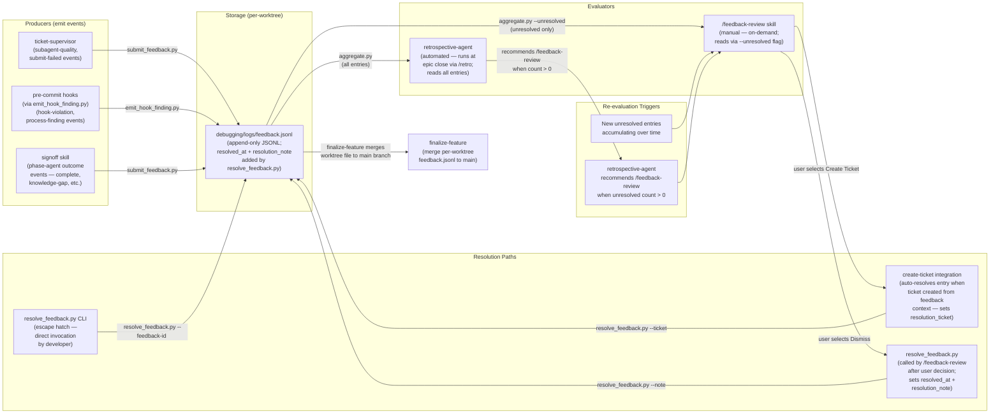

# Feedback Lifecycle — Data Flow

## Purpose

This document describes the complete lifecycle of a feedback entry in the leafcutter
system: how entries are produced, where they are stored, how they are evaluated, and
how they are resolved. It covers all producers, the central storage format, the
evaluation agents, and the three resolution paths available after review.

---

## Diagram

Parent: [Agent Delivery Workflows](./agent_delivery_workflows.md)

---

## Nodes Reference

### Producers

| Node | Description | Script |
|------|-------------|--------|
| `ticket-supervisor` | Emits `subagent-quality` events when an agent retry or halt occurs; emits `submit-failed` events when `submit_feedback.py` itself fails | `submit_feedback.py` |
| `pre-commit hooks` | Emits `hook-violation` and `process-finding` events whenever a pre-commit check fires a finding | `emit_hook_finding.py` |
| `signoff skill` | Every phase agent calls `submit_feedback.py` during sign-off; emits outcome events (`complete`, `knowledge-gap`, `convention-ambiguity`, `tooling-issue`, etc.) | `submit_feedback.py` |

### Storage

| Node | Description | Location |
|------|-------------|----------|
| `feedback.jsonl` | Append-only JSONL file; one JSON object per line; `resolved_at` and `resolution_note` fields added in place when an entry is resolved | `debugging/logs/feedback.jsonl` (per-worktree) |

During `finalize-feature`, per-worktree `feedback.jsonl` files are merged into the main
branch so the full feedback corpus is available after an epic closes.

### Evaluators

| Node | Description | Trigger |
|------|-------------|---------|
| `retrospective-agent` | Reads the full feedback corpus via `aggregate.py`; produces a structured retrospective with category breakdown, subagent quality trends, and proposed improvements | Automated — invoked at epic close via `/retro` |
| `/feedback-review skill` | Reads only unresolved entries via `aggregate.py --unresolved`; presents each entry to the user for triage (create ticket, dismiss, skip) | Manual — on-demand by user |

### Resolution Paths

| Path | Description | Method |
|------|-------------|--------|
| `create-ticket integration` | Auto-resolves the originating feedback entry when a ticket is created from feedback context; sets `resolution_ticket` to the new ticket path | `resolve_feedback.py --ticket <path>` |
| `/feedback-review manual` | Called by `/feedback-review` after the user selects Dismiss; sets `resolved_at` and `resolution_note` | `resolve_feedback.py --feedback-id <id> --note "<reason>"` |
| `resolve_feedback.py CLI` | Direct invocation escape hatch for developers who want to resolve an entry outside the skill flow | `python scripts/feedback/resolve_feedback.py --feedback-id <id>` |

---

## Entry Schema (summary)

Each `feedback.jsonl` entry carries these key fields:

| Field | Description |
|-------|-------------|
| `feedback_id` | Unique ID (`fb_YYYY-MM-DD_XXXXXXXX`) |
| `timestamp` | ISO 8601 emission time |
| `phase` | Agent or hook that emitted the entry |
| `category` | Outcome category (`complete`, `knowledge-gap`, `subagent-quality`, `hook-violation`, etc.) |
| `severity` | `info`, `warning`, or `error` |
| `note` | Human-readable description of the event |
| `tags` | Optional list of kebab-case descriptors |
| `resolved_at` | ISO 8601 timestamp set when entry is resolved (absent if unresolved) |
| `resolution_note` | Human-readable reason for resolution (absent if unresolved) |
| `resolution_ticket` | Path to the ticket created from this entry (optional) |

---

## Re-evaluation Cycle

1. Entries accumulate in `feedback.jsonl` during an epic drive.
2. `retrospective-agent` reads the corpus at epic close and recommends `/feedback-review`
   when `aggregate.py --unresolved` returns count > 0.
3. User (or retrospective-agent) invokes `/feedback-review`.
4. For each unresolved entry, the user chooses: Create Ticket, Dismiss, or Skip.
5. Resolved entries have `resolved_at` set; skipped entries remain unresolved for the next cycle.
6. The cycle repeats on the next epic close or on-demand invocation.

---

## Config Resolution — Source Repo and Deployed Layouts (AC INF-100c-2)

When `submit_feedback.py` runs from the leafcutter source tree at
`leafcutter-ai/scripts/feedback/`, it must find `feedback_categories.yaml` at
`leafcutter-ai/config/feedback_categories.yaml`. This is the source-repo layout,
distinct from the deployed-project layout (`.leafcutter/`).

The `_find_config_root()` function achieves this by anchoring to `__file__` and
returning `Path(__file__).resolve().parents[2] / "config"`. For the source repo:

- Script at `leafcutter-ai/scripts/feedback/submit_feedback.py`
- `parents[2]` = `leafcutter-ai/`
- Config found at `leafcutter-ai/config/` ✓

This preserves backward compatibility: the source-repo config layout (`config/`
adjacent to `scripts/`) is identical to the deployed layout (`.leafcutter/config/`
adjacent to `.leafcutter/scripts/`), so the same `parents[2]` resolution works
in both cases.

**Verification:** `unit_tests/feedback/test_submit_feedback_config_resolution.py`
class `TestConfigRootFromSourceRepoLocation` (AC INF-100c-2).

---

## Config Resolution in Git Worktrees (AC INF-100c-1-i)

When leafcutter is deployed into a project at `<project>/.leafcutter/` and a git
worktree is created from that project, `submit_feedback.py` must resolve its config
without walking past `.leafcutter/` into the parent directory.

### How it works

`submit_feedback.py` uses `_find_config_root()` which anchors config resolution to
the script file's own location via `Path(__file__).resolve().parents[2] / "config"`.

This means:

| Deployment layout | Script location | Config resolved at |
|---|---|---|
| Source repo | `leafcutter-ai/scripts/feedback/submit_feedback.py` | `leafcutter-ai/config/` |
| Deployed project | `<project>/.leafcutter/scripts/feedback/submit_feedback.py` | `<project>/.leafcutter/config/` |
| Git worktree of deployed project | `<worktree>/.leafcutter/scripts/feedback/submit_feedback.py` | `<worktree>/.leafcutter/config/` |

### Invariant

The config directory is always exactly **two parents above the script file**, regardless of:

- The process working directory (CWD)
- The presence of `.claude/` markers in the directory tree
- The existence of a `config/` directory in the worktree's parent

This is enforced by the `_find_config_root()` function (not `_find_project_root()`,
which searches for `.claude/` and is used only for the JSONL log path).

**Cross-reference:** AC INF-100c-1 (base), AC INF-100c-1-i (worktree scenario),
`unit_tests/feedback/test_submit_feedback_worktree_resolution.py`.

---

## Cross-Links

- Parent: [Agent Delivery Workflows](./agent_delivery_workflows.md) — supervisor dispatch topology
- Related: [Agent Knowledge System](./agent_knowledge_system.md) — how agents classify and persist learnings
- Skill: `templates/skills/feedback-review/SKILL.md` — procedural definition of the `/feedback-review` triage flow
