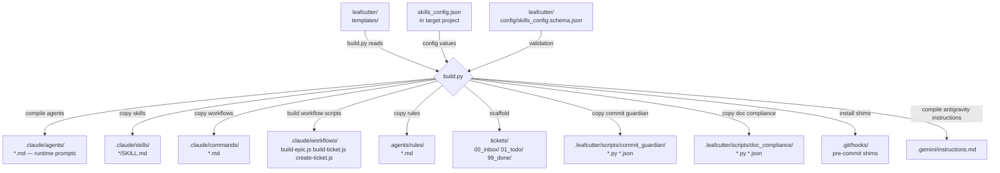
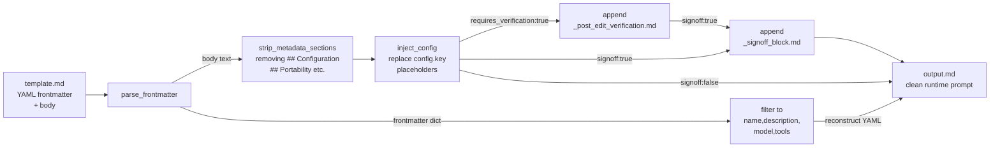
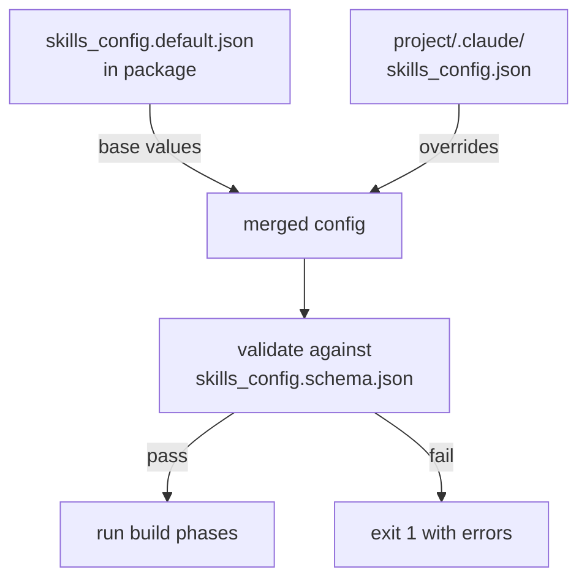

# Build Pipeline Architecture

This document shows how the leafcutter templates are compiled
into a target project by `build.py`.

## Source → Build → Output Flow

*Note: the post-edit verification contract enforced during build is the
`requires_verification` frontmatter rule, validated by
[`registry_validator.py`](../scripts/registry_validator.py).*



## Agent Compilation Detail

For each `.md` file in `templates/agents/` (excluding `_*.md` helpers):



## Component Registry Tooling

The `scripts/add_component.py` script provides a CLI for appending new entries
to `docs/components.json` with schema validation before the write:

```bash
python scripts/add_component.py \
    --id my_component \
    --name "My Component" \
    --type utility \
    --description "Does something useful for the build pipeline." \
    --primary-code "scripts/my_component.py" \
    --status active \
    [--detail-ref "docs/architecture/components/my_component.md"]
```

The script:
- Validates the new entry against the minimum schema (same rules as the
  `check_components_integrity` pre-commit hook).
- Exits non-zero if the component ID already exists (prevents silent overwrites).
- Writes back with 2-space indentation and sorted component keys.

## Config Resolution


