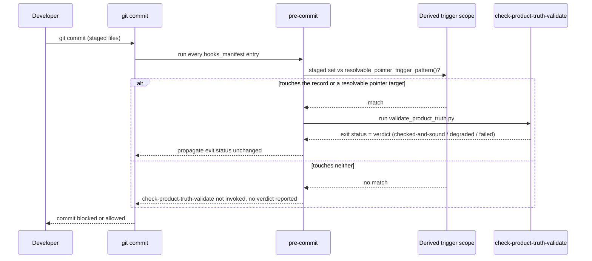

# How to manage pre-commit hooks in leafcutter

This guide covers the full lifecycle of **pre-commit hooks** in the leafcutter
build pipeline: creating a new hook, modifying an existing one, disabling one
temporarily, and deleting one permanently.

> **Naming collision note.** Two distinct hook systems exist side-by-side in
> leafcutter:
>
> - **Pre-commit hooks** (this guide) — Python scripts registered in
>   `commit_guardian.json` that run on every `git commit` via
>   `.pre-commit-config.yaml`.
> - **Claude Code hooks** — Python scripts triggered by Claude tool events
>   (PostToolUse, PreToolUse, etc.), registered in `templates/settings.json`.
>
> These are completely independent. See
> `docs/how-to/creating-a-claude-code-hook.md` for Claude Code hooks.

---

## Canonical paths (important)

All pre-commit hook scripts live at exactly one location:

```
leafcutter/templates/scripts/commit_guardian/<hook-name>.py
```

The configuration file that controls which hooks are active and how they
behave is:

```
leafcutter/templates/scripts/commit_guardian/commit_guardian.json
```

> **Note.** The directory `leafcutter/templates/commit-guardian/` was removed
> in TICKET-20260618-RemoveDeprecatedCommitGuardianTree. The canonical path
> `leafcutter/templates/scripts/commit_guardian/` is the only source of truth.

When `build.py` runs, it reads scripts from the canonical path and regenerates
`.pre-commit-config.yaml` in the consumer project from the `hooks_manifest`
section of `commit_guardian.json`.

---

## Prerequisites

- The leafcutter package is installed: `build.py` has run at least once.
- You have access to `leafcutter/templates/scripts/commit_guardian/`.
- The consumer project's `.pre-commit-config.yaml` was generated by `build.py`
  (not hand-edited — the builder manages the `@package-managed` section).

---

## Create a new hook

### Step 1 — Write the hook script

Create a new Python file in the canonical scripts directory:

```
leafcutter/templates/scripts/commit_guardian/<hook-name>.py
```

Replace `<hook-name>` with a lowercase-hyphenated name that matches what you
will register in `commit_guardian.json`, e.g. `check-my-policy.py`.

A minimal hook follows the shared runner contract: it must be invocable by
`run_hook.py` and exit `0` on pass, non-zero on fail. Study any existing hook
(e.g. `check_file_size.py`) for the expected structure — all hooks read their
configuration section from `commit_guardian.json` via the `config.py` helper.

Typical structure:

```python
"""
MODULE: check_my_policy
GOAL: One-sentence description of what this hook enforces.
BUSINESS CONTEXT: Why this policy matters for the project.
ARCHITECTURE: How the check is implemented (file scan, AST, git diff, etc.).
"""

from __future__ import annotations
import sys
from pathlib import Path
from scripts.commit_guardian.config import load_config


def main() -> int:
    """Entry point for the hook. Returns 0 on pass, 1 on failure."""
    cfg = load_config()
    hook_cfg = cfg.get("my_policy", {})
    # ... implementation ...
    return 0


if __name__ == "__main__":
    sys.exit(main())
```

### Step 2 — Register the hook in commit_guardian.json

Open `leafcutter/templates/scripts/commit_guardian/commit_guardian.json` and:

1. Add a configuration block for your hook's parameters (if any) at the top
   level of the JSON object, keyed by a snake_case name:

   ```json
   "my_policy": {
       "_comment": "check_my_policy.py — what this block controls",
       "max_violations": 5
   }
   ```

2. Add an entry to the `hooks_manifest.hooks` array:

   ```json
   {
       "id": "check-my-policy",
       "name": "Check My Policy",
       "entry": "python {{config.output_root}}/scripts/commit_guardian/run_hook.py {{config.output_root}}/scripts/commit_guardian/check_my_policy.py",
       "language": "system",
       "stages": ["pre-commit"],
       "pass_filenames": false,
       "change_set_source": "handed_by_commit_path"
   }
   ```

   Available options:
   - `"files"` — a regex pattern limiting which staged files trigger the hook.
   - `"types"` — e.g. `["markdown"]` or `["python"]` to filter by file type.
   - `"enabled": false` — to ship the hook disabled by default.
   - `"change_set_source"` — **required on every entry** (`GE-120e-2`). Set
     `"handed_by_commit_path"` if your hook only inspects the files the commit
     path hands it (this is almost every hook — do NOT infer this from
     `pass_filenames`, which is not the discriminator). Set `"self_derived"`
     only if your hook computes its own diff, and only once it genuinely
     consumes the shared `_authored_change.get_authored_change()` source
     rather than calling `git diff --cached` privately — an entry recorded
     `"self_derived"` that does not is named and reported as a failure. An
     entry with no `"change_set_source"` at all is also a reported failure;
     there is no default. See
     [commit-guardian.md](../architecture/components/commit-guardian.md#recorded-change-set-source-per-entry-change_set_source-ge-120e-2)
     for the full field reference.

### Step 3 — Run build.py

Regenerate the consumer project's `.pre-commit-config.yaml`:

```bash
python leafcutter/scripts/build.py --target-dir .
```

This replaces the `@package-managed` section in `.pre-commit-config.yaml`
with the updated hooks list. Project-specific entries (those without the
`@package-managed` marker) are preserved.

### Step 4 — Verify the hook is installed

Check that the hook appears in the generated config:

```bash
grep "check-my-policy" .pre-commit-config.yaml
```

Then run a test commit that should trigger the hook:

```bash
git add <some-file>
git commit -m "test: verify check-my-policy fires"
```

If the hook fires and blocks the commit, the output will appear in the terminal
before the commit completes. Fix the violation and try again.

---

## Modify an existing hook

### Step 1 — Edit the hook script

Open the hook script at:

```
leafcutter/templates/scripts/commit_guardian/<hook-name>.py
```

Make your changes. The script runs directly from this location; there is no
separate deployment step for the script itself.

### Step 2 — Adjust configuration parameters (if needed)

If your change requires new or modified configuration knobs, update the
corresponding section in `commit_guardian.json`.

For example, to raise the maximum line count for `check_file_size`:

```json
"file_size": {
    "line_limits": {
        ".py": 500
    }
}
```

### Step 3 — Re-run build.py

Re-run `build.py` if you changed the `hooks_manifest` section (e.g. added a
`"files"` filter or changed the `"entry"` command). If you only edited the
hook script or its config block, `build.py` is not required — the hook reads
`commit_guardian.json` at runtime.

```bash
python leafcutter/scripts/build.py --target-dir .
```

---

## Disable a hook (without deleting it)

Disabling a hook leaves the script and its configuration intact; it simply
tells `build.py` not to emit that hook into `.pre-commit-config.yaml`.

### Step 1 — Set enabled: false in commit_guardian.json

Find the hook's entry in the `hooks_manifest.hooks` array and add:

```json
"enabled": false
```

Example:

```json
{
    "id": "check-mermaid-drift",
    "name": "Check Mermaid Diagram Drift",
    "entry": "...",
    "language": "system",
    "stages": ["pre-commit"],
    "pass_filenames": false,
    "enabled": false,
    "_comment": "Disabled until diagram hash markers are seeded."
}
```

### Step 2 — Re-run build.py

```bash
python leafcutter/scripts/build.py --target-dir .
```

The hook entry will be omitted from `.pre-commit-config.yaml`. To re-enable,
remove the `"enabled": false` line and run `build.py` again.

---

## Delete a hook permanently

### Step 1 — Remove the script

Delete the script from the canonical location:

```bash
rm leafcutter/templates/scripts/commit_guardian/<hook-name>.py
```

### Step 2 — Remove the config block

Open `commit_guardian.json` and remove both:

1. The hook's top-level config block (if any), e.g. the `"my_policy": { ... }` section.
2. The hook's entry in the `hooks_manifest.hooks` array.

### Step 3 — Remove from .pre-commit-config.yaml

Re-run `build.py` to regenerate `.pre-commit-config.yaml`:

```bash
python leafcutter/scripts/build.py --target-dir .
```

The removed hook's entry will no longer appear in the output file.

> **Note:** `build.py --clean` (planned in a future release) will additionally
> remove deployed hook artefacts from the consumer project's `.git/hooks/`
> directory. Until that flag is available, verify manually that no stale
> references remain.

---

## Verification

After any CRUD operation, run the following to confirm the hook lifecycle is
consistent:

```bash
# Confirm commit_guardian.json is valid JSON
python -c "import json; json.load(open('leafcutter/templates/scripts/commit_guardian/commit_guardian.json'))" && echo "OK"

# Confirm .pre-commit-config.yaml was regenerated
grep -c "id:" .pre-commit-config.yaml

# Run the full pre-commit suite against all staged files
pre-commit run --all-files

# Confirm every manifest entry carries a valid, verified change_set_source
python3 templates/scripts/commit_guardian/change_set_source.py \
    templates/scripts/commit_guardian/commit_guardian.json
```

The last command exits non-zero and names any entry whose `change_set_source`
is missing, unrecognised, or (for `"self_derived"` entries) not actually
backed by the shared `_authored_change` source — see
[commit-guardian.md](../architecture/components/commit-guardian.md#recorded-change-set-source-per-entry-change_set_source-ge-120e-2).

---

## Transform hooks and the transform tier

> See [transform-hooks-in-precommit.md](transform-hooks-in-precommit.md) for
> the `judgment`/`transform` tier split, the two shipped transform hooks
> (`transform-doc-frontmatter`, `transform-description-field`), how silent
> auto-fix and re-staging works, hook ordering relative to validators, and
> fail-open / absent-docs-layout no-op behavior.

---

## The record's checker runs automatically (product-truth validation)

The record's checker (`docs/product-truth/scripts/validate_product_truth.py`)
is registered as `check-product-truth-validate` in `hooks_manifest.hooks[]`
alongside every other pre-commit check in this guide — it is not a separate
pipeline. See
[ADR-049](../architecture/adrs/ADR-049-record-checker-trigger-scope.md) for
the full decision and
[GE-120](../acceptance-criteria/guardrail-engine/GE-120-green-means-checked/GE-120.yaml)
for the guarantee it exists to uphold: green must mean *checked*, never
*could not look*.

### Trigger scope is derived, not hand-written

The hook's `files:` regex is not a literal you edit freely. It MUST equal
`product_truth_checks.resolvable_pointer_trigger_pattern()` — the union of
`RESOLVABLE_POINTER_TRIGGER_PATTERNS`
(`docs/product-truth/scripts/product_truth_trigger_scope.py`), one
repository root per pointer kind the checker can actually resolve (today:
the record's own root, `docs/product-truth/`, plus
`docs/acceptance-criteria/` for acceptance-criterion-id pointers).

If you widen `is_resolvable_pointer_target()` to recognise a new pointer
kind (e.g. a file-path pointer), add that kind's root to
`RESOLVABLE_POINTER_TRIGGER_PATTERNS` **in the same commit**, and update the
duplicated `files:` value in `.pre-commit-config.yaml`,
`scripts/commit_guardian/commit_guardian.json`, and
`templates/scripts/commit_guardian/commit_guardian.json` to match. A test
asserts the configured regex equals the derived value — see
`unit_tests/product_truth/test_uxp_700c_3.py`. If the new pointer kind's
targets cannot be named as a bounded set of repository roots, do not widen
the regex to a catch-all — write a new ADR instead (ADR-049 sub-decision 3).

### The hook's verdict is the gate's verdict

`check-product-truth-validate` carries no `fail_open` and is never wired as
advisory: its process exit status **is** the pre-commit result. A `failed`
verdict blocks the commit; a `degraded` verdict (an unresolvable pointer) is
never reported as `checked-and-sound`.

### What "does not run" means for an unrelated change

A commit touching neither the record nor anything it resolvably points at
never matches the derived regex above, so `check-product-truth-validate` is
not invoked and no product-truth verdict is reported for that commit — this
is checked against the *configured trigger scope*, never by instrumenting
whether the process launched.

### Sequence: the record's checker as one of the automatic checks



---

## Troubleshooting

**"Hook fires on files it should not touch."**

Add a `"files"` regex to the hook's `hooks_manifest` entry:

```json
"files": "^docs/.*\\.md$"
```

This restricts the hook to markdown files under `docs/`. Alternatively use
`"types": ["markdown"]` for pre-commit's built-in type filters.

**"My config changes are not picked up at runtime."**

`commit_guardian.json` is read at runtime by each hook script. Make sure you
edited the file at the canonical path
(`leafcutter/templates/scripts/commit_guardian/commit_guardian.json`).

**"build.py regenerated .pre-commit-config.yaml but my hook is missing."**

Check that your hook entry in `hooks_manifest.hooks` does **not** have
`"enabled": false`. If the entry is absent entirely, verify it was added to the
canonical `commit_guardian.json`, not the deprecated copy.

**"I edited a hook script but the changes are not running."**

Pre-commit caches hook environments. If you changed the `entry` command, run:

```bash
pre-commit clean
pre-commit install
```

Script-only changes (no entry change) take effect immediately on the next commit.

---

## Enabling optional hooks via the onboarding wizard

The `check-duplicate-code` (jscpd) and `check-diff-coverage` (diff-cover) hooks
ship **disabled by default** because they depend on external binaries. The
onboarding wizard handles opt-in automatically: during Step 11b it detects each
binary on PATH and, when found, offers an interactive yes/no prompt.

**If you ran `/onboard` before installing the binaries**, you can enable the
hooks afterwards without re-running the full wizard:

```bash
# Install the binary first, then:
python scripts/onboard_hook_opt_in.py
```

This script detects `jscpd` and `diff-cover` on PATH and prompts you for each
one that is found. Enabled tools have their `*.enabled` flag set to `true` in
`scripts/commit_guardian/commit_guardian.json` automatically.

---

## Enabling the duplicate code detection hook (manual)

The `check-duplicate-code` hook ships **disabled by default**. To opt in
manually (without the wizard):

1. Open `scripts/commit_guardian/commit_guardian.json` (or
   `leafcutter/templates/scripts/commit_guardian/commit_guardian.json` in the
   package source).

2. Set `enabled: true` in the `duplicate_code` section:

   ```json
   "duplicate_code": {
       "enabled": true,
       "strict": false,
       "min_lines": 5,
       "min_tokens": 50,
       "threshold_percent": 5,
       "checked_extensions": [".py", ".ts", ".js", ".tsx", ".jsx", ".sql"]
   }
   ```

3. Install jscpd v3.x if not already present:

   ```bash
   npm install -g jscpd@^3
   ```

**Mode options:**

- `strict: false` (default) — the hook warns about detected clones but **does
  not block** the commit (exits 0).
- `strict: true` — the hook **blocks** the commit when clones exceed the
  configured threshold and at least one side of the clone pair is a staged file.

The hook is **fail-open**: if the `jscpd` binary is absent, or if jscpd v4.x
is detected (incompatible CLI flags), the hook exits 0 with an advisory message
and never blocks the commit.

See `docs/pre-commit-hooks.md` for the full configuration reference table.

---

## See also

- `leafcutter/templates/scripts/commit_guardian/README.md` — full Commit
  Guardian system overview and integration guide.
- `docs/how-to/creating-a-claude-code-hook.md` — how to add Claude Code
  tool-event hooks (a separate system).
- [`docs/how-to/transform-hooks-in-precommit.md`](transform-hooks-in-precommit.md) —
  the transform tier, extracted from this guide.
- [`docs/architecture/adrs/ADR-049-record-checker-trigger-scope.md`](../architecture/adrs/ADR-049-record-checker-trigger-scope.md) —
  why the record's checker's trigger scope is derived, not hand-written.
