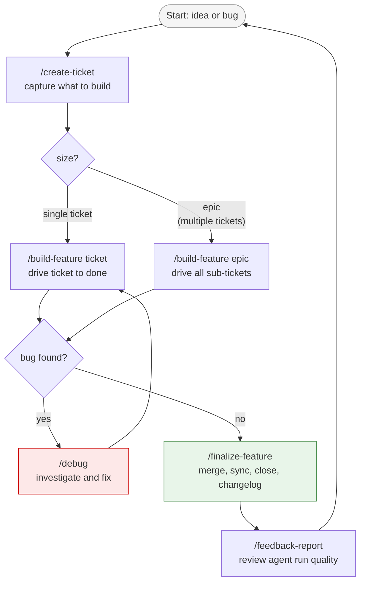

# How to work with leafcutter end-to-end

This guide walks you through the full daily workflow lifecycle — from capturing
an idea to shipping code and reviewing what went well. Read it once to
understand the shape of the system; refer back when you need a specific step.

**Estimated reading time:** 5 minutes.

---

## Lifecycle overview



---

## Step 1 — `/create-ticket`: capture what you want to build

**When to use:** Whenever you have an idea, a task, or a bug report that needs
to enter the system. This is the front door for all work.

```
/create-ticket Add rate-limiting middleware to the API gateway
```

The `create-ticket` agent interviews you to clarify value, risk, and scope, then
decides whether to write a single ticket or scaffold a full epic:

- **Single ticket** — a change touching fewer than ~3 files. Written to
  `tickets/00_inbox/TICKET-YYYYMMDD-ShortDescription.md`.
- **Epic** — a change touching many files or crossing logical boundaries. Creates
  an `EPIC-Name/` folder with a `Master_Plan.md` and individual sub-ticket files.

> **Tip — `/plan` is the same command.**
> `/plan` is a legacy alias for `/create-ticket`. The two commands are identical.
> Use whichever you prefer; the guide uses `/create-ticket` throughout.

After the command completes, review the generated file(s) in `tickets/00_inbox/`
and confirm the scope looks right before proceeding.

---

## Step 2 — `/build-feature`: drive ticket(s) to completion

**When to use:** This is the main execution command. Run it once per ticket (or
epic) to take work from inbox to done.

```
/build-feature tickets/00_inbox/TICKET-20260603-RateLimit.md
# or for an epic:
/build-feature EPIC-RateLimiting
```

Internally, `/build-feature` dispatches `ticket-supervisor`, which walks the
ticket through a fixed phase sequence:

1. **business-analyst** — refines requirements, identifies files to touch
2. **test-planner** — writes failing tests (TDD gate)
3. **python-coder** (or relevant coder) — implements the change
4. **test-runner** — runs the test suite; retries on failure
5. **architect-review** — validates structural correctness
6. **documentation-expert** — writes or updates docs
7. **pr-reviewer** — reviews the diff before commit
8. **commit** — commits with a conventional message
9. **pull-request** — opens a PR against the base branch

Each phase agent signs off when it finishes. If a phase fails after retries, the
ticket enters a `blocked` state and surfaces a question to you. Resolve it and
re-run `/build-feature` — it picks up from where it left off.

> **Note:** `/build-feature` enforces a no-inline-work rule. The command writes
> a lock file at startup that prevents any code edits until `ticket-supervisor`
> is running. This is intentional — all work happens inside the supervised
> pipeline.

---

## Step 3 — `/finalize-feature`: merge, sync, close, generate changelog

**When to use:** After `/build-feature` completes and the PR is ready to merge.

```
/finalize-feature
# or target a specific branch:
/finalize-feature EPIC-RateLimiting
```

The finalize sequence runs six steps with confirmation gates on each destructive
action:

1. Open the PR if it does not yet exist
2. Merge to main
3. Sync local main with origin
4. Run the test suite
5. Close tickets (move to `99_done/`)
6. Remove the worktree
7. Generate a changelog entry (dispatches `changelog-agent`)

You will be prompted before each merge or deletion — `/finalize-feature` never
acts destructively without confirmation.

---

## Step 4 — `/debug`: multi-angle debugging when something goes wrong

**When to use:** Any time you hit a bug, an unexpected failure, or a confusing
system state. Use this instead of investigating manually.

```
/debug The API returns 500 on requests with large payloads
```

The debug workflow runs three investigative agents **in parallel**, each
examining the issue from a different angle:

| Agent | Investigates |
|-------|-------------|
| Database investigator | Schemas, migrations, ORM, data integrity |
| Backend investigator | Business logic, code paths, error handling |
| Frontend/config/docs investigator | UI, config, environment, documentation discrepancies |

After all three return, the workflow synthesizes their findings:

- Where 2+ agents agree on the root cause → high confidence diagnosis
- Where agents disagree or report low confidence → targeted question to you

Once the diagnosis is confirmed (or you clarify the ambiguity), `/debug`
automatically creates a fix ticket via `/create-ticket` and drives it via
`/build-feature`. The full debug-to-fix loop is handled without manual steps.

```
/debug <issue>
  → 3 parallel investigators
  → synthesis
  → [clarification if needed]
  → /create-ticket (fix ticket)
  → /build-feature (auto-builds the fix)
```

---

## Step 5 — `/feedback-report`: review what went well and what did not

**When to use:** After finishing a feature, an epic, or a session of agent work.
Run this to understand where the agent pipeline is working well and where it is
producing low-quality output.

```
/feedback-report
# or scoped to a date range:
/feedback-report --since 2026-06-01
```

The `feedback-analyst` agent reads `debugging/logs/agent_telemetry.jsonl` and
returns a prioritized summary grouped by category (e.g. tooling-issue,
slow-agent, wrong-output). Use the output to decide which agents or workflows
to improve next.

**Useful flags:**

| Flag | Effect |
|------|--------|
| `--since YYYY-MM-DD` | Only feedback after this date |
| `--trend week` | Add week-over-week trend indicators per category |
| `--category <id>` | Restrict to one feedback category |
| `--format json` | Machine-readable output for scripting |

---

## Supporting commands

These commands are available for targeted tasks that arise during the workflow:

| Command | When to use |
|---------|-------------|
| `/status` | Inspect the current state of a ticket — shows phase completion, git history, open blockers. |
| `/test` | Run the test suite standalone without going through a full ticket build cycle. |
| `/pr-review` | Trigger a PR review on demand (dispatches `pr-reviewer` agent against the current diff). |
| `/commit` | Commit staged changes using the conventional commit convention, with pre-commit hook enforcement. |
| `/pick-next-ticket` | When you have a large backlog, surfaces the highest-priority unblocked ticket using a dependency DAG. |
| `/build-backlog` | Drain the entire prioritized backlog automatically, building one ticket after another until empty. See [drain-backlog-with-build-backlog.md](drain-backlog-with-build-backlog.md). |
| `/code-review` | Request a focused code review of a specific file or diff without creating a ticket. |

---

## Choosing the right command

| Situation | Command |
|-----------|---------|
| New idea or task to capture | `/create-ticket` |
| Multiple tickets, not sure which to do next | `/pick-next-ticket` |
| Ready to build a specific ticket or epic | `/build-feature <ticket-path>` |
| Entire backlog needs clearing | `/build-backlog` |
| Bug or unexpected failure | `/debug <description>` |
| PR is ready and approved | `/finalize-feature` |
| Want to understand agent run quality | `/feedback-report` |
| Check where a ticket stands | `/status` |

---

## See also

- [Ticket Lifecycle](../ticket-lifecycle.md) — state machine diagram showing all
  ticket states and transitions.
- [Agent Delivery Workflows](../architecture/agent_delivery_workflows.md) — detailed
  flow diagrams for every slash command, including the supervisor dispatch topology.
- [Drain the backlog with /build-backlog](drain-backlog-with-build-backlog.md) — how
  to process the full backlog in one automated run.
- [Drive an epic manually](drive-epic-manually.md) — fallback procedure when
  `epic-supervisor` is itself the artifact being changed.
- [Agent Documentation](../agents/README.md) — complete agent registry and tier
  summary.
