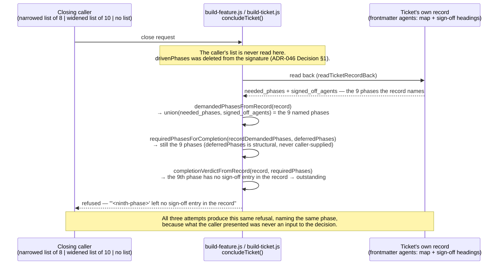

# KI-BO-20260831-1932 — The completion guard refuses one ticket and passes another on identical conditions

> One known issue, split out of `docs/known-issues/build-orchestration.md` on
> 2026-09-14. Index: [build-orchestration.md](../build-orchestration.md).
> Filename severity is the three-level index bucket (`low`); the
> original grading is the `**Severity:**` line below, unchanged.

- **Severity:** medium
- **Status:** open — no AC
- **Occurrences:** 1 (one drive, three tickets, split outcome)
- **First seen:** 2026-08-31 · **Last seen:** 2026-08-31
- **Where:** the completion-write step of `templates/workflows-js/build-feature.js`, and
  `scripts/set_ticket_status.py`'s agents-parity check

**Symptom.** In a single drive, with three tickets in exactly the same state — every phase
signed off except `pull-request: needed`, no sign-off entry for it — the guard **refused**
ticket 01 and **flipped tickets 03 and 20 to `status: done`**.

The refusal cited the condition explicitly: "the ticket's own frontmatter still lists
`pull-request: needed` ... Per my closing protocol I only mark a ticket done when every phase
the ticket names as needed is confirmed signed off". The other two met that description
equally and were written anyway.

**Why it matters more than the inconsistency itself.** The refusing path is the correct one.
The lenient path is a phantom-done write: it records `status: done` on a ticket the guard's
own stated rule says is not done. Whichever way this is unified, it should be unified toward
the refusal — but a guard that produces both outcomes from one condition gives no signal
about which it will do next time, so neither result can be trusted as evidence.

**A secondary consequence, observed.** Ticket 20 was flipped to `done` while its
`source_ac` (`ACD-2100d-2`) was still `work_status: todo`, which
`check-ticket-ac-status-parity` then blocked at commit time. The lenient write produced a
state a different gate had to catch.

**Fix direction.** Make the completion write take its phase list from the ticket, not from
the caller's request. Both observed paths had the same 8-item request; only one of them
went and read the ticket for a ninth.

**Why that direction, spelled out — it has already been read backwards.** Two agents read the
paragraph above on the same day and drew opposite conclusions from it, so the reasoning
belongs in the entry rather than in the reader.

Taken literally and on its own, the direction unifies both paths onto the refusal. While the
tickets still say `pull-request: needed`, that converts an intermittent blocker into a
permanent and universal one — 316 tickets, per `KI-BO-20260831-1930`. An implementer can
reasonably conclude from that alone that the direction is wrong. It is not wrong; it is
mis-ordered if taken alone. See the sequencing warning on that entry for the order.

The tempting alternative — have the completion writer trust the exclusion list its caller
hands it — must be rejected, and rejected explicitly, because it is what the obvious fix looks
like. The guard's refusal is worth something only while the record is authored by someone
other than the party being checked. A writer that accepts the drive's word about which phases
do not count has stopped checking the drive, which is the only thing it was ever for. It would
fix today's symptom by removing the guard.

The direction completes the fix only when paired with making the RECORD true — the generator
emitting `pull-request: not_needed` for epic members, per `KI-BO-20260831-1930` — so that a
writer reading the ticket gets the right answer. The two halves are a pair. Reading the ticket
without correcting the ticket halts everything; correcting the ticket without reading it
leaves a guard that trusts its caller. Neither works alone.

**Related.** `KI-BO-20260831-1930` — the `pull-request: needed` entry that put all three
tickets in this state.

**Resolution.** `BO-400e-1` closed this by deleting the caller-supplied input from the
decision entirely, rather than by choosing one of the two observed outcomes as "correct" and
patching toward it. Both `templates/workflows-js/build-feature.js` and
`templates/workflows-js/build-ticket.js` (twins, changed in the same commit per
`BO-400a-2-ii`) now derive the demanded-step set with `demandedPhasesFromRecord(record)` —
reading only the ticket's own frontmatter `agents:` map and its own `## Comments` sign-off
headings — and pass that, and only that, into `requiredPhasesForCompletion`. The function no
longer accepts a caller-supplied `drivenPhases` argument at all; the parameter was deleted,
not merely left unread, so there is no channel left for a future edit to reopen. Full rule
recorded in [ADR-046](../../architecture/adrs/ADR-046-completion-demanded-set-is-record-only.md).

The three-way split this entry documents is now impossible by construction: a narrowed
caller list, a widened caller list, and no caller list at all reach the same
`completionVerdictFromRecord` call with the same `requiredPhases`, because none of the three
was ever read. `scripts/set_ticket_status.py` needed no change — `_get_needed_agents` already
derived solely from the record, and per this decision it gains no exclusion parameter.



Covers AC-1 of `BO-400e-1`: the decision is taken against the nine phases the ticket's own
record names, in all three attempts alike.

**Follow-on.** `BO-400e-2` drove both the refused-ticket case and this entry's own
same-run control case through the real, deployed `build-feature.js` / `build-ticket.js`
via `unit_tests/prompt_assembly/harness_build_ticket_guard.mjs`, and confirmed the refusal
above is reached exactly as specified — no change to `scripts/set_ticket_status.py` or
`build-ticket.js` was needed. It found and fixed a distinct, adjacent defect in the same
file at the *reporting* layer rather than the write layer: see
[`KI-BO-20260915-completed-sibling-in-a-halted-batch-is-reported-not-built`](resolved/resolved-medium-ki-bo-20260915-completed-sibling.md).

```mermaid
sequenceDiagram
    participant Driver as build-feature.js / build-ticket.js<br/>concludeTicket()
    participant Guard as scripts/set_ticket_status.py<br/>agents-parity check (BO-400a-2-i)
    participant Record as Ticket's own record<br/>(frontmatter agents: map)

    Note over Driver,Record: Ticket A — one phase named needed, no sign-off entry
    Driver->>Guard: request close(Ticket A)
    Guard->>Record: read agents: map
    Record-->>Guard: the needed phase has no sign-off entry
    Guard-->>Driver: refuse — names the unaccounted phase
    Note over Driver,Record: no write — status and agents: map left exactly as found;<br/>the finished state is NOT written for Ticket A

    Note over Driver,Record: Ticket B — same run, every needed phase signed off
    Driver->>Guard: request close(Ticket B)
    Guard->>Record: read agents: map
    Record-->>Guard: every needed phase carries a sign-off
    Guard-->>Driver: proceed
    Driver->>Record: status: done written
    Note over Driver,Record: the finished state IS written for Ticket B, in the same run
```

Covers AC-1 of `BO-400e-2`: the refusal is a read-only decision reached through
`scripts/set_ticket_status.py`'s existing, unmodified parity check, and the finished state
is not written for the unaccounted ticket — paired, in the same run, with a control ticket
that IS written finished.

---
