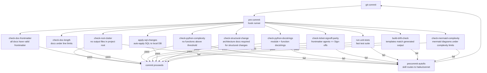
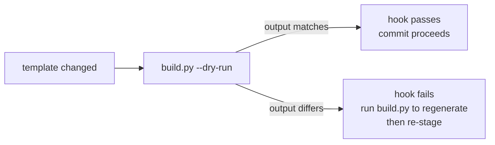

# Pre-Commit Hooks

This document describes the pre-commit hooks enforced on every commit and
their relationship to build-drift detection.

## Hook Execution Sequence

## Build-Drift Check

The build-drift hook (`check-build-drift`) fires when any file under
`leafcutter/templates/` is staged. It runs `build.py --dry-run`
and checks whether the generated output matches the files currently in
`.claude/agents/`, `.claude/skills/`, etc.

## Hook Configuration

All hooks are configured in `.pre-commit-config.yaml`. The commit guardian
manages a subset via `scripts/commit_guardian/commit_guardian.json`.
See `scripts/commit_guardian/INTEGRATION.md` for setup instructions.
