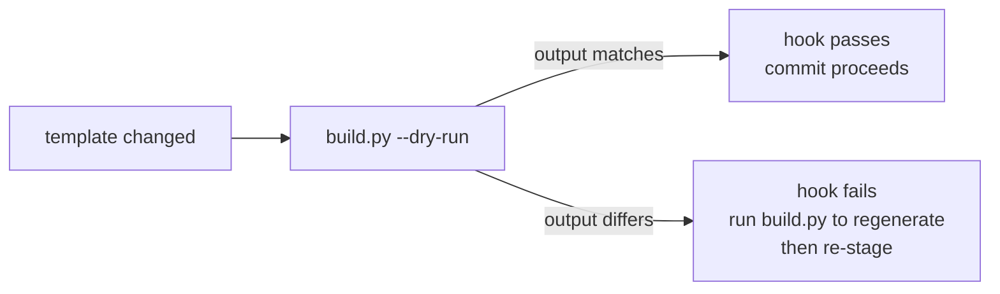

# Pre-Commit Hooks

This document describes the pre-commit hooks enforced on every commit and
their relationship to build-drift detection.

## Hook Execution Sequence

```mermaid
flowchart TD
    GC[git commit] --> PC[pre-commit\nhook runner]

    PC --> H1[check-root-clutter\nno output files in project root]
    PC --> H2[check-doc-frontmatter\nall docs have valid frontmatter]
    PC --> H3[check-doc-length\ndocs under line limits]
    PC --> H4[check-python-complexity\nno functions above threshold]
    PC --> H5[check-python-docstrings\nmodule + function docstrings]
    PC --> H6[check-ticket-signoff-parity\nfrontmatter agents == Sign-offs]
    PC --> H7[apply-sql-changes\nauto-apply SQL to local DB]
    PC --> H8[run-unit-tests\nfast test suite]
    PC --> H9[check-structural-change\narchitecture docs required\nfor structural changes]
    PC --> H10[build-drift-check\ntemplates match generated output]
    PC --> H11[check-mermaid-complexity\nmermaid diagrams under complexity limits]
    PC --> H12[check-duplicate-code\ncopy-paste clone detection via jscpd\nwarn-only or blocking]

    H1 -->|pass| COMMIT[commit proceeds]
    H2 -->|pass| COMMIT
    H3 -->|pass| COMMIT
    H4 -->|pass| COMMIT
    H5 -->|pass| COMMIT
    H6 -->|pass| COMMIT
    H7 -->|pass| COMMIT
    H8 -->|pass| COMMIT
    H9 -->|pass| COMMIT
    H10 -->|pass| COMMIT
    H11 -->|pass| COMMIT
    H12 -->|pass| COMMIT

    H1 -->|fail| FIX[precommit-autofix\nskill routes to haiku/sonnet]
    H4 -->|fail| FIX
    H5 -->|fail| FIX
    H6 -->|fail| FIX
    H8 -->|fail| FIX
    H10 -->|fail| FIX
    H11 -->|fail| FIX
    H12 -->|fail| FIX
    FIX --> GC
```



## Build-Drift Check

The build-drift hook (`check-build-drift`) fires when any file under
`leafcutter/templates/` is staged. It runs `build.py --dry-run`
and checks whether the generated output matches the files currently in
`.claude/agents/`, `.claude/skills/`, etc.



## Hook Configuration

All hooks are configured in `.pre-commit-config.yaml`. The commit guardian
manages a subset via `scripts/commit_guardian/commit_guardian.json`.
See `scripts/commit_guardian/INTEGRATION.md` for setup instructions.

## Duplicate Code Detection (check-duplicate-code)

The `check-duplicate-code` hook uses [jscpd](https://github.com/kucherenko/jscpd)
to detect copy-paste clones in staged files.

**Key behaviours:**

- Ships **disabled by default** (`duplicate_code.enabled: false`).
- **Fail-open**: exits 0 when the `jscpd` binary is not installed, emitting an
  advisory message with install instructions.
- **Version guard**: if jscpd v4.x is detected (incompatible CLI flags), the
  hook skips scanning and exits 0 with a recommendation to install v3.x.
- **Staged-only scope**: only clone pairs where at least one file is staged are
  reported (non-staged-file pairs are silently discarded).
- **WSL2 support**: when the project root lives on an NTFS mount (`/mnt/c/…`),
  staged files are copied into a native Linux temp directory before jscpd runs.
- **Human-readable output**: each detected clone pair is reported as:

  ```
  [check-duplicate-code] WARNING: Duplicate block detected
    Source: path/to/file.py lines 10-20
    Clone:  path/to/other.py lines 30-40
  ```

**Configuration** (in `duplicate_code` section of `commit_guardian.json`):

| Key | Default | Description |
|-----|---------|-------------|
| `enabled` | `false` | Set to `true` to activate the hook. |
| `strict` | `false` | `true` blocks the commit; `false` warns only (exits 0). |
| `min_lines` | `5` | Minimum duplicate block size in lines. |
| `min_tokens` | `50` | Minimum duplicate block size in tokens. |
| `threshold_percent` | `5` | Percentage of total code that may be duplicated before triggering. |
| `checked_extensions` | `[".py", ".ts", ".js", ".tsx", ".jsx", ".sql"]` | File types scanned. |

To enable, edit `scripts/commit_guardian/commit_guardian.json`:

```json
"duplicate_code": {
    "enabled": true,
    "strict": false
}
```

**Onboarding wizard:** The `/onboard` wizard (Step 11b) detects `jscpd` on
PATH and offers an interactive yes/no prompt to set `enabled: true` automatically.
If `jscpd` is not installed at onboard time, the wizard adds it to the
post-onboard checklist. After installing, run:

```bash
python scripts/onboard_hook_opt_in.py
```

## Diff Coverage Check (check-diff-coverage)

The `check-diff-coverage` hook uses [diff-cover](https://github.com/Bachmann1234/diff_cover)
to gate commits on coverage of the lines that actually changed.

**Key behaviours:**

- Ships **disabled by default** (`diff_coverage.enabled: false`).
- **Fail-open**: exits 0 when the `diff-cover` binary is not installed, when
  `coverage.xml` does not exist, or when `coverage.xml` is stale (older than
  `max_age_seconds`). An advisory message is emitted to stderr in each case.
- **Compare-branch fallback chain** (AC GE-101a-1): the hook resolves the
  comparison base in this priority order:
  1. The configured branch (e.g. `origin/main`) — tried first via
     `git rev-parse --verify`.
  2. The bare local branch with the same name (e.g. `main`) — used when the
     remote tracking ref is absent (remote unreachable or uses a different
     default branch name).
  3. `HEAD~1` — used when neither the configured ref nor a local branch of
     that name exists.

  An advisory is printed to stderr whenever the hook falls back to a lower
  priority option.
- **Shallow-clone guard** (AC GE-101c-1): before any branch resolution is
  attempted, the hook calls `git rev-parse --is-shallow-repository`.  When
  that returns `"true"`, the hook emits an advisory explaining that diff-cover
  requires full git history and instructs the developer to re-clone with
  `fetch-depth: 0` (or run `git fetch --unshallow`), then exits 0 (fail-open).
  The commit proceeds unblocked.  This guard fires before the fallback-chain
  logic so that shallow clones never trigger a misleading `HEAD~1` fallback
  message.
- **Strict mode**: set `diff_coverage.strict: true` to block the commit when
  coverage of changed lines falls below `min_coverage_percent`.  In non-strict
  mode (the default) the hook warns but exits 0.  When strict mode fires, the
  hook emits the diff-cover output (per-file coverage percentages and overall
  diff coverage vs threshold) followed by a `Commit blocked` message, then
  exits 1 (AC GE-101b-1).

**Configuration** (in `diff_coverage` section of `commit_guardian.json`):

| Key | Default | Description |
|-----|---------|-------------|
| `enabled` | `false` | Set to `true` to activate the hook. |
| `strict` | `false` | `true` blocks the commit on low coverage; `false` warns only. |
| `min_coverage_percent` | `80` | Minimum required coverage for changed lines (0–100). |
| `coverage_xml_path` | `"coverage.xml"` | Path to the coverage XML artifact (relative to project root or absolute). |
| `compare_branch` | `"origin/main"` | Primary comparison branch; fallback chain applies when unreachable. |
| `max_age_seconds` | `3600` | Maximum age of `coverage.xml` before the hook skips (0 disables). |

To enable, edit `scripts/commit_guardian/commit_guardian.json`:

```json
"diff_coverage": {
    "enabled": true,
    "strict": false,
    "min_coverage_percent": 80
}
```

**Onboarding wizard:** The `/onboard` wizard (Step 11b) detects `diff-cover` on
PATH and offers an interactive yes/no prompt to set `enabled: true` automatically.
If `diff-cover` is not installed at onboard time, the wizard adds it to the
post-onboard checklist. After installing, run:

```bash
python scripts/onboard_hook_opt_in.py
```

## Proof Promise vs. Claim Check (check-proof-promise-claim)

The `check-proof-promise-claim` hook fires on staged ticket markdown files
(`^tickets/.*\.md$`) and refuses a commit when a ticket's own `## Test
Requirements` block promises a kind of proof for a stated behaviour that no
test in the tree has yet claimed a matching tag for.

**Key behaviours:**

- Compares exactly two authored declarations and nothing else: the promise
  side (each `## Test Requirements` descriptor's `angle` + `covers` fields)
  and the claim side (`done_proof.collect_test_tag_records` — the same
  single-pass scanner `check-done-proof` and CI's done-proof gate use).
  Reading a test's own body to judge what it does is forbidden on every path
  to this outcome (see `BO-2900a-2.yaml`, linked below).
- **The promise set is the denominator.** A kind never promised for a given
  AC is never named in that AC's refusal, and a ticket that promises nothing
  is never refused (`BO-2900f-1.yaml`).
- **STATIC only** — no pytest run at pre-commit time, matching the posture
  `check-done-proof` already established.
- On refusal, prints one line per unmatched promise naming the AC id, the
  stated behaviour, and the missing kind by name, e.g.:

  ```
  BP-1100g-4: promised 'reachability' proof for "..." was never claimed by
  any test — write a test tagged '# covers: BP-1100g-4' and '# angle:
  reachability'
  ```

  On success it prints exactly `promised and claimed` — the outcome is
  established, never worded as reached, proven, verified, or done.
- **Bypassable** via `SKIP=check-proof-promise-claim` or `--no-verify`, same
  as every other judgment-tier hook in this file.

**Relationship to check-done-proof.** Both hooks read the same underlying
test-tag scanner but govern different moments: `check-done-proof` blocks a
staged AC YAML from claiming `work_status: done` without a covers-tagged
test; `check-proof-promise-claim` blocks a staged ticket whose own plan
promised a kind of proof that the test tree does not yet claim. Neither
changes which *failing* tests block a commit — that decision is untouched
and belongs to a separate axis. See
[`docs/how-to/done-proof-enforcement.md`](how-to/done-proof-enforcement.md)
for the two-layer (pre-commit + CI) enforcement model this hook's sibling
uses; the promise/claim gate is pre-commit-only today and has no CI-mode
counterpart.

**Related AC contracts:**

- `docs/acceptance-criteria/build-orchestration/BO-2900-runtime-reachability-guard/BO-2900a-2.yaml` — the claim/verdict boundary this hook must never cross.
- `docs/acceptance-criteria/build-orchestration/BO-2900-runtime-reachability-guard/BO-2900g-4.yaml` — the promise-side vocabulary this hook reads and does not reinterpret.
- `docs/acceptance-criteria/build-orchestration/BO-2900-runtime-reachability-guard/BO-2900f-1.yaml` — the denominator discipline.
- `docs/acceptance-criteria/build_pipeline/BP-1100-phantom-done-prevention/BP-1100b-5.yaml` — the compatible posture: a diff-time check on the shape of what was written, not a test execution.

There is no `enabled`/`strict` configuration for this hook — it runs
whenever `tickets/*.md` is staged, once registered under
`hooks_manifest.hooks` in `scripts/commit_guardian/commit_guardian.json`.

## Presence-Only Assertion Guard (check-presence-only-assertions)

The `check-presence-only-assertions` hook rejects a newly staged test
assertion whose entire "coverage" is a grep for a symbol's presence in a
source file — a substring check (`'literal(' in content`,
`assertIn('literal(', content)`) or a regular-expression declaration check
(`re.compile(r"function\s+NAME\s*\(")`). A presence-only assertion stays
green even when the code it names is unreachable, so by itself it is not
coverage (BP-1100b-5, EPIC-BuildPipelinePhantomRemediation).

**Key behaviours:**

- **Staged hunks only.** The hook reads `git diff --cached` and scans only
  ADDED lines — never a whole-file or whole-tree scan. This makes it a
  ratchet: pre-existing presence-only assertions elsewhere in the repo do not
  block a commit that never touches them (the backlog is a separate,
  out-of-scope sweep).
- **Scope: test files only, scanned sources only.** Only files that look like
  test files (`test_*.py`, `*_test.py`) are scanned, and only when the
  assertion is proximate to a reference to a file matched by
  `scanned_source_globs` — an assertion over an unlisted file is not flagged.
- **Both forms matched.** Substring-form and regex-declaration-form
  presence-only assertions are both detected, independently.
- **Waiver:** a `# presence-only: <reason>` comment directly above the
  assertion suppresses it, provided `<reason>` is non-empty after stripping.
  An empty or whitespace-only reason does NOT suppress. Accepted waivers and
  their reasons are listed in the hook's own output.

**Configuration** (in `presence_only_assertion_guard` section of `commit_guardian.json`):

| Key | Default | Description |
|-----|---------|-------------|
| `enabled` | `true` | Set to `false` to disable the hook entirely. |
| `scanned_source_globs` | `["templates/workflows-js/*.js", "templates/scripts/commit_guardian/*.py"]` | Glob patterns (matched via `fnmatch`) for source files whose presence-only coverage is rejected. DATA read from this key — never hardcoded in the hook. |
| `waiver_marker` | `"presence-only"` | The comment marker recognised as `# <marker>: <reason>`. |
