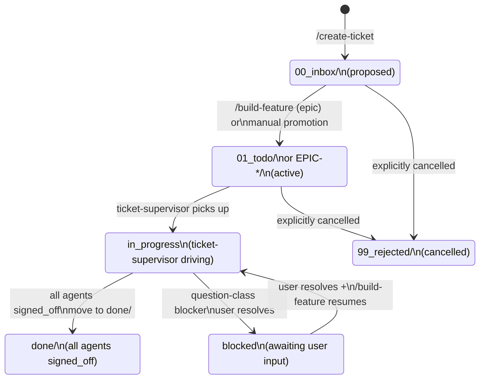
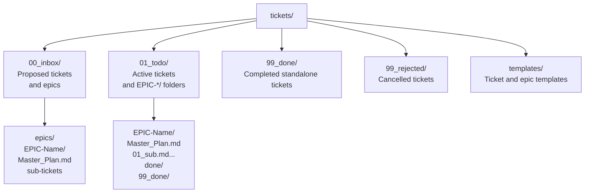
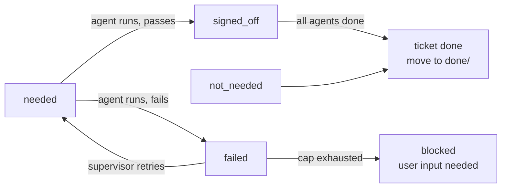

# Ticket Lifecycle

This document shows how tickets flow through the system from creation to completion.

## Ticket State Transitions

## Folder Structure

## Agent Sign-off Sequence

## Strict Workflow Rules

To maintain the integrity of the ticket lifecycle, the following rules apply:
- **No Untracked Code Changes**: Never change code without asking the user or having an explicit ticket assigned.
- **No Spontaneous Implementation**: If functionality is discovered missing during an epic, do not spontaneously implement it. Add new tickets for the missing features.
- **Lifecycle Integrity**: This ensures all changes properly trigger documentation updates, code splitting, architecture diagrams, and unit tests as mandated by the ticket lifecycle.

<!--
====================================================================
DECISION HISTORY
====================================================================
- 2026-05-22 [AI]: Added Strict Workflow Rules to enforce ticket-driven development and prevent untracked code modifications.
====================================================================
-->
