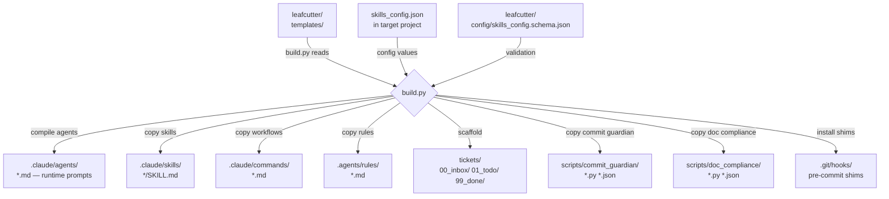
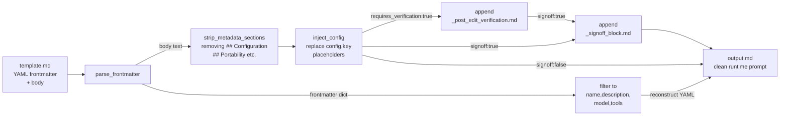
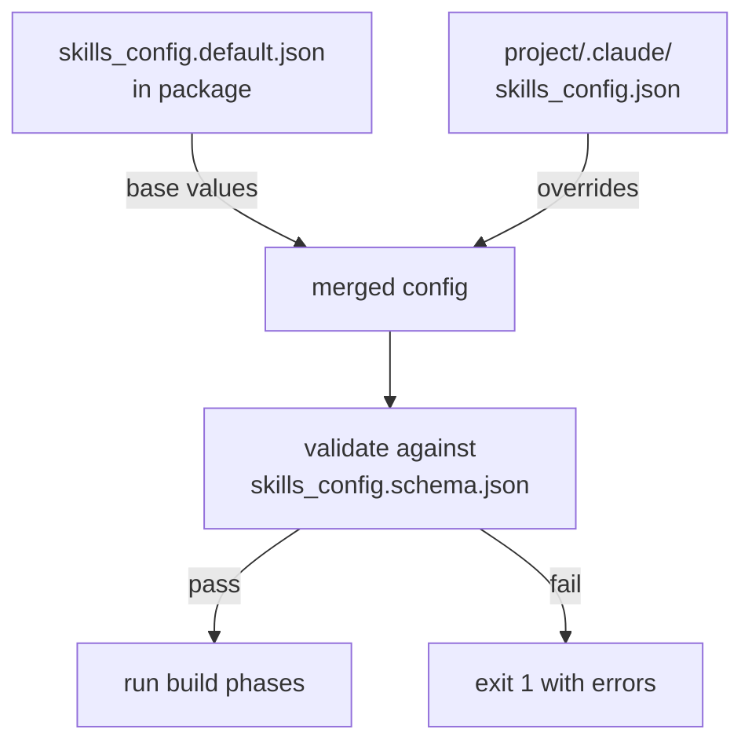

# Build Pipeline Architecture

This document shows how the leafcutter templates are compiled
into a target project by `build.py`.

## Source → Build → Output Flow

*Note: For the post-edit verification contract enforced during build, see [ADR 021: Agent Post-Edit Verification](../../docs/architecture/adrs/ADR-021-agent-post-edit-verification.md).*

## Agent Compilation Detail

For each `.md` file in `templates/agents/` (excluding `_*.md` helpers):

## Config Resolution

