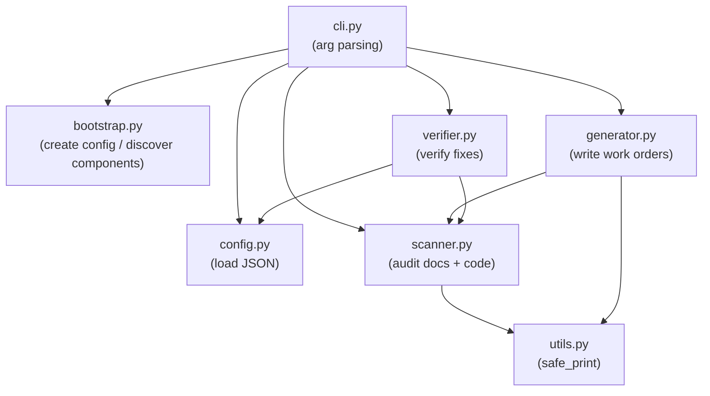

# `scripts/doc_compliance/` — Documentation Compliance Package

## A. Purpose

This package implements the **doc_compliance_scanner** — a tool that audits the project for
documentation traceability compliance. It checks markdown docs for valid frontmatter, checks
Python/SQL code files for `DOC_LINKS:` annotations, and generates batched AI work orders for
remediation. It also supports a registry review workflow for `docs/components.json`.

The entry point is `scripts/doc_compliance_scanner.py`, which delegates to `cli.py`.

## B. Key Files & Structure

| File | Responsibility |
|---|---|
| `config.py` | Load `doc_compliance.json` and `components.json`; shared constants |
| `utils.py` | Shared print utilities (UTF-8 safe output) |
| `bootstrap.py` | `bootstrap()` — create config; `discover_components()` — populate registry |
| `scanner.py` | `Scanner` class — scans docs, Python, SQL for compliance violations |
| `generator.py` | `generate_orders()` and `review_registry()` — write batched AI work orders |
| `verifier.py` | `verify_batch()` — re-scan to confirm fixes from a work order were applied |
| `cli.py` | Argument parsing and entrypoint routing |

## C. Critical Context (Gotchas)

- **Windows paths**: All path comparisons must use `.replace('\\', '/')` (single backslash), NOT
  `replace('\\\\', '/')`. The double-backslash was a recurring bug and has been corrected.
- **f-string escaping**: Template strings written to markdown files must use triple-quoted
  multiline strings (`f"""..."""`) rather than concatenated `f"...\n"` chains — the latter
  causes `SyntaxError: unexpected character after line continuation character` on Windows.
- **`PYTHONPATH`**: When running tests, `sys.path` must include the project root so that
  `from scripts.doc_compliance.scanner import Scanner` resolves correctly.
- **Registry format**: `docs/components.json` may be either an array-format or a keyed-object format.
  All functions handle both via `isinstance(components, list)` checks.

## D. Maintenance Instructions

- Add new CLI subcommands in `cli.py` and wire them to functions in the appropriate sub-module.
- Run tests: `poetry run pytest unit_tests/scripts/test_doc_compliance_scanner.py -v`
- The entry point `scripts/doc_compliance_scanner.py` must remain a ≤50 line shim (enforced by pre-commit).

