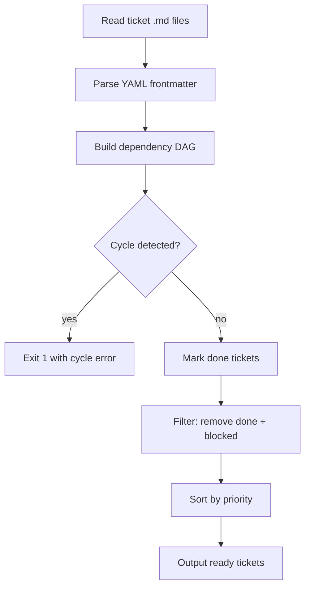

# ticket-prioritizer skill

## Purpose

Return the set of tickets that are **ready to work on now** — meaning all their
`depends_on` predecessors are in `done` status or live in a `done/` directory.
Tickets with unresolved predecessors are omitted from the output.

## Invocation

```bash
# Scan a single epic (scope: sub-tickets of this epic only)
python .agents/skills/ticket-prioritizer/scripts/prioritize.py \
  --epic tickets/01_todo/EPIC-MyFeature/

# Scan all tickets in 00_inbox and 01_todo (default)
python .agents/skills/ticket-prioritizer/scripts/prioritize.py --all

# JSON output for machine consumers (epic-supervisor)
python .agents/skills/ticket-prioritizer/scripts/prioritize.py \
  --epic tickets/01_todo/EPIC-MyFeature/ --json
```

## Output

### Human-readable (default)

```
READY TICKETS  (unblocked, sorted by priority):
  [high]    02_add_logic.md
  [medium]  04_write_tests.md

BLOCKED TICKETS  (has unresolved depends_on):
  [high]    03_migrate_db.md
    blocked by: 02_add_logic.md (status: todo)
```

### JSON (--json flag)

```json
{
  "ready": [
    {"path": "02_add_logic.md", "title": "Add logic", "priority": "high"},
    {"path": "04_write_tests.md", "title": "Write tests", "priority": "medium"}
  ],
  "blocked": [
    {"path": "03_migrate_db.md", "title": "Migrate DB", "priority": "high",
     "blocked_by": ["02_add_logic.md"]}
  ],
  "done": ["01_base.md"]
}
```

## Integration with epic-supervisor

```bash
# epic-supervisor uses this to compute the next ready batch:
python .agents/skills/ticket-prioritizer/scripts/prioritize.py \
  --epic <epic_path> --json 2>/dev/null
```

Parse the `ready` array. Each entry maps to a ticket path. Apply
the `files_touched` disjoint-set gate (per building-epics §1.2)
on the ready set before dispatching.

## Architecture



## Priority ordering

```
critical > high > medium > low > (unlabelled)
```

Unlabelled tickets (no `priority:` field) rank lowest.

## Done detection

A ticket is considered **done** when any of these is true:
- Its `status` frontmatter field equals `done` or `deferred`
- It lives in a directory named `done/`, `99_done/`, or `99_rejected/`

## Cycle detection

If a cycle is detected, the script exits with code 1 and prints:
```
CYCLE DETECTED: A → B → A
```
This is a hard error — cycles mean the epic's depends_on graph is malformed.
Fix the ticket frontmatter before re-running.
