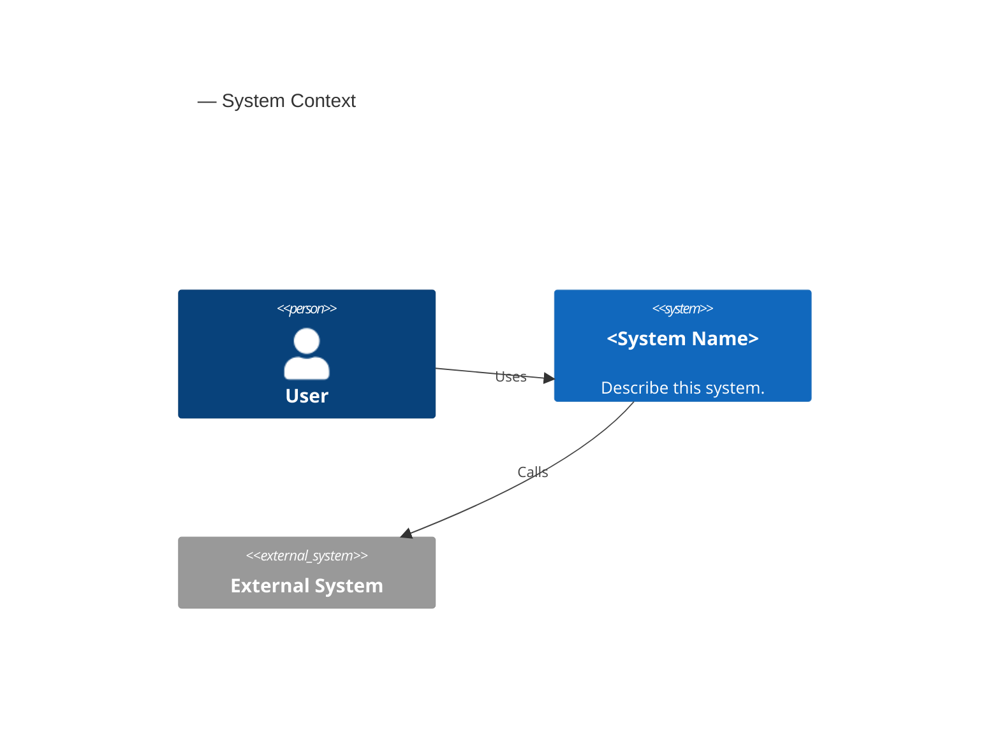
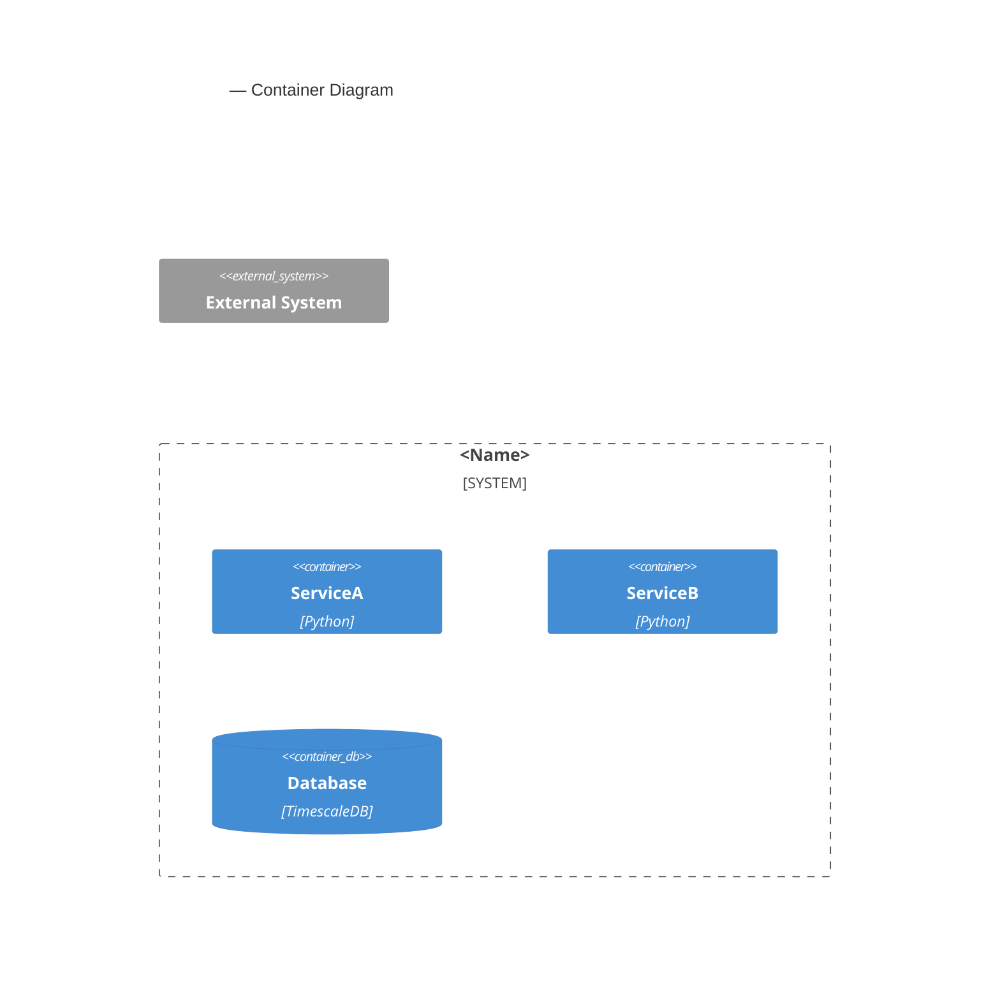
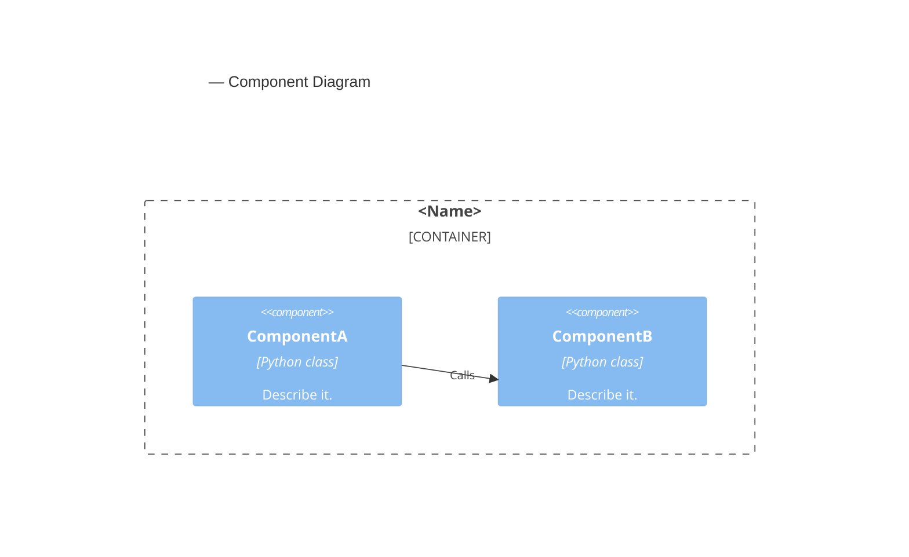
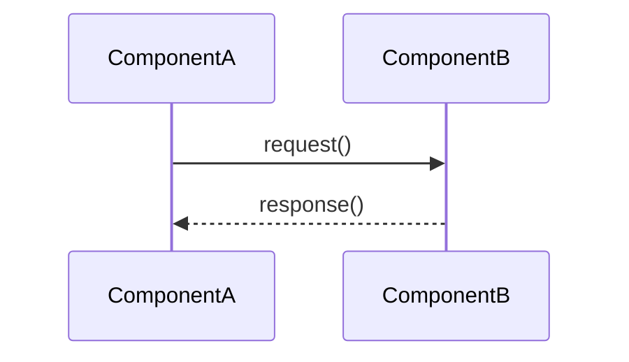
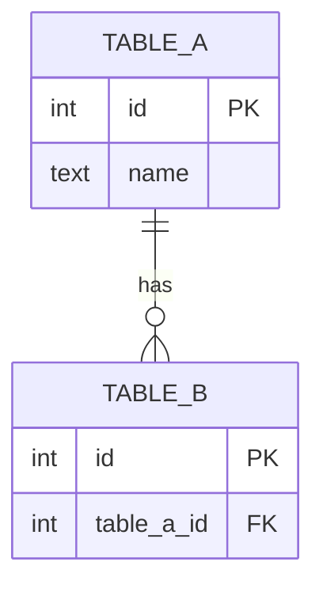
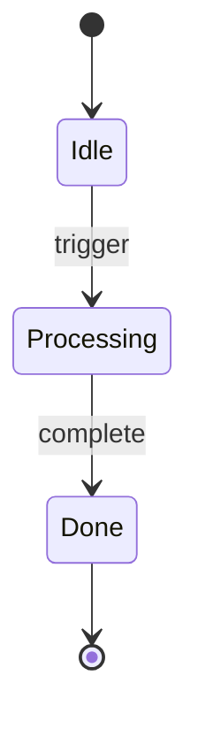
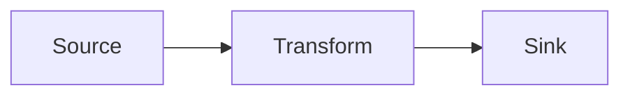
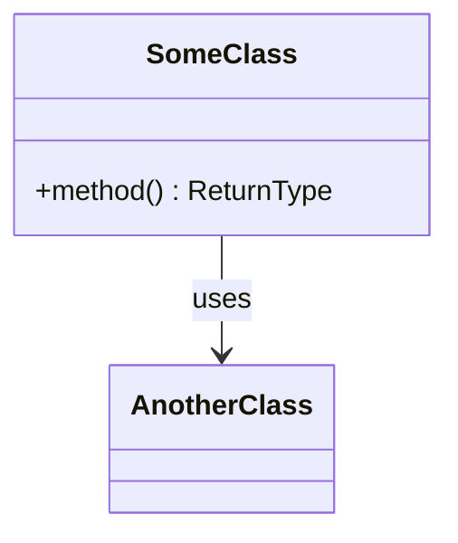

# Skill: write-c4-diagram

This skill governs every architecture-doc authoring action: choosing the
tier, running the scaffolder, completing the draft, and committing. Follow
it exactly — it is rigid.

---

## Section 1: When this skill applies

Invoke this skill whenever you are about to:

- Create a new file under `docs/architecture/` (any tier, any subdirectory).
- Add or update a Mermaid diagram in any `docs/` file.
- Respond to a request that includes words such as: "arch doc", "architecture
  diagram", "C4", "L1/L2/L3/L4 diagram", "component doc", "container doc",
  "context doc", "sequence diagram", "ERD", "state diagram", "dataflow diagram".
- Run `scripts/scaffold/new_arch_doc.py` manually.

Do NOT skip this skill because the task "looks simple" — the frontmatter
checklist in Section 6 and the scaffold-first rule in Section 4 prevent the
most common failure modes.

---

## Section 1a: Compare to Ticket Spec (MUST run before any file write)

This check fires BEFORE the `flight_level` decision tree (§2) produces a tier. If the
ticket's `## Architecture Plan` specifies values that disagree with the agent's computed
classification, the agent MUST NOT write any file and MUST emit `status: question`.

### Algorithm

1. **If `ticket_path` was NOT provided**, skip this section entirely and proceed to §2.
2. **Read the `## Architecture Plan` block** from the ticket file at `ticket_path`.
   - If the block is absent, skip this section and proceed to §2 (no spec to compare).
3. **Extract `flight_level` and `diagram_type`** from the Architecture Plan block.
   - If neither is present in the block, skip this section and proceed to §2.
4. **Run §2** (and §3 for diagram type if applicable) to compute the agent's values:
   - `agent_flight_level` (e.g. `L3-Component`)
   - `agent_diagram_type` (e.g. `sequence`)
5. **Compare**:
   - If `flight_level` is in the spec AND `agent_flight_level ≠ spec_flight_level`: **MISMATCH**
   - If `diagram_type` is in the spec AND `agent_diagram_type ≠ spec_diagram_type`: **MISMATCH**
   - If both agree (or spec values are absent): proceed normally to §4.
6. **On MISMATCH — emit `status: question` and stop**:
   - Do NOT call `new_arch_doc.py`.
   - Do NOT write any file.
   - Append a `## Comments` entry using the schema from `.claude/skills/signoff/SKILL.md` §3:
     ```
     ### YYYY-MM-DD HH:MM — <agent-name> (status: question)
     feedback-id: <fb_id>
     Ticket spec: flight_level: <spec_value> / diagram_type: <spec_value>
     Agent computed: flight_level: <agent_value> / diagram_type: <agent_value>
     Rationale: <one sentence explaining why the agent's classification differs>
     Adjudication required: edit the ticket's ## Architecture Plan to reflect either
     the ticket-spec values (if intentional) or the agent-computed values (if the
     spec was stale). Then re-invoke the agent.
     ```
   - Set the agent's frontmatter row to `needed` (do NOT sign off).
   - Return — do not proceed to §4.
7. **On match or absent spec** — proceed to §4 (scaffold) as normal.

**Note:** This check applies to `architecture-diagram-author` and `architecture-author`.
It is encoded here in the shared skill so both agents receive the same behaviour.
See ADR-027 for the policy rationale.

---

## Section 2: `flight_level` decision tree

Answer the five yes/no questions in order. Pick the FIRST tier where you
answer YES.

1. **Is this a whole-system context doc** (one box = the entire Trading System,
   surrounded by external actors and external systems)?
   YES → **L1-Context** (`diagram_type: context`)

2. **Does this doc cover multiple services or containers that communicate**
   (e.g. Trader, Collector, DB, API, Dashboard — how they connect)?
   YES → **L2-Container** (`diagram_type: container`)

3. **Does this doc show the internal modules or classes inside one service**
   (e.g. what lives inside `live_trader/`, how `candle_context` populator
   classes interact)?
   YES → **L3-Component** (`diagram_type: component`)
   Exception: if the doc is a sequence, state machine, ERD, or dataflow
   description of that service's internal logic, choose:
   - Sequence of calls: `diagram_type: sequence`
   - State machine: `diagram_type: state`
   - Table schema: `diagram_type: erd`
   - Data pipeline: `diagram_type: dataflow`
   All of these map to `flight_level: "L3-Component"`.

4. **Does this doc show function-level or class-level detail of one module**
   (e.g. the `SignalDetector` class hierarchy, or the inheritance tree for
   strategy templates)?
   YES → **L4-Code** (`diagram_type: component` or `none`)

5. None of the above match → re-read the doc description. If still unclear,
   default to **L3-Component** and note the uncertainty in a `## Note` section
   at the top of the draft.

---

## Section 3: Diagram format rule (from ADR-015)

**Read `docs/architecture/adrs/ADR-015-diagram-format-and-legends.md` now.**
Do not rely on memory — the ADR is the single source of truth. Key summary:

- **Mermaid is required** for all diagrams in this project.
- PlantUML, draw.io, Structurizr, hand-drawn SVG, inline ASCII: all banned.
- The only approved escape hatch: a mermaid sequence diagram with >15 parallel
  lifelines that is genuinely unreadable. In that case, surface to the user
  with rationale and wait for explicit approval before reaching for PlantUML.
- `.svg` companion files are allowed ONLY when auto-generated from a committed
  `.mmd` source via `mmdc`. Never commit a `.svg` without its `.mmd`.

---

## Section 4: Always scaffold first (MANDATORY)

**Do not hand-author frontmatter, the legend block, or the mermaid skeleton.**
This is explicitly forbidden by this skill. Instead:

1. Determine `--tier`, `--diagram-type`, `--component`, `--title`, `--output`
   from the task context.
2. Run the scaffolding script:

   ```bash
   poetry run python scripts/scaffold/new_arch_doc.py \
     --tier <L1|L2|L3|L4> \
     --diagram-type <type> \
     --component <id> \
     --title "<title>" \
     --output <path> \
     --date <currentDate>
   ```

   > **Date injection (required):** always pass `--date <currentDate>` to the
   > scaffold script, where `currentDate` is the value from your context
   > (`YYYY-MM-DD`). Do not rely on the script's default `date.today()` — the
   > agent runtime may be in UTC while the project convention is local date.

3. Open the generated file. Replace the `_Describe what this component does_`
   placeholder and flesh out the mermaid skeleton.
4. Do NOT delete or modify the `## Legend` section — it is auto-populated by
   the script from ADR-015 and must remain verbatim.
5. If `scripts/scaffold/new_arch_doc.py` is unavailable or fails, surface to
   the user and DO NOT improvise a hand-authored frontmatter/legend. Diagnosing
   the scaffolding failure is the right action; bypassing it is not.

**Exception**: minor edits to an existing doc (e.g. adding a node to an
existing diagram, fixing a typo) do not require re-scaffolding. The scaffold
rule applies only to NEW docs.

---

## Section 5: Per-tier mermaid templates (reference)

These are the same skeletons the scaffolding script emits. They are shown
here for the agent's mental model when completing a generated draft. Do not
copy these manually — run the script instead.

### L1-Context



### L2-Container



### L3-Component



### L3-Sequence



### L3-ERD



### L3-State



### L3-Dataflow



### L4-Code



---

## Section 6: Frontmatter checklist

After editing the scaffolded draft, verify every field before committing.

```yaml
---
title: "<human-readable title>"         # required; used in H1 too
type: architecture                      # or: reference / explanation / how-to / adr
flight_level: "L3-Component"           # required for docs/architecture/** (not ADRs)
diagram_type: component                 # required; one of: context|container|component|
                                        # sequence|erd|state|dataflow|none
status: draft                           # required; use 'active' after first review
components:                             # required; one or more ids from docs/components.json
  - candle_data
created: 2026-05-11                     # required; ISO date
last_updated: 2026-05-11                # required; update on each edit
---
```

- `last_updated` MUST equal `currentDate` from your context (never a
  future date). If the generated file carries a `last_updated` > `currentDate`,
  correct it before staging.

Run `check_doc_frontmatter.py` to verify before staging:

```bash
poetry run python scripts/commit_guardian/check_doc_frontmatter.py \
  --files <path-to-doc>
```

All errors must be resolved before committing. Do not bypass the pre-commit
hook.

---

## Section 6a: Prose Parent Link (MANDATORY — run immediately after Section 4 scaffold)

After the scaffolding script generates the new file and you have filled in the
diagram content, you MUST perform these two steps **before staging the file**.
Both are required by the `check-mermaid-parent-link` hook (requirements
`ARCH-MARKDOWN-LINK` and `ARCH-BIDIRECTIONAL`). Missing either step causes a
hook failure on the first commit attempt.

### Step A — Add the prose `Parent:` line (`ARCH-MARKDOWN-LINK`)

On the line immediately after the closing triple-backtick of the **first** mermaid
code fence in the document, insert:

```
Parent: [<parent-doc-title>](<relative-path-to-parent-doc>)
```

Example:

```markdown
```mermaid
C4Component
    ...
```

Parent: [Bybit Trader — Container Diagram](../c2-001-container-diagram.md)
```

- Use the exact human-readable title from the parent doc's `title:` frontmatter
  field (not the filename).
- Use a relative path from the current doc's location to the parent doc.
- The `Parent:` prefix is case-sensitive.

If the file has no parent (e.g. it IS an L1-Context doc), skip Step A.

### Step B — Update the parent doc's `children:` frontmatter (`ARCH-BIDIRECTIONAL`)

Open the parent document identified in Step A. In its YAML frontmatter, locate
the `children:` list (create it if absent). Append the repo-relative path of
the **new** diagram doc:

```yaml
children:
  - docs/architecture/components/c3-001-existing-child.md
  - docs/architecture/components/c3-002-your-new-doc.md   # add this line
```

Both Step A and Step B must be complete before committing. The
`check-mermaid-parent-link` hook validates both `ARCH-MARKDOWN-LINK` (prose
link present) and `ARCH-BIDIRECTIONAL` (parent doc lists this doc in
`children:`). A missing step causes the commit to fail with a named
requirement ID, making it easy to pinpoint which step was skipped.

---

## Section 7: Cross-link checklist

Every architecture doc must link the tier above it and below it:

| Your tier | Link to |
|-----------|---------|
| L1-Context | — (top of hierarchy) |
| L2-Container | Parent L1 doc (system context) |
| L3-Component | Parent L2 doc (container diagram for this service) |
| L4-Code | Parent L3 doc (component diagram for this module) |

Additionally, any L2 doc should list its known L3 child docs in a
`## Component Docs` section (links may be `[planned]` if not yet written).

The scaffolding script auto-populates links to `docs/architecture/README.md`
and `ADR-015`. Add parent/child tier links manually in the `## Cross-Links`
section.

---

## Section 8: When to update `docs/architecture/README.md`

Use the `--update-readme` flag on the scaffolding script rather than editing
the file manually:

```bash
poetry run python scripts/scaffold/new_arch_doc.py \
  --tier L3 \
  --diagram-type component \
  --component candle_data \
  --title "Candle Data Component" \
  --output docs/architecture/components/candle_data.md \
  --update-readme
```

Update the README when:
- A new architecture doc is published with `status: active`.
- An existing doc is superseded (update the link, add a deprecation note).

Do NOT update the README for `status: draft` docs — only stable docs belong
in the index.

---

## Section 9: Escape-hatch rule

If mermaid is genuinely insufficient (sequence diagram with >15 parallel
lifelines that is unreadable even after splitting):

1. Surface to the user with a clear rationale:
   - Which specific diagram requirement cannot be met by mermaid.
   - Why splitting into multiple mermaid diagrams would not solve it.
2. Wait for explicit user approval.
3. Only after approval: use PlantUML with a committed `.puml` source file and
   a note in the doc's frontmatter: `diagram_format_override: plantuml`.

There is **no escape hatch** for draw.io, Excalidraw, hand-drawn SVG,
Structurizr, or inline ASCII art. These are unconditionally banned per
ADR-015 regardless of diagram complexity.

---

## Sample docs (per tier)

- L3 example: `docs/architecture/strategy_evaluation_lifecycle.md` (sequence)
- L3 example: `docs/architecture/agent_delivery_workflows.md` (sequence)
- Placeholder: L1, L2, L4 examples will be added as Phase 5 tickets land.
