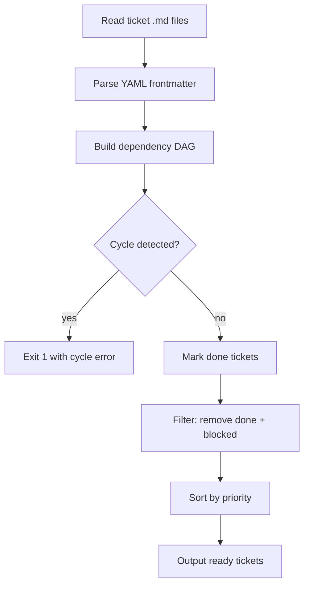

# ticket-prioritizer skill

## Purpose

Return the set of tickets that are **ready to work on now** — meaning all their
`depends_on` predecessors are in `done` status or live in a `done/` directory.
Tickets with unresolved predecessors are omitted from the output.

## Invocation

```bash
# Scan a single epic (scope: sub-tickets of this epic only)
python .agents/skills/ticket-prioritizer/scripts/prioritize.py \
  --epic tickets/01_todo/EPIC-MyFeature/

# Scan all tickets in 00_inbox and 01_todo (default)
python .agents/skills/ticket-prioritizer/scripts/prioritize.py --all

# JSON output for machine consumers (epic-supervisor)
python .agents/skills/ticket-prioritizer/scripts/prioritize.py \
  --epic tickets/01_todo/EPIC-MyFeature/ --json
```

## Output

### Human-readable (default)

```
READY TICKETS  (unblocked, sorted by priority):
  [high]    02_add_logic.md
  [medium]  04_write_tests.md

BLOCKED TICKETS  (has unresolved depends_on):
  [high]    03_migrate_db.md
    blocked by: 02_add_logic.md (status: todo)
```

### JSON (--json flag)

```json
{
  "ready": [
    {"path": "02_add_logic.md", "title": "Add logic", "priority": "high"},
    {"path": "04_write_tests.md", "title": "Write tests", "priority": "medium"}
  ],
  "blocked": [
    {"path": "03_migrate_db.md", "title": "Migrate DB", "priority": "high",
     "blocked_by": ["02_add_logic.md"]}
  ],
  "done": ["01_base.md"]
}
```

## Integration with epic-supervisor

```bash
# epic-supervisor uses this to compute the next ready batch:
python .agents/skills/ticket-prioritizer/scripts/prioritize.py \
  --epic <epic_path> --json 2>/dev/null
```

Parse the `ready` array. Each entry maps to a ticket path. Apply
the `files_touched` disjoint-set gate (per building-epics §1.2)
on the ready set before dispatching.

## AC-aware prioritization

The `--include-acs` flag extends `prioritize.py` to merge open Acceptance
Criteria from the AC store into the ranked ticket list. When passed, the
script loads AC YAML files from the AC store directory, converts each
unimplemented AC's complexity to a priority level using the mapping below,
and emits AC entries alongside ticket entries in the `ready` array.

### Complexity-to-priority mapping

| AC complexity | Mapped priority |
|---|---|
| `S` (small) | `high` |
| `M` (medium) | `medium` |
| `L` (large) | `low` |
| `XL` (extra-large) | `low` |
| _(absent)_ | `medium` |

### Invocation with AC-aware output

```bash
# Merged ticket + AC list (human-readable)
python .agents/skills/ticket-prioritizer/scripts/prioritize.py \
  --all --include-acs

# JSON output for machine consumers
python .agents/skills/ticket-prioritizer/scripts/prioritize.py \
  --all --include-acs --json
```

The JSON output schema is extended with a `source` field on each item:

```json
{
  "ready": [
    {"path": "02_add_logic.md", "title": "Add logic", "priority": "high",
     "source": "ticket"},
    {"id": "ACS-100a-1", "title": "Required fields reject missing values",
     "priority": "high", "assigned_agent": "python-coder",
     "source": "ac"}
  ],
  "blocked": [...],
  "done": [...]
}
```

AC entries carry `id`, `title`, `priority`, `assigned_agent`, and
`source: "ac"`. Ticket entries carry `path`, `title`, `priority`, and
`source: "ticket"`. Both lists are sorted together by priority level
(`critical > high > medium > low`).

See also: `scripts/ac_store/ac_prioritizer.py` for the AC complexity
ranking logic that `prioritize.py --include-acs` delegates to internally.

---

## pick_next.py — human recommendation

`pick_next.py` is a thin presentation layer that calls `prioritize.py
--all --include-acs --json` and formats the top result(s) as a
human-readable recommendation block.

### Invocation

```bash
# Print the single highest-priority ready item (default)
python .agents/skills/ticket-prioritizer/scripts/pick_next.py

# Print the top 3 ready items
python .agents/skills/ticket-prioritizer/scripts/pick_next.py --top 3

# Machine-readable JSON output
python .agents/skills/ticket-prioritizer/scripts/pick_next.py --json

# Override root paths (useful when running from a non-standard working dir)
python .agents/skills/ticket-prioritizer/scripts/pick_next.py \
  --ac-root /path/to/ac_store \
  --tickets-root /path/to/tickets
```

### Human output format (default)

```
Next recommended work item:
  Type:   AC              (or "ticket")
  ID:     ACS-100a-1
  Title:  "Required fields reject missing values at commit time"
  Agent:  python-coder
  Score:  high priority, S complexity
  Action: run /build-ac --ac ACS-100a-1   (or /build-feature <path>)
```

When `--top N` is passed, `N` blocks are printed in priority order,
each with the same Type / ID / Title / Agent / Score / Action structure.

### JSON output format (`--json`)

```json
{
  "top": [
    {
      "type": "ac",
      "id": "ACS-100a-1",
      "title": "Required fields reject missing values at commit time",
      "assigned_agent": "python-coder",
      "priority": "high",
      "action": "/build-ac --ac ACS-100a-1"
    }
  ]
}
```

For `type: "ticket"` entries, the `id` field is absent and `action` is
`/build-feature <path>` where `<path>` is the relative ticket path.

### Empty ready list

When no ready tickets or ACs exist, `pick_next.py` prints:

```
Nothing ready to build — all work items are blocked or the store is empty.
```

and exits with code 0.

---

## Architecture



## Priority ordering

```
critical > high > medium > low > (unlabelled)
```

Unlabelled tickets (no `priority:` field) rank lowest.

## Done detection

A ticket is considered **done** when any of these is true:
- Its `status` frontmatter field equals `done` or `deferred`
- It lives in a directory named `done/`, `99_done/`, or `99_rejected/`

## Cycle detection

If a cycle is detected, the script exits with code 1 and prints:
```
CYCLE DETECTED: A → B → A
```
This is a hard error — cycles mean the epic's depends_on graph is malformed.
Fix the ticket frontmatter before re-running.
