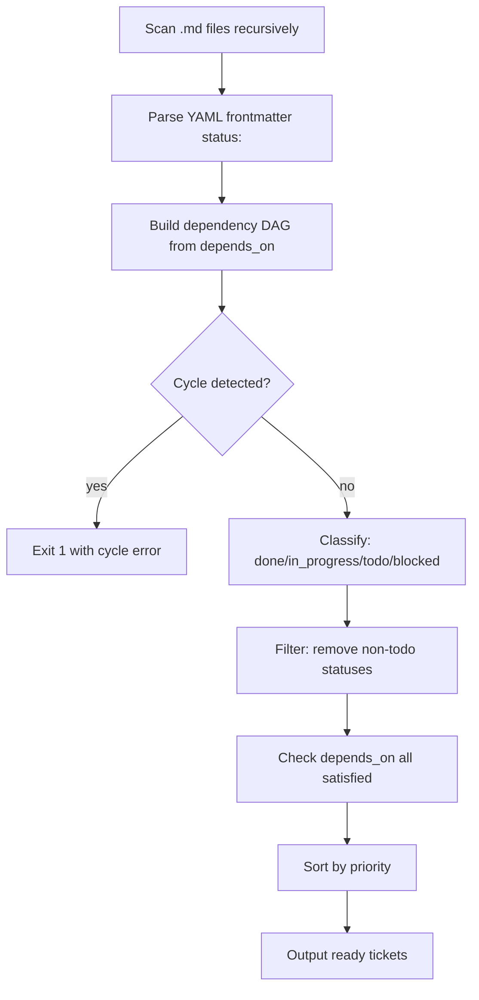

# ticket-prioritizer skill

## Purpose

Return the set of tickets that are **ready to work on now** — meaning all their
`depends_on` predecessors have `status: done` in their frontmatter (or live in a
legacy `done/` directory without a `status:` field), and the ticket itself has
`status: todo`.

## Status-Field-Based Lifecycle (BO-400)

**Authoritative source:** The ticket's `status:` frontmatter field, not its
folder position. Every lifecycle decision uses this field directly.

| `status:` value | Meaning | In ready set? | Satisfies `depends_on`? |
|---|---|---|---|
| `todo` | Not yet started — eligible to pick up | YES (if unblocked) | No |
| `in_progress` | Already being driven by a ticket-supervisor | **NO** | No |
| `done` | Completed | No | YES |
| `deferred` | Deferred to a future cycle | No | YES (treated as complete for dependency purposes) |
| `blocked` | Blocked on external input | No | No |
| absent | Treated as `todo` (backward compat) | YES (if unblocked) | No |

**`in_progress` exclusion (BO-400a-5):** A ticket with `status: in_progress` is
already being driven by an active ticket-supervisor. Including it in the ready set
would cause a second supervisor to attempt driving the same ticket concurrently —
a correctness hazard. It is unconditionally excluded.

## Invocation

```bash
# Scan a single epic folder
python scripts/ticket_prioritizer.py --epic tickets/01_todo/EPIC-MyFeature/

# Scan all tickets in 00_inbox and 01_todo (default)
python scripts/ticket_prioritizer.py --all

# JSON output for machine consumers (epic-supervisor, /build-feature)
python scripts/ticket_prioritizer.py --epic tickets/01_todo/EPIC-MyFeature/ --json
```

## Output

### Human-readable (default)

```
READY TICKETS  (unblocked, sorted by priority):
  [high]    02_add_logic.md
  [medium]  04_write_tests.md
```

### JSON (--json flag)

```json
{
  "ready": [
    {"path": "02_add_logic.md", "title": "Add logic", "priority": "high", "status": "todo"},
    {"path": "04_write_tests.md", "title": "Write tests", "priority": "medium", "status": "todo"}
  ]
}
```

## Integration with /build-feature

```bash
# /build-feature uses this to compute the next ready batch:
python scripts/ticket_prioritizer.py --epic <epic_path> --json 2>/dev/null
```

Parse the `ready` array. Each entry maps to a ticket path. Apply
the `files_touched` disjoint-set gate (per building-epics §1.2)
on the ready set before dispatching.

## AC-aware prioritization

The `--include-acs` flag extends `prioritize.py` to merge open Acceptance
Criteria from the AC store into the ranked ticket list. When passed, the
script loads AC YAML files from the AC store directory, converts each
unimplemented AC's complexity to a priority level using the mapping below,
and emits AC entries alongside ticket entries in the `ready` array.

### Complexity-to-priority mapping

| AC complexity | Mapped priority |
|---|---|
| `S` (small) | `high` |
| `M` (medium) | `medium` |
| `L` (large) | `low` |
| `XL` (extra-large) | `low` |
| _(absent)_ | `medium` |

### Invocation with AC-aware output

```bash
# Merged ticket + AC list (human-readable)
python .agents/skills/ticket-prioritizer/scripts/prioritize.py \
  --all --include-acs

# JSON output for machine consumers
python .agents/skills/ticket-prioritizer/scripts/prioritize.py \
  --all --include-acs --json
```

The JSON output schema is extended with a `source` field on each item:

```json
{
  "ready": [
    {"path": "02_add_logic.md", "title": "Add logic", "priority": "high",
     "source": "ticket"},
    {"id": "ACS-100a-1", "title": "Required fields reject missing values",
     "priority": "high", "assigned_agent": "python-coder",
     "source": "ac"}
  ],
  "blocked": [...],
  "done": [...]
}
```

AC entries carry `id`, `title`, `priority`, `assigned_agent`, and
`source: "ac"`. Ticket entries carry `path`, `title`, `priority`, and
`source: "ticket"`. Both lists are sorted together by priority level
(`critical > high > medium > low`).

See also: `scripts/ac_store/ac_prioritizer.py` for the AC complexity
ranking logic that `prioritize.py --include-acs` delegates to internally.

---

## pick_next.py — human recommendation

`pick_next.py` is a thin presentation layer that calls `prioritize.py
--all --include-acs --json` and formats the top result(s) as a
human-readable recommendation block.

### Invocation

```bash
# Print the single highest-priority ready item (default)
python .agents/skills/ticket-prioritizer/scripts/pick_next.py

# Print the top 3 ready items
python .agents/skills/ticket-prioritizer/scripts/pick_next.py --top 3

# Machine-readable JSON output
python .agents/skills/ticket-prioritizer/scripts/pick_next.py --json

# Override root paths (useful when running from a non-standard working dir)
python .agents/skills/ticket-prioritizer/scripts/pick_next.py \
  --ac-root /path/to/ac_store \
  --tickets-root /path/to/tickets
```

### Human output format (default)

```
Next recommended work item:
  Type:   AC              (or "ticket")
  ID:     ACS-100a-1
  Title:  "Required fields reject missing values at commit time"
  Agent:  python-coder
  Score:  high priority, S complexity
  Action: run /build-ac --ac ACS-100a-1   (or /build-feature <path>)
```

When `--top N` is passed, `N` blocks are printed in priority order,
each with the same Type / ID / Title / Agent / Score / Action structure.

### JSON output format (`--json`)

```json
{
  "top": [
    {
      "type": "ac",
      "id": "ACS-100a-1",
      "title": "Required fields reject missing values at commit time",
      "assigned_agent": "python-coder",
      "priority": "high",
      "action": "/build-ac --ac ACS-100a-1"
    }
  ]
}
```

For `type: "ticket"` entries, the `id` field is absent and `action` is
`/build-feature <path>` where `<path>` is the relative ticket path.

### Empty ready list

When no ready tickets or ACs exist, `pick_next.py` prints:

```
Nothing ready to build — all work items are blocked or the store is empty.
```

and exits with code 0.

---

## Architecture



## Priority ordering

```
critical > high > medium > low > (unlabelled)
```

Unlabelled tickets (no `priority:` field) rank lowest.

## Done detection (BO-400a-4)

A ticket's `depends_on` is satisfied when **all** referenced predecessors have:
- Frontmatter `status: done` or `status: deferred`, **OR**
- No `status:` field AND live in a directory named `done/` or `99_done/`
  (backward compatibility for legacy epics — BO-400c-1-i).

The **file's folder position alone is not authoritative** for tickets outside
legacy `done/` directories. A ticket at `tickets/01_todo/EPIC-Foo/03_ticket.md`
with `status: done` in its frontmatter is treated as done.

## Backward compatibility with legacy done/ subfolders (BO-400c-1-i)

Epics that were created before BO-400 may have tickets in `done/` subfolders.
The prioritizer handles these correctly:

1. **Recursive scan:** All `.md` files under the epic folder are scanned,
   including those in any `done/` subfolder.
2. **Status fallback:** If a ticket in a `done/` subfolder has no `status:` field,
   its effective status is `done` (it was placed there under the old convention).
3. **No errors:** The prioritizer emits no error or warning when a `done/`
   subfolder is present — it is treated as a normal subdirectory.

## Cycle detection

If a cycle is detected, the script exits with code 1 and prints:
```
CYCLE DETECTED: A -> B -> A
```
This is a hard error — cycles mean the epic's depends_on graph is malformed.
Fix the ticket frontmatter before re-running.
